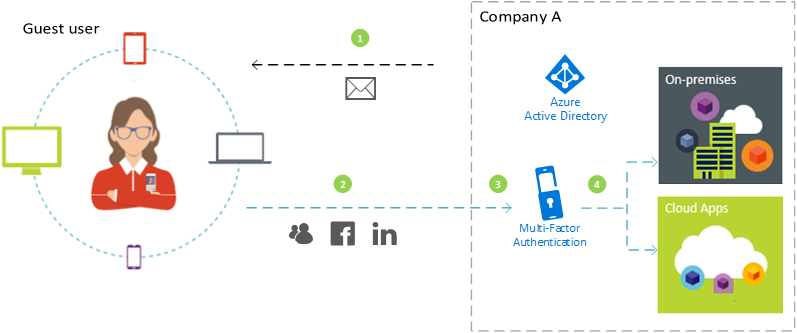
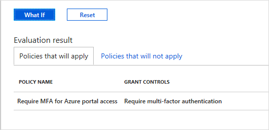

When collaborating with external B2B guest users, it’s a good idea to protect your apps with multi-factor authentication (MFA) policies. This way, external users will need more than just a user name and password to access your resources. In Azure Active Directory (Azure AD), you can accomplish this goal with a conditional access policy that requires MFA for access. MFA policies are always enforced at your organization, regardless of whether the partner has MFA capabilities, so you’ll need to make sure you have sufficient Azure AD Premium licenses for your guest users. MFA policies can be enforced at the tenant, app, or individual guest user level, the same way that they are enabled for members of your own organization.

Example:

1.	An admin or employee at Company A invites a guest user to use a cloud or on-premises application that is configured to require MFA for access.
2.	The guest user signs in with their own work, school, or social identity. 
3.	The user is asked to complete an MFA challenge. 
4.	The user sets up MFA with Company A and chooses their MFA option. The user is allowed access to the application.

In this tutorial, you will:

> [!NOTE]
> This is only applicable for approved MDM apps for Windows 10 devices.

> [!div class="checklist"]
> * Test the sign-in experience before MFA setup
> * Create a conditional access policy that requires MFA for access to a cloud app in your environment. In this tutorial, we’ll use the Microsoft Azure Management app to illustrate the process.
> * Use the What If tool to simulate MFA sign-in
> * Test your conditional access policy
> * Clean up the test user and policy

If you don’t have an Azure subscription, create a [free account](https://azure.microsoft.com/free/?WT.mc_id=A261C142F) before you begin.

## Prerequisites

To complete the scenario in this tutorial, you need:

 - Access to an Azure AD Premium edition - Azure AD conditional access is an Azure AD Premium capability. 
 - An email account for the test guest user – You’ll need a valid email account that you can add to your tenant directory as a guest user, and that you can use to sign in. If you don't know how to create a guest account, see [Add a B2B guest user in the Azure portal](add-users-administrator.md).

## Create a test guest user in Azure AD

1. Sign in to the [Azure portal](https://portal.azure.com/) as an Azure AD administrator.
2. In the navigation pane, select **Azure Active Directory**.

    

3.	Under **Manage**, select **Users**.

    

4.	Select **New guest user**.

    

5.	Under **User name**, enter the email address of the external user. Optionally, include a welcome message. 

    

6.	Select **Invite** to automatically send the invitation to the guest user. In the **Notification** area, look for a **Successfully invited user** message. 
7.	After you send the invitation, the user account is automatically added to the directory as a guest.

## Test the sign-in experience before MFA setup
1.	Use your test user name and password to sign in to your Azure portal.
2.	Note that you’re able to access the Azure portal immediately.
3.	Sign out.

## Create a conditional access policy that requires MFA
1.	Sign in to your Azure portal as global administrator, security administrator, or a conditional access administrator.
2.	In the Azure portal, select **Azure Active Directory**. 

    

3.	On the **Azure Active Directory** page, in the **Security** section, select **Conditional access**.

    

4.	On the **Conditional Access** page, in the toolbar on the top, select **New policy**.

    

5.	On the **New** page, in the **Name** textbox, type Require MFA for Azure portal access.

    

6.	In the **Assignment** section, select **Users and groups**.

    

7.	On the **Users and groups** page, choose **Select users and groups**, select the **Users and groups** checkbox, and then choose **Select**.

    

8.	On the **Select** page, select the checkbox next to your test user account, and then choose **Select**.

    

9.	On the **Users and groups** page, select **Done**.

    

10.	Select **Cloud apps**.

    

11.	On the **Cloud apps** page, choose **Select apps**, and then choose **Select**.

    

12.	On the **Select** page, choose **Microsoft Azure Management**, and then choose **Select**.

    

13.	On the **Cloud apps** page, select **Done.
14.	In the **Access controls** section, select **Grant**.

    

15.	On the **Grant** page, choose **Grant access**, select the **Require multi-factor authentication** checkbox, and then choose **Select**.

    

16.	Under **Enable policy**, select **On**.

    

17.	Select **Create**.

## Use the What If option to simulate sign-in

1.	On the **Conditional access - Policies** page, select **What If**. 

    

2.	Select **User**, choose your test guest user, and then choose **Select**.

    

3.	Select **Cloud apps**.
4.	On the **Cloud apps** page, choose **Select apps**, choose **Select**, and then choose **Microsoft Azure Management**. Choose **Select**. 

    

5.	On the cloud apps page, select **Done**.
6.	Select **What If**, and verify that your new policy appears under **Evaluation results** on the **Policies that will apply** tab.

    

## Test your conditional access policy
1.	Use your test user name and password to sign in to your Azure portal.
2.	You should see a request for additional authentication methods. Note that it could take some time for the policy to take effect.
 
3.	Sign out.

## Clean up resources
1.	Sign in to the Azure portal as an Azure AD administrator.
2.	In the navigation pane, select **Azure Active Directory**.
3.	Under **Manage**, select **Users**.
4.	Select the test user, and then select **Delete user**.

    

5.	In the navigation pane, select **Azure Active Directory**.
6.	Under **Security**, select **Conditional Access**.
7.	In the **Policy Name** list, select the context menu (…) for your test policy, and then select **Delete**.

    

## Next steps
In this tutorial, you’ve created a conditional access policy that requires guest users to use MFA when signing in to one of your cloud apps. To learn more about adding guest users for collaboration, see [Add Azure Active Directory B2B collaboration users in the Azure portal](add-users-administrator.md).
