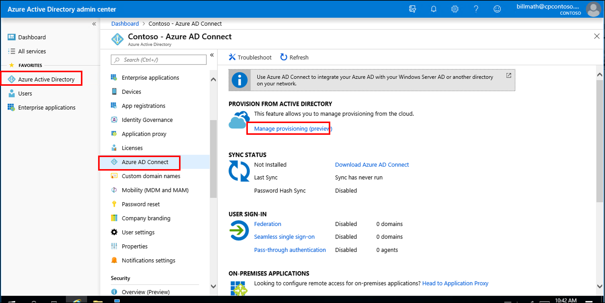

# Install Azure AD Connect provisioning agent
This document will walk you through the installation process for the Azure AD Connect provisioning agent and how to initially configure it in the Azure portal.

>[!IMPORTANT]
>The following installation instructions assume that all of the [Pre-requisites](how-to-cloud-prov-prereq.md) have been met.

Installing and configuring Azure AD Connect provisioning is accomplished in the following steps:
	
- [Install the agent](#install-the-agent)
- [Verify agent installation](#verify-agent-installation)

## Install the agent

1. Sign in to the server you will use with enterprise admin permissions.
2. Navigate to the Azure portal, select Azure Active Directory on the left.
3. Click **Manage provisioning (preview)** and select **Review all agents**.
3. Download the Azure AD Connect provisioning agent from the Azure portal.
 
3. Run the Azure AD Connect provisioning (AADConnectProvisioningAgent.Installer)
3. On the splash screen, **Accept** the licensing terms and click **Install**. 
 

4. Once this operation completes, the configuration wizard will launch.  Sign in with your Azure AD global administrator account.
5. On the **Connect Active Directory** screen, click **Add directory** and then sign in with your Active Directory administrator account.  This operation will add your on-premises directory.  Click **Next**. 
 

6. On the **Configuration complete** screen, click **Confirm**.  This operation will register and restart the agent. 
 

7. Once this operation completes you should see a notice **Your was successfully verified.**  You can click **Exit**. 
 
8. If you still see the initial splash screen, click **Close**.

## Verify agent installation
Agent verification occurs in the Azure portal and on the local server that is running the agent.

### Azure portal agent verification
To verify the agent is being seen by Azure follow these steps:

1. Sign in to the Azure portal.
2. On the left, select **Azure Active Directory**, click **Azure AD Connect** and in the center select **Manage provisioning (preview)**. 
 

3.  On the **Azure AD Provisioning (preview)** screen click **Review all agents**.
 
 
4. On the **On-premises provisioning agents screen** you will see the agents you have installed.  Verify that the agent in question is there and is marked **active**.
 

### Verify the port
To verify the Azure is listening on port 443 and that your agent can communicate with it, you can use the following:

https://aadap-portcheck.connectorporttest.msappproxy.net/ 

This test will verify that your agents are able to communicate with Azure over port 443.  Open a browser and navigate to the above URL from the server where the agent is installed.

### On the local server
To verify that the agent is running follow these steps:

1.  Log on to the server with an administrator account
2.  Open **Services** by either navigating to it or by going to Start/Run/Services.msc.
3.  Under **Services** make sure **Microsoft Azure AD Connect Agent Updater** and **Microsoft Azure AD Connect Provisioning Agent** are there and the status is **Running**.

>[!IMPORTANT]
>The agent has been installed but must be configured and enabled before it will start synchronizing users.  To configure a new agent see [Azure AD Connect provisioning new agent configuration](how-to-cloud-prov-manage.md).

## Next Steps 

- [Azure AD Connect provisioning new agent configuration](how-to-cloud-prov-manage.md)
- [cloud provisioning pre-requisites](how-to-cloud-prov-prereq.md) 
- [What is Azure AD Connect cloud provisioning?](whatis-cloud-prov.md)
 
