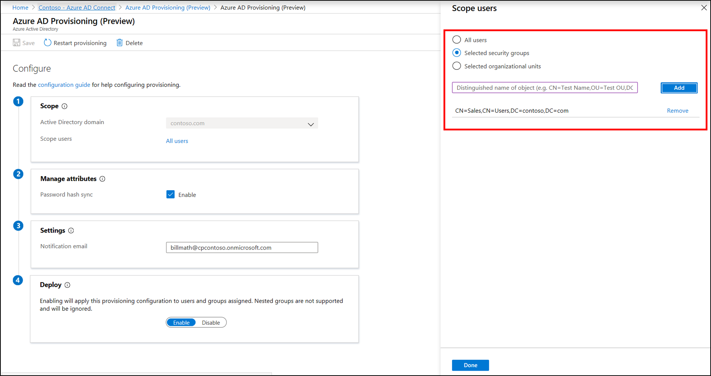
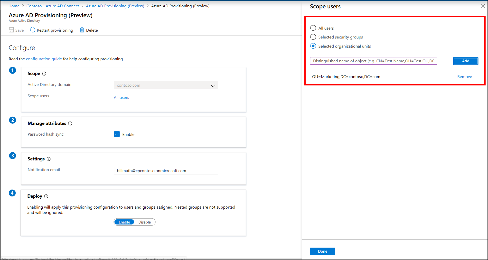

# Azure AD Connect cloud provisioning new configuration

Once you have installed the agent, you need to sign-in to the Azure portal and configure provisioning.  Use the following steps to enable the agent.

## Configure provisioning
To configure provisioning, use the following steps:

1.  In the Azure AD portal.
2.  Click **Azure Active Directory**
3.  Click **Azure AD Connect**
4.  Select **Manage provisioning (Preview)**

5.  Click on **New configuration**.
6.  On the configuration screen, the on-premises domain is pre-populated
8. Enter a **Notification email**. This email will be notified 
9. when provisioning is not healthy.  
9. Move the selector to **Enable** and click **Save**.

## Scoping provisioning to specific users and groups
If you want to scope the agent to only synchronize specific users and groups, you can do this. You can scope using on-premises AD groups or Organizational Units. You cannot configure groups and Organizational Units within a configuration. 

1.  In the Azure AD portal.
2.  Click **Azure Active Directory**
3.  Click **Azure AD Connect**
4.  Select **Manage provisioning (Preview)**
5.  Under **Configuration** click on your configuration.  

6.  Under **Configure**, select **All users** to change the scope of the configuration rule.

7. On the right, you can change the scope to include only security groups by entering the distinguished name of the group and clicking **Add**.

8. Or change it to include only specific OUs.

9.  Click **Done** and **Save**.

## Restart provisioning 
If you do not want to wait for the next scheduled run, you can trigger the provisioning run using the restart provisioning button. 
1.  In the Azure AD portal.
2.  Click **Azure Active Directory**
3.  Click **Azure AD Connect**
4.  Select **Manage provisioning (Preview)**
5.  Under **Configuration** click on your configuration.  

6.  At the top, click **Restart provisioning**.

## Removing a configuration
If you want to delete a configuration you can do that by using the following steps.

1.  In the Azure AD portal.
2.  Click **Azure Active Directory**
3.  Click **Azure AD Connect**
4.  Select **Manage provisioning (Preview)**
5.  Under **Configuration** click on your configuration.  

6.  At the top, click **Delete**.

>[!IMPORTANT]
>There is no confirmation prior to deleting a configuration so be sure that this is the action you want to take before clicking **Delete**.

## Next steps 

- [cloud provisioning installation](how-to-cloud-prov-install.md)
- [cloud provisioning pre-requisites](how-to-cloud-prov-prereq.md) 
- [What is Azure AD Connect cloud provisioning?](whatis-cloud-prov.md)
