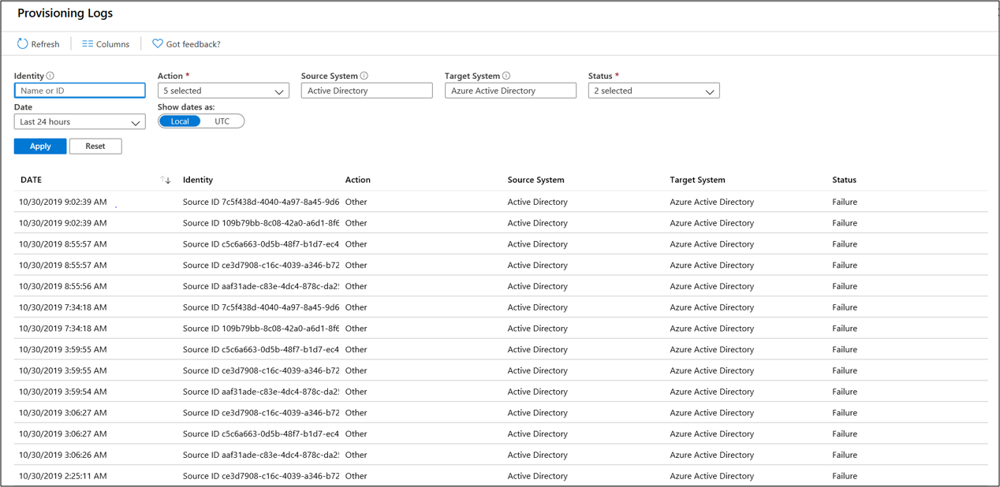
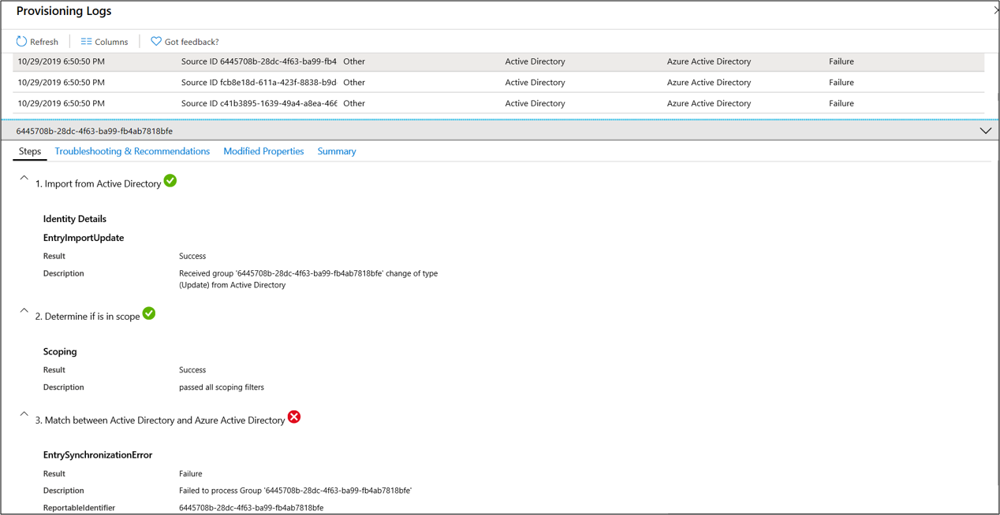

# Cloud provisioning troubleshooting
Cloud provisioning touches many different things and has many different dependencies.  Naturally, this can give rise to various issues.  This document is designed to get you started on troubleshooting these issues.  This document will introduce you to the typical areas that you should focus on, how to gather additional information, and various techniques that can be used to track down problems.  


  ##  Common troubleshooting areas

|Name|Description|
|-----|-----|
|[Agent issues](#agent-issues)|Verify that the agent has been installed correctly and is communicating with Azure AD.|
|[Object synchronization issues](#object-synchronization-issues)|Use provisioning logs to troubleshoot object synchronization issues.|
|[Provisioning quarantine issues](#provisioning-quarantined-issues)|Understand provisioning quarantine issue and how to fix them.|


## Agent issues
Some of the first things that you want to verify with the agent are:


-  is it installed?
-  is the agent running locally?
-  is the agent in the portal?
-  is the agent marked as healthy?  

These items can be verified in the Azure portal and on the local server that is running the agent.

### Azure portal agent verification
To verify the agent is being seen by Azure and is healthy follow these steps:

1. Sign in to the Azure portal.
2. On the left, select **Azure Active Directory**, click **Azure AD Connect** and in the center select **Manage provisioning (preview)**.
3.  On the **Azure AD Provisioning (preview)** screen click **Review all agents**.
 </br>
 
4. On the **On-premises provisioning agents screen** you will see the agents you have installed.  Verify that the agent in question is there and is marked **Healthy**.
 </br>

### Verify the port
To verify the Azure is listening on port 443 and that your agent can communicate with it, you can use the following tool:

https://aadap-portcheck.connectorporttest.msappproxy.net/ 

This test will verify that your agents are able to communicate with Azure over port 443.  Open a browser and navigate to the above URL from the server where the agent is installed.
 

### On the local server
To verify that the agent is running follow these steps:

2.  On the server with the agent installed, open **Services** by either navigating to it or by going to Start/Run/Services.msc.
3.  Under **Services**, make sure **Microsoft Azure AD Connect Agent Updater** and **Microsoft Azure AD Connect Provisioning Agent** are there and the status is **Running**.
 

### Common agent installation issues
The following are some common agent installation issues and what the typical resolution is.

#### Agent failed to start
If you receive an error message that states:

**Service 'Microsfoft Azure AD Connect Provisioning Agent' failed to start.  Verify that you have sufficient privileges to start the system services.** 

This is typically caused by a group policy that prevented permissions from being applied to the local NT Service “Logon Account” created by the installer (NT SERVICE\AADConnectProvisioningAgent) These permissions are required to start the service.

To resolve this, use the following steps:

1.  Log on to the server with an administrator account
2.  Open **Services** by either navigating to it or by going to Start/Run/Services.msc.
3.  Under **Services** double-click **Microsoft Azure AD Connect Provisioning Agent**
4. On the **Log On** tab change the “Logon Account” to a domain admin and restart the service. 

 

#### Agent times out or certificate is invalid
You may get the following errors if you are attempting to register the agent.

 

This is usually caused by the agent being unable to connect to the Hybrid Identity Service and requires configuring HTTP proxy.  To resolve this configure an outbound proxy. 

The Provisioning Agent supports use of outbound proxy. You can configure it by editing the agent config file **C:\Program Files\Microsoft Azure AD Connect Provisioning Agent\AADConnectProvisioningAgent.exe.config**.
Add the following lines into it, towards the end of the file just before the closing `</configuration>` tag.
Replace the variables [proxy-server] and [proxy-port] with your proxy server name and port values.

    ```xml
        <system.net>
            <defaultProxy enabled="true" useDefaultCredentials="true">
                <proxy
                    usesystemdefault="true"
                    proxyaddress="http://[proxy-server]:[proxy-port]"
                    bypassonlocal="true"
                />
            </defaultProxy>
        </system.net>
    ```

#### Agent registration fails with security error
You may see the following error when installing the cloud provisioning agent.

This is typically caused by the agent being unable to execute the PowerShell registration scripts due to local PowerShell execution policies.

To resolve this, change the PowerShell execution policies on the server. You need to have Machine and User policies as "Undefined" or "RemoteSigned". If it is “Unrestricted” you will see this error.  For more information see [PowerShell execution policies](https://docs.microsoft.com/powershell/module/microsoft.powershell.core/about/about_execution_policies?view=powershell-6). 

### Log files
By default, the agent emits very minimal error messages and stack trace information. You can find these trace logs in the folder: **C:\ProgramData\Microsoft\Azure AD Connect Provisioning Agent\Trace**

Use the following steps to gather additional details for troubleshooting agent-related issues.

1. Stop the service **Microsoft Azure AD Connect Provisioning Agent**
2. Create a copy of the original config file: **C:\Program Files\Microsoft Azure AD Connect Provisioning Agent\AADConnectProvisioningAgent.exe.config**
3. Replace the existing <system.diagnostics> section with the following and all trace messages will go to the file **ProvAgentTrace.log**

      ```xml
        <system.diagnostics>
            <sources>
            <source name="AAD Connect Provisioning Agent">
                <listeners>
                <add name="console"/>
                <add name="etw"/>
                <add name="textWriterListener"/>
                </listeners>
            </source>
            </sources>
            <sharedListeners>
            <add name="console" type="System.Diagnostics.ConsoleTraceListener" initializeData="false"/>
            <add name="etw" type="System.Diagnostics.EventLogTraceListener" initializeData="Azure AD Connect Provisioning Agent">
                <filter type="System.Diagnostics.EventTypeFilter" initializeData="All"/>
            </add>
            <add name="textWriterListener" type="System.Diagnostics.TextWriterTraceListener" initializeData="C:/ProgramData/Microsoft/Azure AD Connect Provisioning Agent/Trace/ProvAgentTrace.log"/>
            </sharedListeners>
        </system.diagnostics>

      ```
4. Start the service **Microsoft Azure AD Connect Provisioning Agent**
5. You can use the following command to tail the file and debug issues: 
    ```
    Get-Content “C:/ProgramData/Microsoft/Azure AD Connect Provisioning Agent/Trace/ProvAgentTrace.log” -Wait
    ```
## Object synchronization issues
The following section contains information on troubleshooting object synchronization.

### Provisioning logs
In the Azure portal, provisioning logs can be used to help track down and troubleshoot object synchronization issues.  To view the logs, select **Logs**.
 

The provisioning logs provide a wealth of information on the state of the objects being synchronized between your on-premises AD environment and Azure.

 

You can use the drop-downs at the top of the page to filter the view to zero in on specific issues, dates, etc.  Double-clicking on an individual event will provide additional detailed information.

 

This information will provide detailed steps and where the synchronization issue is occurring.  Thus, allowing you to zero in and pinpoint the exact spot of the problem.


## Provisioning quarantined issues

Cloud provisioning monitors the health of your configuration and places unhealthy objects in a "quarantine" state. If most or all of the calls made against the target system consistently fail because of an error, for example invalid admin credentials, the provisioning job is marked as in quarantine.

 

By clicking on the status, you can see additional information about the quarantine.  You can also obtain the error code and message.

 

### Resolving a quarantine

- Use the Azure portal to restart the provisioning job. On the agent configuration page select **Restart provisioning**.


 

- Use Microsoft Graph to [restart the provisioning job](https://docs.microsoft.com/graph/api/synchronization-synchronizationjob-restart?view=graph-rest-beta&tabs=http). You'll have full control over what you restart. You can choose to clear escrows (to restart the escrow counter that accrues toward quarantine status), clear quarantine (to remove the application from quarantine), or clear watermarks. Use the following request:
 
       `POST /servicePrincipals/{id}/synchronization/jobs/{jobId}/restart`

## Next steps 

- [What is Azure AD Connect cloud provisioning?](whatis-cloud-prov.md)
- [Azure AD Connect cloud provisioning installation](how-to-cloud-prov-install.md)
- [Azure AD Connect cloud provisioning pre-requisites](how-to-cloud-prov-prereq.md) 
- [What is Azure AD Connect cloud provisioning?](whatis-cloud-prov.md) 

