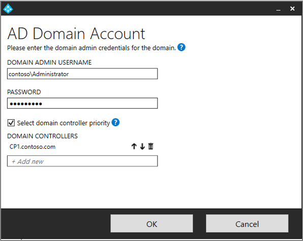
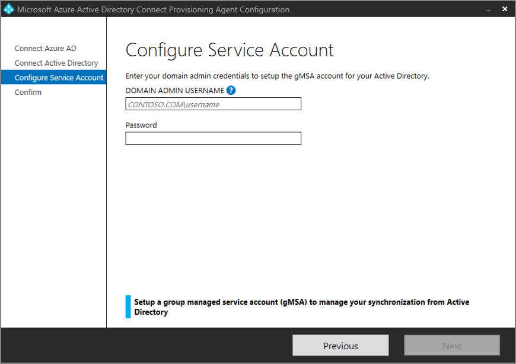
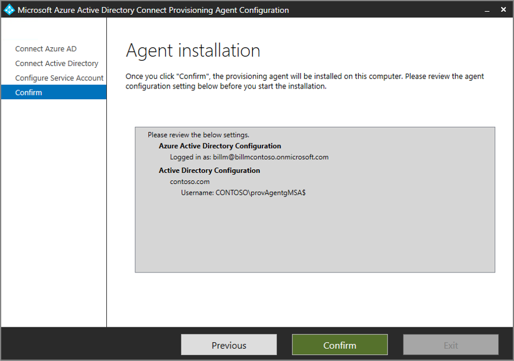
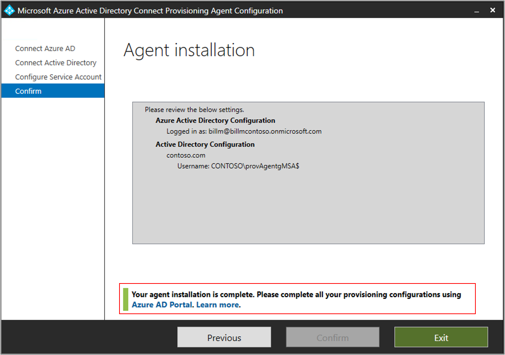

# Install the Azure AD Connect cloud provisioning agent
This document walks you through the installation process for the Azure Active Directory (Azure AD) Connect provisioning agent and how to initially configure it in the Azure portal.

>[!IMPORTANT]
>The following installation instructions assume that all of the [Prerequisites](how-to-prerequisites.md) have been met.

Installing and configuring Azure AD Connect provisioning is accomplished in the following steps:
	
- [Install the agent](#install-the-agent)
- [Verify agent installation](#verify-agent-installation)

## Install the agent
To install the agent, follow these steps.

 1. Sign in to the server you'll use with enterprise admin permissions.
 2. Sign in to the Azure portal, and then go to **Azure Active Directory**.
 3. In the left menu, select **Azure AD Connect**.
 4. Select **Manage provisioning (preview)** > **Review all agents**.
 5. Download the Azure AD Connect provisioning agent from the Azure portal.
    
 6. Run the Azure AD Connect provisioning installer AADConnectProvisioningAgent.msi.
 7. On the **Microsoft Azure AD Connect Provisioning Agent Package** screen, accept the licensing terms and select **Install**.
    
 8. After this operation finishes, the configuration wizard starts. Sign in with your Azure AD global administrator account.
 9. On the **Connect Active Directory** screen, select **Add Directory**. Then sign in with your Active Directory administrator account. This operation adds your on-premises directory. 
 10. Optionally, you can manage the preference of domain controllers the agent will use by selecting **Select domain controller priority** and ordering the list of domain controllers.   Click **OK**.
   
 11. Select **Next**.
   
 12. On the **Configure Service Account screen** enter the domain admin credentials to create the group Managed Service account that will be used to run the agent service.  This account will be named provAgentgMSA$.
    
 13.  On the **Agent Installation** screen confirm settings and the account that will be created and click **Confirm**.
   
 14. After this operation finishes, you should see **Your agent installation is complete.** Select **Exit**.
   
1. If you still see the initial **Microsoft Azure AD Connect Provisioning Agent Package** screen, select **Close**.

## Verify agent installation
Agent verification occurs in the Azure portal and on the local server that's running the agent.

### Azure portal agent verification
To verify the agent is being seen by Azure, follow these steps.

1. Sign in to the Azure portal.
1. On the left, select **Azure Active Directory** > **Azure AD Connect**. In the center, select **Manage provisioning (preview)**.

    

1.  On the **Azure AD Provisioning (preview)** screen, select **Review all agents**.

     
 
1. On the **On-premises provisioning agents** screen, you see the agents you installed. Verify that the agent in question is there and is marked *active*.

    

### On the local server
To verify that the agent is running, follow these steps.

1.  Sign in to the server with an administrator account.
1.  Open **Services** by either navigating to it or by going to **Start** > **Run** > **Services.msc**.
1.  Under **Services**, make sure **Microsoft Azure AD Connect Agent Updater** and **Microsoft Azure AD Connect Provisioning Agent** are there and their status is *Running*.

    

>[!IMPORTANT]
>The agent has been installed but it must be configured and enabled before it will start synchronizing users. To configure a new agent, see [Create a new configuration for Azure AD Connect cloud-based provisioning](how-to-configure.md).

## Group Managed Service Accounts
A group Managed Service Account is a managed domain account that provides automatic password management, simplified service principal name (SPN) management,the ability to delegate the management to other administrators, and also extends this functionality over multiple servers.  Azure AD Connect Cloud Sync supports and recommends the use of a group Managed Service Account for running the agent.  For more information on a gMSA, see [Group Managed Service Accounts](https://docs.microsoft.com/windows-server/security/group-managed-service-accounts/group-managed-service-accounts-overview) 

### Upgrading an existing agent to use the gMSA account
To upgrade an existing agent to use the gMSA account created during installation, simply update the agent service to the latest version by running the AADConnectProvisioningAgent.msi.  This will upgrade the service to the latest version.  Now run through the installation wizard again and provide the credentials to create the account when prompted.

## Next steps 

- [What is provisioning?](what-is-provisioning.md)
- [What is Azure AD Connect cloud provisioning?](what-is-cloud-provisioning.md)
 
