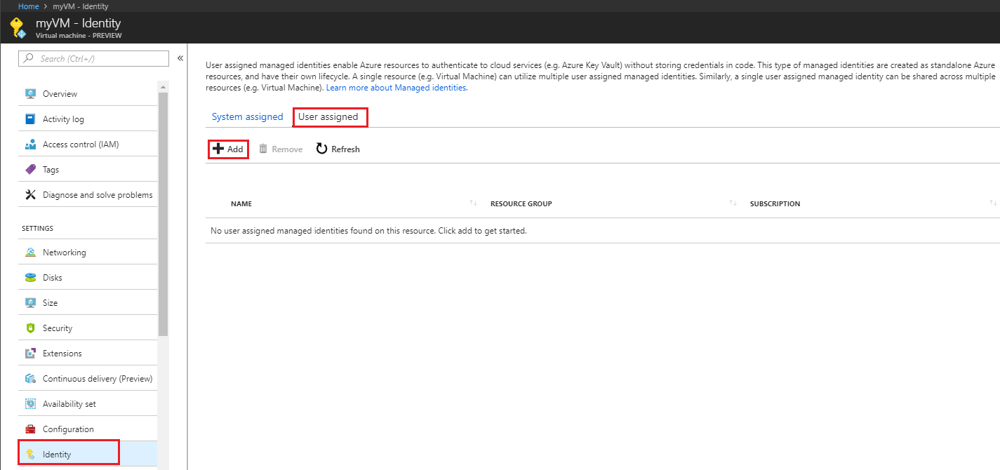
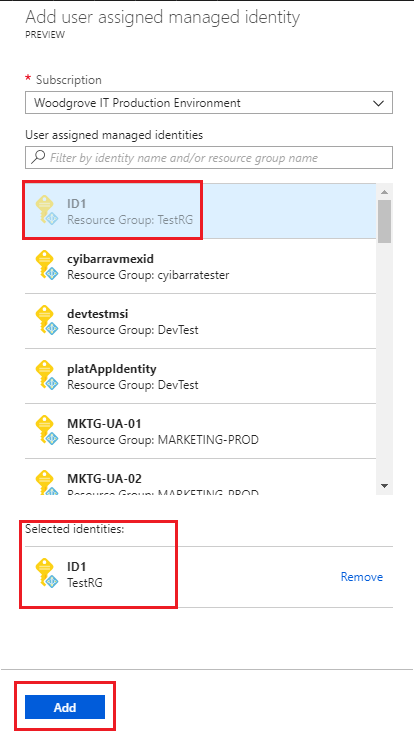
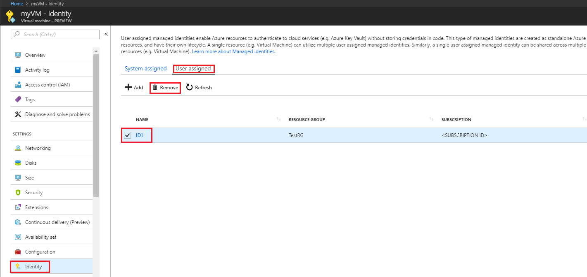

---
title: How to configure Managed Service Identity on an Azure VM using the Azure portal
description: Step by step instructions for configuring a Managed Service Identity on an Azure VM using the Azure portal.
services: active-directory
documentationcenter: ''
author: daveba
manager: mtillman
editor: ''

ms.service: active-directory
ms.component: msi
ms.devlang: na
ms.topic: conceptual
ms.tgt_pltfrm: na
ms.workload: identity
ms.date: 09/19/2017
ms.author: daveba
---

# Configure a VM Managed Service Identity using the Azure portal

[!INCLUDE[preview-notice](../../../includes/active-directory-msi-preview-notice.md)]

Managed Service Identity provides Azure services with an automatically managed identity in Azure Active Directory. You can use this identity to authenticate to any service that supports Azure AD authentication, without having credentials in your code. 

In this article, you will learn how to enable and disable system and user assigned identity for an Azure Virtual Machine (VM), using the Azure portal. 

## Prerequisites

- If you're unfamiliar with Managed Service Identity, check out the [overview section](overview.md).
- If you don't already have an Azure account, [sign up for a free account](https://azure.microsoft.com/free/) before continuing.
- To perform the management operations in this article, your account needs the following role assignment:
    - [Virtual Machine Contributor](/azure/role-based-access-control/built-in-roles#virtual-machine-contributor) to enable and remove system assigned identity from an Azure VM.

## System assigned identity

In this section, you learn how to enable and disable the system assigned identity for VM using the Azure portal.

### Enable system assigned identity during creation of a VM

Currently, the Azure portal does not support enabling system assigned identity during the creation of a VM. Instead, refer to one of the following VM creation Quickstart articles to first create a VM, and then proceed to the next section for details on enabling system assigned identity on the VM:

- [Create a Windows virtual machine with the Azure portal](../../virtual-machines/windows/quick-create-portal.md#create-virtual-machine)
- [Create a Linux virtual machine with the Azure portal](../../virtual-machines/linux/quick-create-portal.md#create-virtual-machine)  
### Enable system assigned identity on an existing Azure VM

To enable the system assigned identity on a VM that was originally provisioned without it:

1. Sign in to the [Azure portal](https://portal.azure.com) using an account associated with the Azure subscription that contains the VM.

2. Navigate to the desired Virtual Machine and select the "Configuration" page.

3. Enable the system assigned identity on the VM by selecting "Yes" under "Managed service identity" and then click **Save**. This operation can take 60 seconds or more to complete:

     

### Remove system assigned identity from an Azure VM

If you have a Virtual Machine that no longer needs the system assigned identity:

1. Sign in to the [Azure portal](https://portal.azure.com) using an account associated with the Azure subscription that contains the VM. 

2. Navigate to the desired Virtual Machine and select the "Configuration" page.

3. Disable the system assigned identity on the VM by selecting "No" under "Managed service identity", then click Save. This operation can take 60 seconds or more to complete:

   

## User assigned identity

 In this section, you will learn how to add and remove a user assigned identity from an Azure VM using the Azure portal.

### Assign a user assigned identity during the creation of an Azure VM

Currently, the Azure portal does not support assigning a user assigned identity during the creation of a VM. Instead, refer to one of the following VM creation Quickstart articles to first create a VM, and then proceed to the next section for details on assigning a user assigned identity to the VM:

- [Create a Windows virtual machine with the Azure portal](../../virtual-machines/windows/quick-create-portal.md#create-virtual-machine)
- [Create a Linux virtual machine with the Azure portal](../../virtual-machines/linux/quick-create-portal.md#create-virtual-machine)

### Assign a user assigned identity to an existing Azure VM

1. Sign in to the [Azure portal](https://portal.azure.com) using an account associated with the Azure subscription that contains the VM.
2. Navigate to the desired VM and click **Identity**, **User assigned** and then **\+Add**.

   

3. Click the user assigned identity you want to add to the VM and then click **Add**.

    

### Remove a user assigned identity from a VM

1. Sign in to the [Azure portal](https://portal.azure.com) using an account associated with the Azure subscription that contains the VM.
2. Navigate to the desired VM and click **Identity**, **User assigned**, the name of the user assigned identity you want to delete and then click **Remove** (click **Yes** in the confirmation pane).

   

## Related content

- For an overview of Managed Service Identity, see [overview](overview.md).

## Next steps

- Using the Azure portal, give an Azure VM's Managed Service Identity [access to another Azure resource](howto-assign-access-portal.md).

