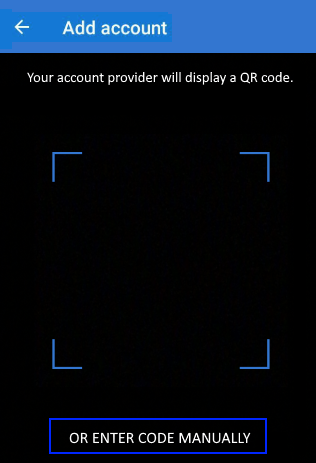

# Manually add an account to the app
If your camera is unable to capture the QR code, you can manually add your account information to the Microsoft Authenticator app for two-factor verification. This works for work or school accounts and non-Microsoft personal accounts.

The codes provided for your accounts aren't case-sensitive and don't require spaces when added into the Microsoft Authenticator app.

>[!Important]
>Before you can add your account, you have to download and install the Microsoft Authenticator app. If you haven't done that yet, follow the steps in the [Download and install the app](microsoft-authenticator-app-how-to.md) article.

## Add your work or school account
If your camera couldn't capture the QR code while you were adding your work or school account to the Microsoft Authenticator app, you can manually add your account.

1. From the **Configure mobile app** screen on your PC, note the **Code** and **Url** information. Keep this screen open so you can see the code and URL.
    
    

2. Open the Microsoft Authenticator app, select **Add account** from the **Customize and control** icon in the upper-right, and then select **Work or school account**.

3. Select **OR ENTER CODE MANUALLY** at the bottom of the screen.

    
   
4. Enter the **Code** and **URL** from Step 1, and then select **Finish**.

    

    The **Accounts** screen of the app shows you your account name and a six-digit verification code. For additional security, the verification code changes every 30 seconds preventing you from using the same code twice.

## Add your Google account
If your camera couldn't capture the QR code while you were adding your Google account to the Microsoft Authenticator app, you can manually add your account.

1. On your PC, select **CAN'T SCAN IT** from the **Set up Authenticator** screen with the QR code.

    The **Can't scan barcode** screen appears with the secret code. Keep this screen open so you can see the secret code.

2. Open the Microsoft Authenticator app, select **Add account** from the **Customize and control** icon in the upper-right, select **Other account (Google, Facebook, etc.)**, and then select **OR ENTER CODE MANUALLY** at the bottom of the screen.

3. Enter an **Account name** (for example, Google) and type the **Secret key** from Step 1, and then select **Finish**.

4. On the **Set up Authenticator** screen on your PC, type the 6-digit verification code provided in the app for your Google account, and then select **Verify**.

    The **Accounts** screen of the app shows you your account name and a six-digit verification code. For additional security, the verification code changes every 30 seconds preventing you from using the same code twice.

## Add your Facebook account
If your camera couldn't capture the QR code while you were adding your Facebook account to the Microsoft Authenticator app, you can manually add your account.

1. On the **Set up via Third Party Authenticator** screen, which includes the QR code, you'll also see a code written out for entry into your app. Keep this screen open so you can see the code.

2. Open the Microsoft Authenticator app, select **Add account** from the **Customize and control** icon in the upper-right, select **Other account (Google, Facebook, etc.)**, and then select **OR ENTER CODE MANUALLY** at the bottom of the screen.

3. Enter an **Account name** (for example, Facebook) and type the **Secret key** from Step 1, and then select **Finish**.

4. On the **Two-Factor Authenticator** screen on your PC, type the 6-digit verification code provided in the app for your Facebook account, and then select **Verify**.

    The **Accounts** screen of the app shows you your account name and a six-digit verification code. For additional security, the verification code changes every 30 seconds preventing you from using the same code twice.

## Add your Apple ID
[STEPS]

## Next steps

- After you add your accounts to the app, you can sign in using the Authenticator app on your device. For more information, see [Sign in using the app](microsoft-authenticator-app-phone-signin-faq.md).

- For devices running iOS, you can also back up your account credentials and related app settings, such as the order of your accounts, to the cloud. For more information, see [Backup and recover with Microsoft Authenticator app](microsoft-authenticator-app-backup-and-recovery.md).

If your camera isn't working properly, you can [enter the QR code and URL manually](#add-an-account-to-the-app-manually).