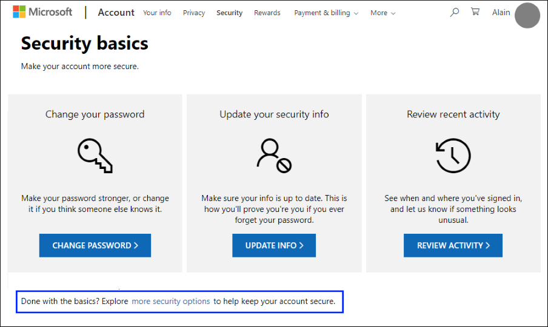

# Add your personal accounts
You can add your personal Microsoft and non-Microsoft accounts, such as for Outlook.com, Xbox LIVE, Google, Facebook, and more to the Microsoft Authenticator app for two-factor verification.

>[!Important]
>Before you can add your account, you have to download and install the Microsoft Authenticator app. If you haven't done that yet, follow the steps in the [Download and install the app](microsoft-authenticator-app-how-to.md) article.

## Add your personal Microsoft account

1. On your PC, go to your [Security basics](https://account.microsoft.com/security) page and sign-in using your personal Microsoft account. For example, alain@outlook.com.

2. At the bottom of the **Security basics** page, choose the **more security options** link.

    

3. Go to the **Two-step verification** section and choose to turn the feature **On**. You can also turn it off here if you no longer want to use it with your personal account.

4. Open the Microsoft Authenticator app on your mobile device.

5. Select **Add account** from the **Customize and control** icon in the upper-right.

    

6. In the **Add account** screen, choose **Personal account**.

7. Sign in to your personal account, using the appropriate email address (such as alain@outlook.com), and then choose **Next**.

    >[!Note]
    >If you don't have a personal Microsoft account, you have the ability to create one here.

8. Enter your password, and then choose **Sign in**.

    Your personal account is added to the Microsoft Authenticator app.

### Add your personal Google account
You can add your personal Google account to the Microsoft Authenticator app.

1. On your PC, go to https://myaccount.google.com/signinoptions/two-step-verification/enroll-welcome, select **Get Started**, and then verify your identity.

2. Follow the on-screen steps to turn two-step verification on for your personal Google account. For more information about turning on two-factor verification and your Google account, see [Turn on 2-Step Verification](https://support.google.com/accounts/answer/185839).

3. In the **Set up alternative second step** section, choose **Set up** from the **Authenticator app** section.

4. In the **Get codes from the Authenticator app** screen, select either **Android** or **iPhone** based on your phone type, and then select **Next**.

5. Open the Microsoft Authenticator app, select **Add account** from the **Customize and control** icon in the upper-right, and then select **Other account (Google, Facebook, etc)**.

6. Use your device's camera to scan the QR code from the **Set up Authenticator** screen on your PC, and then choose **Next**.

    >[!Note]
    >If your camera isn't working properly, you can [enter the QR code and URL manually](#add-an-account-to-the-app-manually).

7. Review the **Accounts** screen of the Microsoft Authenticator app on your device, to make sure your account information is right and that there's an associated six-digit verification code.

    For additional security, the verification code changes every 30 seconds preventing you from using the same code twice.

8. Type the verification code into the **Set up Authenticator** screen on your PC, and then select **Verify**.

9. Your account is verified and you can select **Done** to close the **Set up Authenticator** screen.

### Add your personal Facebook account
You can add your personal Facebook account to the Microsoft Authenticator app.

For more information about two-factor verification and your Facebook account, see [What is two-factor authentication and how does it work?](https://www.facebook.com/help/148233965247823).

### Add your personal Apple account
Add steps about how to add your apple account.

## Add other non-Microsoft personal accounts

Add steps here for how to add other accounts, like Instagram, Adobe, and so on.

## Next steps

- After you add your accounts to the app, you can sign in using the Authenticator app on your device. For more information, see [Sign in using the app](microsoft-authenticator-app-phone-signin-faq.md).

- For devices running iOS, you can also back up your account credentials and related app settings, such as the order of your accounts, to the cloud. For more information, see [Backup and recover with Microsoft Authenticator app](microsoft-authenticator-app-backup-and-recovery.md).