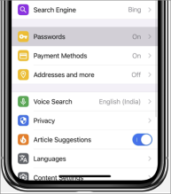
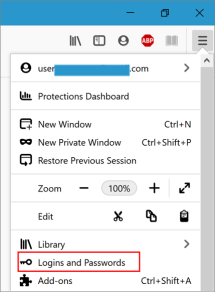
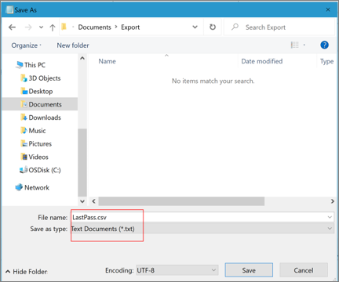
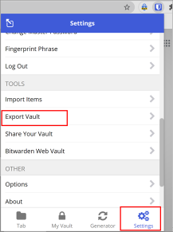
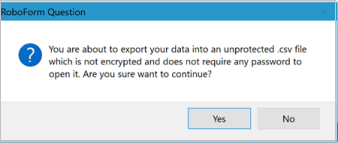

# Import passwords into the Microsoft Authenticator app

You can now import your existing passwords to the Authenticator app to Manage. Just export your passwords from your existing password manager into our comma-separated values (CSV) format. Then, import the exported CSV to Authenticator in our Chrome browser extension or directly into the Authenticator app (Android and iOS). Microsoft Authenticator currently supports importing passwords from Google Chrome, Firefox, LastPass, Bitwarden, and Roboform. If Microsoft doesn’t currently support your existing password manager, you can manually copy sign-in credentials into our template CSV.

## Import passwords from Google Chrome or Android Smart Lock

You can import your passwords from Google Chrome or Android Smart Lock to Authenticator on either your smartphone or your desktop computer. You can:

- [Import passwords from Chrome on Android and iOS](#import-passwords-from-chrome-on-android-and-ios)
- [Import passwords from Chrome desktop browser](#import-passwords-from-chrome-desktop-browser)

### Import passwords from Chrome on Android and iOS

Google Chrome users on Android and Apple phones can import their passwords directly from their phone with few simple steps.

1. Install Authenticator app on your phone and signed into the **Passwords** tab.

1. Sign in to Google Chrome on your phone.

1. Tap the  at the top right for Android phones or at bottom right for iOS devices, and then tap **Settings.**

   &nbsp; | &nbsp;
   ---------- | --------
   Android | 
   iOS | 

1. In **Settings**, open **Passwords**.

   &nbsp; | &nbsp;
   ---------- | --------
   Android | 
   iOS | 

1. On Android devices, tap the  at the top right for Android phones, or at bottom right for iOS devices, and then tap **Export passwords**.

   &nbsp; | &nbsp;
   ---------- | --------
   Android | 
   iOS | 

   You must provide a PIN, fingerprint, or facial recognition. Confirm your identity and tap **Export passwords** again for Chrome start exporting.

1. After the passwords are exported, Chrome prompts you to choose which app you're importing into. Select **Authenticator** to start importing passwords.You'll receive notification when it’s complete.

   &nbsp; | &nbsp;
   ---------- | --------
   Android | 
   iOS | 

### Import passwords from Chrome desktop browser

Before you begin, you must install and sign in to the [Microsoft Autofill extension](https://chrome.google.com/webstore/detail/microsoft-autofill/fiedbfgcleddlbcmgdigjgdfcggjcion) on your Chrome browser.

1. Open [Google Password Manager](https://passwords.google.com) in any browser. If you haven’t already, sign in to your Google account.

1. Select the gear icon  to open to Password settings page.

1. Select **Export**, then on the next page select **Export** again to start exporting your passwords. Provide your Google password when prompted to confirm your identity. You'll receive notification when it’s complete.

   

1. Open the Autofill Chrome Extension and select **Settings**.

   

1. Select **Import data** to open a dialog. Then, select **Choose File** to locate and import the CSV file.

   

### Import passwords from Firefox

Firefox allows exporting of passwords from the desktop browser only, so ensure that you have access to the Firefox desktop browser before importing passwords from Firefox. To access this help page on desktop, navigate to this short url: aka.ms/ImportFireFox

1. Sign in to the latest version of Firefox on your desktop and select the  menu from the top right of screen.

1. Select **Logins and Passwords**.

   

1. From the Firefox Lockwise page, select the  menu, select **Export Logins** and then, to confirm your intent, select **Export** again. You are prompted to identify yourself by entering your PIN, device password or by scanning your fingerprints. Once successfully identified, Firefox exports your passwords in CSV format to the selected location.

1. You can import your passwords from a desktop browser or on iOS or Android phones. Do one of the following:

   - Import to Authenticator from a desktop browser

      1. Open the Google Chrome desktop browser, open the Microsoft Autofill Chrome Extension and select **Settings**.

         

      1. Select “Import Data” to open a dialog. Then, select “Choose File” to locate and open the exported CSV.

         

   - Import to Authenticator from smartphone (requires Authenticator app on phone)

      1. Transfer the exported CSV file on your Android or iOS phone using a preferred and safe way, and then download it. Next, share the CSV file with Authenticator app to start the import.

         &nbsp; | &nbsp;
         ---------- | --------
         Android | 
        iOS | 

Alternatively, you could also import the CSV file by opening the Authenticator app, then going to Settings, and then “Import Passwords” and then “Import from CSV”.

You’ll be notified about the result of import after its complete. After successfully importing your password to Authenticator, DELETE the CSV file from your desktop and mobile.

## Import passwords from LastPass

LastPass allows exporting of passwords from desktop only, so please ensure you have access to a desktop before starting the import. You can access this help-page on desktop by typing this short url: aka.ms/ImportLastPass

### Step 1: “Export” from LastPass Web

Login into https://lastpass.com and select “Advanced Options” and then, select Export.

Please authenticate yourself by providing your master password when asked. Once authenticated, you’ll see the exported passwords on the webpage.

Copy the entire content of the webpage.

Open the notepad (or any other text-editor) and paste the copied content.

Save this notepad file by selecting File &gt; Save As. Provide a name that ends with “.csv” (such as LastPass.csv) at a safe location in your desktop.

Alternatively, you could also export passwords in CSV format by opening LastPass Chrome Extension and then going to “Account Options”> “Advanced” > “Export” > “LastPass CSV File”.

### Step 2: Import to Authenticator

Importing your password to Authenticator is easy and can be done either from a desktop or from a smartphone. Please select a choice that’s applicable to you:

Step 2a: Import to Authenticator from Desktop (requires Chrome browser on desktop)

Step 2b: Import to Authenticator from Smartphone (requires Authenticator app on phone)

#### Step 2a: Import to Authenticator from a Desktop

Please install and sign into Microsoft Autofill extension on your Chrome browser. Once done, select Settings.

Select “Import Data” to open a dialog. Then, select “Choose File” to locate and open the exported CSV.

That’s it! You’ll be notified about the result of import on the screen. After successfully importing your password to Authenticator, you may consider deleting the CSV file from your desktop.

#### Step 2b: Import to Authenticator from a Smartphone

Transfer the exported CSV file on your smartphone using a preferred and safe way, and then download it. Then share the CSV file with Authenticator app to start the import.

&nbsp; | &nbsp;
---------- | --------
Android | 
iOS | 

Alternatively, you could also import the CSV file by opening the Authenticator app, then going to Settings, and then “Import Passwords” and then “Import from CSV”.

You’ll be notified about the result of import after its complete. After successfully importing your password to Authenticator, you may consider deleting the CSV file from your desktop and mobile.

## Import passwords from Bitwarden

Bitwarden allows exporting of passwords from desktop only, so please ensure you have access to a desktop before starting the import. You can access this help-page on desktop by typing this short url: aka.ms/ImportBitwarden

### Step 1: “Export” from Bitwarden Web

Sign in into https://vault.bitwarden.com/ and select Tools and then, select “Export Vault”. Choose the file format as CSV, provide your master password and then select “Export Vault”

Alternatively, export your passwords by opening & logging in to the Bitwarden Chrome extension and then, select “Settings”, and then “Export Vault”. Provide your master password and change the format to CSV and hit Submit to export your passwords.

### Step 2: Import to Authenticator

Importing your password to Authenticator is easy and can be done either from a desktop or from a smartphone. Please select a choice that’s applicable to you:

Step 2a: Import to Authenticator from Desktop (requires Chrome browser on desktop)

Step 2b: Import to Authenticator from Smartphone (requires Authenticator app on phone)

#### Step 2a: Import to Authenticator from a Desktop

Please install and sign into Microsoft Autofill extension on your Chrome browser. Once done, select Settings.

Select “Import Data” to open a dialog. Then, select “Choose File” to locate and open the exported CSV.

That’s it! You’ll be notified about the result of import on the screen. After successfully importing your password to Authenticator, you may consider deleting the CSV file from your desktop.

That’s it! You’ll be notified about the result of import on the screen. After successfully importing your password to Authenticator, you may consider deleting the CSV file from your desktop.

#### Step 2b: Import to Authenticator from a Smartphone

Transfer the exported CSV file on your smartphone using a preferred and safe way, and then download it.

Next, share the CSV file with Authenticator app to start the import.

&nbsp; | &nbsp;
---------- | --------
Android | 
iOS | 

Alternatively, you could also import the CSV file by opening the Authenticator app, then going to Settings, and then “Import Passwords” and then “Import from CSV”.

You’ll be notified about the result of import after its complete. After successfully importing your password to Authenticator, you may consider deleting the CSV file from your desktop and mobile.

## Import passwords from Roboform

Roboform allows exporting of passwords from desktop client only, so please ensure you have access to Roboform client on a desktop before starting the import. You can access this help-page on desktop by typing this short url: aka.ms/ImportRoboform

Step 1: “Export” from Roboform Desktop Client

Launch RoboForm from your desktop client and log in to your account.

Click “Options” from the top menu

Select “Account & Data” and then, select “Export”

Choose a safe location to save your exported file. Select “Logins” in data and select the CSV file in format and then, click Export.

At the pop-up message click Yes. The CSV file will be exported to the provided location.

Step 2: Import to Authenticator

Importing your password to Authenticator is easy and can be done either from a desktop or from a smartphone. Please select a choice that’s applicable to you:

Step 2a: Import to Authenticator from Desktop (requires Chrome browser on desktop)

Step 2b: Import to Authenticator from Smartphone (requires Authenticator app on phone)

#### Step 2a: Import to Authenticator from a Desktop

Please install and sign into Microsoft Autofill extension on your Chrome browser. Once done, select Settings.

Select “Import Data” to open a dialog. Then, select “Choose File” to locate and open the exported CSV.

That’s it! You’ll be notified about the result of import on the screen. After successfully importing your password to Authenticator, you may consider deleting the CSV file from your desktop.

That’s it! You’ll be notified about the result of import on the screen. After successfully importing your password to Authenticator, you may consider deleting the CSV file from your desktop.

#### Step 2b: Import to Authenticator from a Smartphone

Transfer the exported CSV file on your smartphone using a preferred and safe way, and then download it.

Next, share the CSV file with Authenticator app to start the import.

&nbsp; | &nbsp;
---------- | --------
Android | 
iOS | 

Alternatively, you could also import the CSV file by opening the Authenticator app, then going to Settings, and then “Import Passwords” and then “Import from CSV”.

You’ll be notified about the result of import after its complete. After successfully importing your password to Authenticator, you may consider deleting the CSV file from your desktop and mobile.

## Import passwords by creating your CSV

If steps to import passwords from your password manager isn’t listed above, you can create your own CSV and import your passwords into Authenticator. Microsoft recommends that you continue these steps on a desktop for ease of formatting. You can access this help page in a desktop browser by typing this short url: https://aka.ms/ImportCSV.

Step 1: Export Passwords

Please export your passwords from your existing password manager in unencrypted CSV file format.

If you are an iPhone, Safari and Keychain user, you can directly go to step 2.

Step 2: Create/Format CSV

Please open this template file on your desktop

Copy the relevant columns from your exported CSV to the template CSV and then save.

If you don’t have the exported CSV (applicable for iPhone/Keychain users), you may want to manually copy each login from your existing password manager to the template CSV.

Caution: Please don’t remove or change the header row. Once done, please verify the integrity of data and move to next step.

Step 3: Import to Authenticator

Importing your password to Authenticator is easy and can be done either from a desktop or from a smartphone. Please select a choice that’s applicable to you:

Step 3a: Import to Authenticator from Desktop (requires Chrome browser on desktop)

Step 3b: Import to Authenticator from Smartphone (requires Authenticator app on phone)

#### Step 2a: Import to Authenticator from a Desktop

Please install and sign into Microsoft Autofill extension on your Chrome browser. Once done, select Settings.

Select “Import Data” to open a dialog. Then, select “Choose File” to locate and open the exported CSV.

That’s it! You’ll be notified about the result of import on the screen. After successfully importing your password to Authenticator, you may consider deleting the CSV file from your desktop.

That’s it! You’ll be notified about the result of import on the screen. After successfully importing your password to Authenticator, you may consider deleting the CSV file from your desktop.

#### Step 2b: Import to Authenticator from a Smartphone

Transfer the exported CSV file on your smartphone using a preferred and safe way, and then download it.

Next, share the CSV file with Authenticator app to start the import.

&nbsp; | &nbsp;
---------- | --------
Android | 
iOS | 

Alternatively, you could also import the CSV file by opening the Authenticator app, then going to Settings, and then “Import Passwords” and then “Import from CSV”.

You’ll be notified about the result of import after its complete. After successfully importing your password to Authenticator, you may consider deleting the CSV file from your desktop and mobile.

After successfully importing your password to Authenticator, you may consider deleting the CSV file from your desktop and mobile.

## Troubleshooting steps

I generated CSV from my existing password manager, but Import from CSV failed? How should I rectify this error?

Answer: Most common cause of failed import is incorrect format of csv file. You can try following steps to troubleshoot the issue –

Please check here if we already support importing passwords from your current password manager. If we do, you may want to retry the import by following the steps mentioned for your respective provider.

If we don’t currently support importing the format of your password manager, you may want to retry by creating your CSV file manually.

You may also want to verify the integrity of CSV data with below suggestions.

First row must contain a header with three columns: url, username, and password

Each row much contain a value under URL and passwords columns.

You may also consider recreating the CSV on template file by pasting your content

If nothing works, please do report the issue by “Send Feedback” link from app settings.

 

 