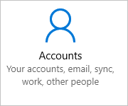

# Set up Azure Active Directory-joined devices

Your organization has asked that if you plan to join your work-owned Windows 10 devices to their network, so you can sign in using your work or school account instead of your personal account, that your device meets specific standards for security and compatibility.

## Join your device to your organization's network
While you are joining your device to your organization's network, the following will happen:

- Windows 10 joins your device to your organization's network.

- You might be asked to set up two-step verification through either [multi-factor authentication](multi-factor-authentication-end-user-first-time.md) or [security info](user-help-security-info-overview.md), depending on what your administrator has set up.

- You'll be automatically enrolled in mobile device management, such as Microsoft Intune, if it's required. For more info about enrolling in Microsoft Intune, see [Enroll your device in Intune](https://docs.microsoft.com/en-us/intune-user-help/enroll-your-device-in-intune-all).

- You'll go through the sign-in process, using either automatic sign-in (if your organization manages your device) or by using your work or school account user name and password (if you manage your own device).

### To join your device to your network

1. Open **Settings**, and then select **Accounts**.

    

2. Select **Access work or school**, and then select **Connect**.

    

3. On the **Set up a work or school account** screen, select **Join this device to Azure Active Directory**.

    

4. On the **Let's get you signed in** screen, type your email address (for example, alain@contoso.com), and then select **Next**.

    

6. On the  **Enter password** dialog, enter your password, and then click **Sign in**.

    

7. On the  **Make sure this is your organization** dialog, click **Join**.

    

8. On the **You're all set** dialog, click **Done**.

    

## Verification

To verify whether a device is joined to an Azure AD, you can review the **Access work or school** dialog on your device.

Alternatively, you can run the following command: `dsregcmd /status`  
On a successfully joined device, **AzureAdJoined** is **Yes**.

You can also review device settings on the Azure AD portal.

For more information, see [locate devices](../devices/device-management-azure-portal.md#locate-devices).

## Next steps

For more information, see: 

- The [introduction to device management in Azure Active Directory](../devices/overview.md)
- [Managing devices using the Azure portal](../devices/device-management-azure-portal.md)

