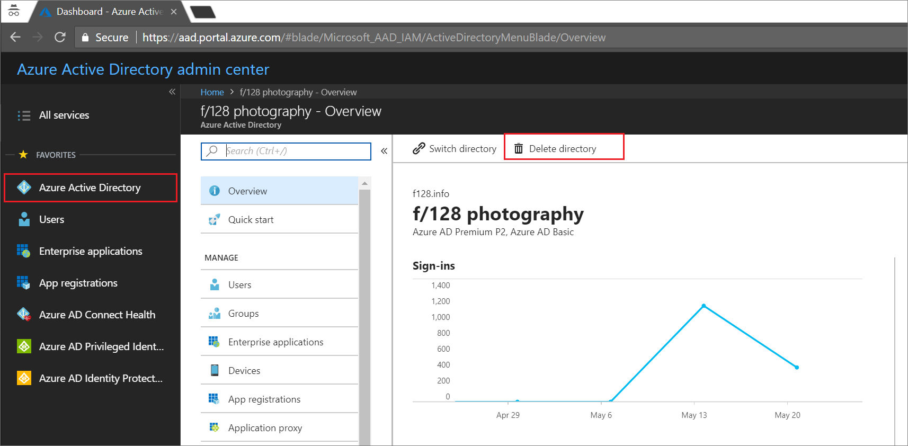
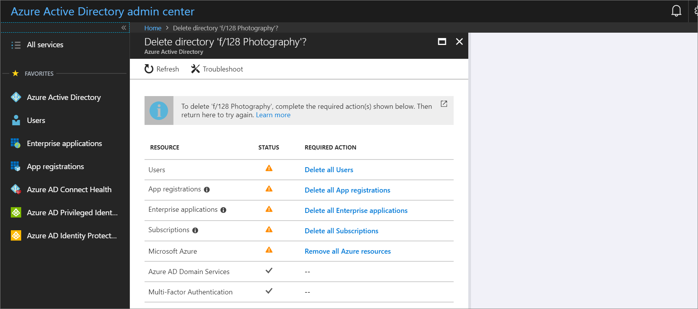

# Delete an Azure Active Directory tenant
When a tenant is deleted, all resources that are contained in the tenant are also deleted. You must prepare the tenant by minimizing its associated resources before you delete. Only an Azure Active Directory (Azure AD) global administrator can delete an Azure AD tenant from the portal.

## Prepare the tenant for deletion

You can't delete a tenant in Azure AD until it passes several checks. These checks reduce risk that deleting a tenant negatively impacts user access, such as the ability to sign in to Office 365 or access resources in Azure. For example, if the tenant associated with a subscription is unintentionally deleted, then users can't access the Azure resources for that subscription. The following explains the conditions that are checked:

* There can be no users in the tenant except one global administrator who is to delete the tenant. Any other users must be deleted before the tenant can be deleted. If users are synchronized from on-premises, then sync must be turned off, and the users must be deleted in the cloud tenant using the Azure portal or Azure PowerShell cmdlets. 
* There can be no applications in the tenant. Any applications must be removed before the tenant can be deleted.
* There can be no multi-factor authentication providers linked to the tenant.
* There can be no subscriptions for any Microsoft Online Services such as Microsoft Azure, Office 365, or Azure AD Premium associated with the tenant. For example, if a default tenant was created for you in Azure, you cannot delete this tenant if your Azure subscription still relies on this tenant for authentication. Similarly, you can't delete a tenant if another user has associated a subscription with it. 

## Delete an Azure AD tenant

1. Sign in to the [Azure AD admin center](https://aad.portal.azure.com) with an account that is the Global Administrator for the tenant.

2. Select **Azure Active Directory**.

3. Switch to the tenant you want to delete.
  
  

4. Select **Delete directory**.
  
  

5. If your tenant does not pass one or more checks, you're provided with a link to more information on how to pass. After you pass all checks, select **Delete** to complete the process.

## I have an expired subscription but I can't delete the tenant

When you configured your Azure Active Directory tenant, you may have also activated license-based subscriptions for your organization like Azure Active Directory Premium P2, Office 365 Business Premium, or Enterprise Mobility + Security E5. These subscriptions block directory deletion until they are fully deleted, to avoid accidental data loss. The subscriptions must be in a **Deprovisioned** state to allow tenant deletion. An **Expired** or **Canceled** subscription moves to the **Disabled** state, and the final stage is the **Deprovisoned** state. 

For what to expect when a trial Office 365 subscription expires (not including paid Partner/CSP, Enterprise Agreement, or Volume Licensing), see the following table. For more information on Office 365 data retention and subscription lifecycle, see [What happens to my data and access when my Office 365 for business subscription ends?](https://support.office.com/article/what-happens-to-my-data-and-access-when-my-office-365-for-business-subscription-ends-4436582f-211a-45ec-b72e-33647f97d8a3). 

Subscription state | Data | Access to data
----- | ----- | -----
Active (30 days for trial)	| Data accessible to all	| <li>Users have normal access to Office 365 files, or apps<li>Admins have normal access to Office 365 admin center and resources 
Expired (30 days)	| Data accessible to all	| <li>Users have normal access to Office 365 files, or apps<li>Admins have normal access to Office 365 admin center and resources
Disabled (30 days) | Data accessible to admin only	| <li>Users can’t access Office 365 files, or apps<li>Admins can access the Office 365 admin center but can’t assign licenses to or update users
Deprovisioned  (30 days after Disabled) | Data deleted (automatically deleted if no other services are in use) | <li>Users can’t access Office 365 files, or apps<li>Admins can access the Office 365 admin center to purchase and manage other subscriptions 

## Delete a subscription in the Microsoft 365 admin center

You can put a subscription into a **Deprovisoned** state to be deleted in 3 days using the Microsoft 365 admin center.

1. Sign in to the [Microsoft 365 admin center](https://admin.microsoft.com) with an account that is a Global Administrator in the tenant. If you are trying to delete the “Contoso” tenant that has the initial default domain contoso.onmicrosoft.com, sign on with a UPN such as admin@contoso.onmicrosoft.com.

2. Go to the **Billing** tab and select **Products and Services**, then choose the subscription you want to cancel. After you click **Cancel**, refresh the page.
  
  
  
3. Select **Delete** to delete the subscription and accept the terms and conditions. All data is permanently deleted within three days. You can reactivate the subscription during the three-day period if you change your mind.
  
  

4. Now the subscription state has changed, the subscription is marked for deletion. The subscription enters the **Deprovisioned** state 72 hours later.

5. Once you have deleted a subscription on your tenant, and 72 hours have elapsed, you can sign back into the Azure AD admin center again and there should be no required action and no subscriptions blocking your tenant deletion. You should be able to successfully delete your Azure AD tenant.
  
  

## Next steps
[Azure Active Directory documentation](https://docs.microsoft.com/azure/active-directory/)
