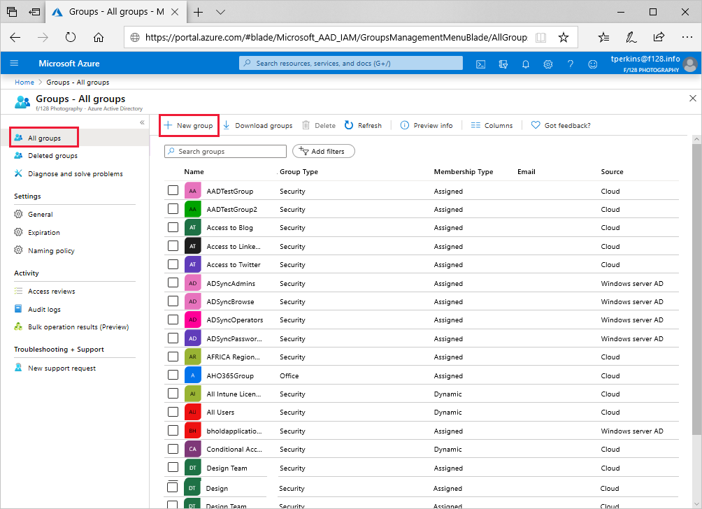
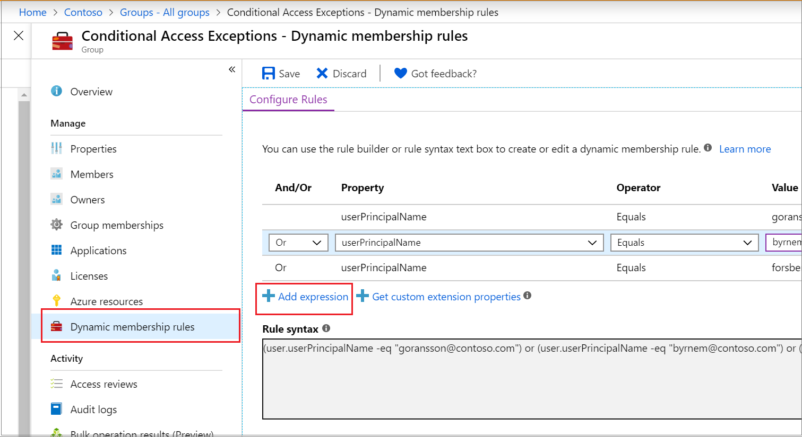

# Create or update a dynamic group in Azure Active Directory

In Azure Active Directory (Azure AD), you can use rules to determine group membership based on user or device properties. This article tells how to set up a rule for a dynamic group in the Azure portal.
Dynamic membership is supported for security groups or Office 365 groups. When a group membership rule is applied, user and device attributes are evaluated for matches with the membership rule. When an attribute changes for a user or device, all dynamic group rules in the organization are processed for membership changes. Users and devices are added or removed if they meet the conditions for a group. Security groups can be used for either devices or users, but Office 365 groups can be only user groups.

## Rule builder in the Azure portal

Azure AD provides a rule builder to create and update your important rules more quickly. The rule builder supports the construction up to five expressions. The rule builder makes it easier to form a rule with a few simple expressions, however, it can't be used to reproduce every rule. If the rule builder doesn't support the rule you want to create, you can use the text box.

Here are some examples of advanced rules or syntax for which we recommend that you construct using the text box:

- Rule with more than five expressions
- The Direct reports rule
- Setting [operator precedence](groups-dynamic-membership.md#operator-precedence)
- [Rules with complex expressions](groups-dynamic-membership.md#rules-with-complex-expressions); for example `(user.proxyAddresses -any (_ -contains "contoso"))`

> [!NOTE]
> The rule builder might not be able to display some rules constructed in the text box. You might see a message when the rule builder is not able to display the rule. The rule builder doesn't change the supported syntax, validation, or processing of dynamic group rules in any way.

For examples of syntax, supported properties, operators, and values for a membership rule, see [Dynamic membership rules for groups in Azure Active Directory](groups-dynamic-membership.md).

## To create a group membership rule

1. Sign in to the [Azure AD admin center](https://aad.portal.azure.com) with an account that is in the Global administrator, Intune administrator, or User administrator role in the tenant.
1. Search for and select **Groups**.
1. Select **All groups**, and select **New group**.

   

1. On the **Group** page, enter a name and description for the new group. Select a **Membership type** for either users or devices, and then select **Add dynamic query**. The rule builder supports up to five expressions. To add more than five expressions, you must use the text box.

   

1. To see the custom extension properties available for your membership query:
   1. Select **Get custom extension properties**
   1. Enter the application ID, and then select **Refresh properties**.
1. After creating the rule, select **Save**.
1. Select **Create** on the **New group** page to create the group.

If the rule you entered isn't valid, an explanation of why the rule couldn't be processed is displayed in an Azure notification in the portal. Read it carefully to understand how to fix the rule.

## To update an existing rule

1. Sign in to the [Azure AD admin center](https://aad.portal.azure.com) with an account that is in the Global administrator, Group administrator, Intune administrator, or User administrator role in the tenant.
1. Select **Groups** > **All groups**.
1. Select a group to open its profile.
1. On the profile page for the group, select **Dynamic membership rules**. The rule builder supports up to five expressions. To add more than five expressions, you must use the text box.

   

1. To see the custom extension properties available for your membership rule:
   1. Select **Get custom extension properties**
   1. Enter the application ID, and then select **Refresh properties**.
1. After updating the rule, select **Save**.

## Turn on or off welcome email

When a new Office 365 group is created, a welcome email notification is sent the users who are added to the group. Later, if any attributes of a user or device change, all dynamic group rules in the organization are processed for membership changes. Users who are added then also receive the welcome notification. You can turn off this behavior in [Exchange PowerShell](https://docs.microsoft.com/powershell/module/exchange/users-and-groups/Set-UnifiedGroup?view=exchange-ps).

## Check processing status for a rule

You can see the membership processing status and the last updated date on the **Overview** page for the group.
  
  

The following status messages can be shown for **Membership processing** status:

- **Evaluating**:  The group change has been received and the updates are being evaluated.
- **Processing**: Updates are being processed.
- **Update complete**: Processing has completed and all applicable updates have been made.
- **Processing error**:  Processing couldn't be completed because of an error evaluating the membership rule.
- **Update paused**: Dynamic membership rule updates have been paused by the administrator. MembershipRuleProcessingState is set to “Paused”.

The following status messages can be shown for **Membership last updated** status:

- &lt;**Date and time**&gt;: The last time the membership was updated.
- **In Progress**: Updates are currently in progress.
- **Unknown**: The last update time can't be retrieved. The group might be new.

If an error occurs while processing the membership rule for a specific group, an alert is shown on the top of the **Overview page** for the group. If no pending dynamic membership updates can be processed for all the groups within the tenant for more than 24 hours, an alert is shown on the top of **All groups**.

These articles provide additional information on groups in Azure Active Directory.

- [See existing groups](../fundamentals/active-directory-groups-view-azure-portal.md)
- [Create a new group and adding members](../fundamentals/active-directory-groups-create-azure-portal.md)
- [Manage settings of a group](../fundamentals/active-directory-groups-settings-azure-portal.md)
- [Manage memberships of a group](../fundamentals/active-directory-groups-membership-azure-portal.md)
- [Manage dynamic rules for users in a group](groups-dynamic-membership.md)
