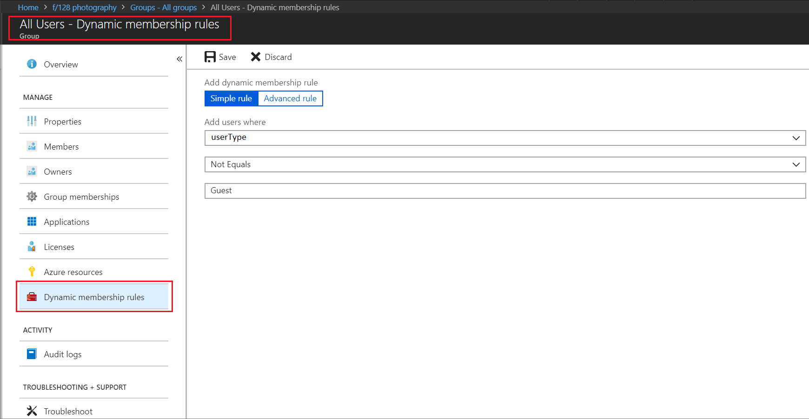

# Tutorial: Add or remove group members automatically

In Azure Active Directory (Azure AD), you can automatically add or remove to security groups or Office 365 groups, so you don't have to do it manually. Whenever any properties of a user or device change, Azure AD evaluates all dynamic group rules in your tenant to see if the change should add or remove members.

In this tutorial, you learn how to:
> [!div class="checklist"]
> * Create an automatically populated group of guest users from a particular partner company
> * Assign licenses to the group for the partner-specific features for guest users to access
> * Bonus: secure the **All users** group by removing guest users so that, for example, you can give your member users access to internal-only sites

If you don't have an Azure subscription, [create a free account](https://azure.microsoft.com/free/) before you begin.

## Prerequisites

This feature requires one Azure AD Premium license for you as the gobal administrator of the tenant. If you don't have one, in Azure AD, select **Licenses** > **Products** > **Try/Buy**.

You're not required to assign licenses to the users for them to be members in dynamic groups. You only need the minimum number of available Azure AD Premium P1 licenses in the tenant to cover all such users. 

## Create a group of guest users

First, you'll create a group for your guest users who all are from a single partner company. They need special licensing, so it's often more efficient to create a group for this purpose.

1. Sign in to the Azure portal (https://portal.azure.com) with an account that is the gobal administrator for your tenant.
2. Select **Azure Active Directory** > **Groups** > **New group**.
  
3. On the **Group** blade:
  
  * Select **Security** as the group type
  * Enter `Guest users Contoso` as the name and description for the group
  * Change **Membership type** to **Dynamic User**
  * Select **Add dynamic query**
  
4. Select **Advanced rule**, and in the **Advanced rule** box, enter:
  `(user.userType -eq "Guest") -and (user.companyName -eq "Contoso")`
5. Select **Add query** to close the blade.
6. On the **Group** blade, select **Create** to create the group.

## Assign licenses

Now that you have your new group, you can apply the licenses that these partner users need.

1. In Azure AD, select **Licenses**, select one or more licenses, and then select **Assign**.
2. Select **Users and groups**, and select the **Guest users Contoso** group, and save your changes.
3. **Assignment options** allow you to turn on or off the service plans included the licenses that you selected. When you make a change, be sure to click **OK** to save your changes.
4. To complete the assignment, on the **Assign license** pane, click **Assign** at the bottom of the pane.

## Remove guests from All users group

Perhaps your ultimate administrative plan is to assign all of your guest users to their own groups by company. You can also now change the **All users** group so that it is reserved for only members users in your tenant. Then you can use it to assign apps and licenses that are specific to your home organization.

   

## Clean up resources

**To remove the guest users group**

1. Sign in to the [Azure portal](https://portal.azure.com) with an account that is the Global Administrator for your tenant.
2. Select **Azure Active Directory** > **Groups**. Select the **Guest users Contoso** group, select the ellipsis (...), and then select **Delete**. When you delete the group, any assigned licenses are removed.

**To restore the All Users group**
1. Select **Azure Active Directory** > **Groups**. Select the name of the **All users** group to open the group.
1. Select **Dynamic membership rules**, clear all the text in the rule, and select **Save**.

## Next steps

In this tutorial, you learned how to:
> [!div class="checklist"]
> * Create a group of guest users
> * Assign licenses to your new group
> * Change All users group to members only

Advance to the next article to learn more group-based licensing basics
> [!div class="nextstepaction"]
> [Group licensing basics](../fundamentals/active-directory-licensing-whatis-azure-portal.md)

