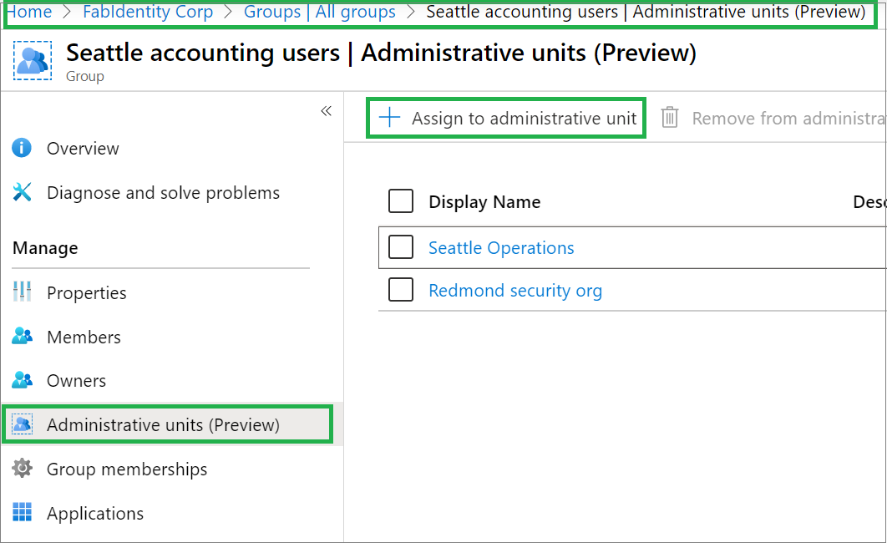
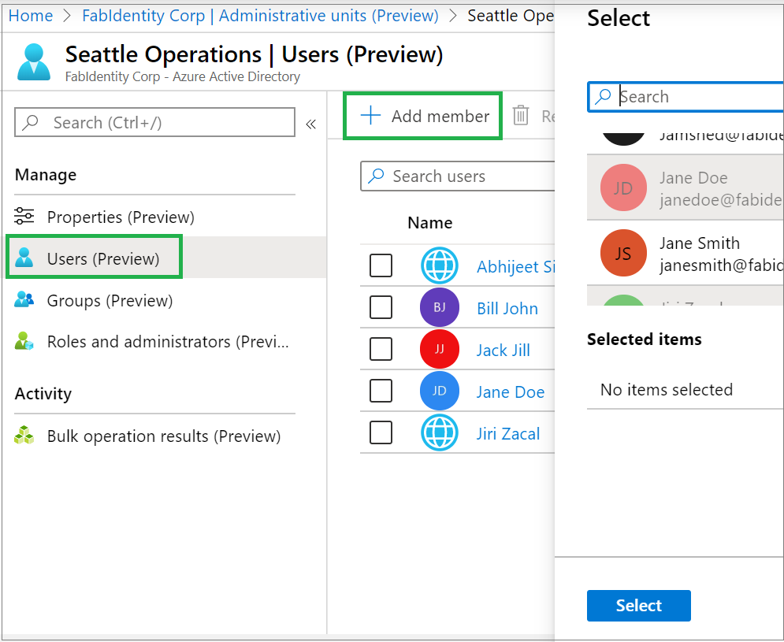
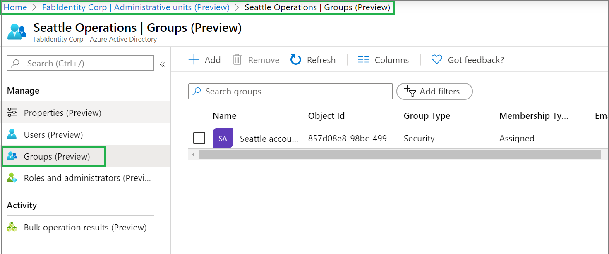
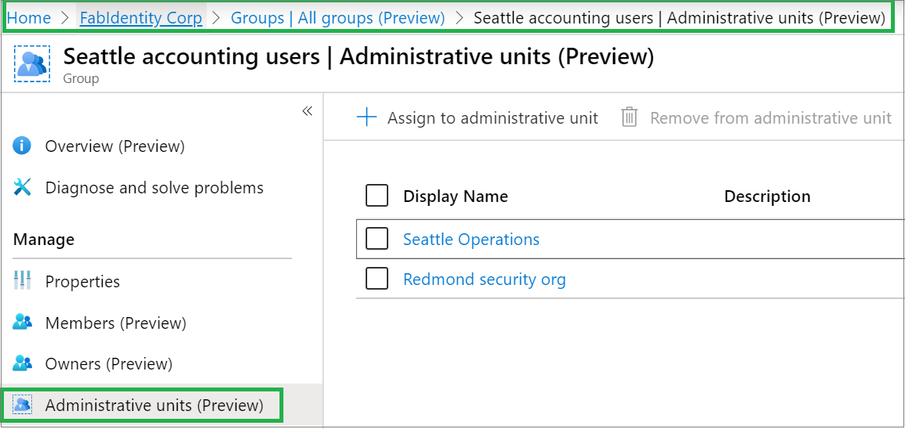
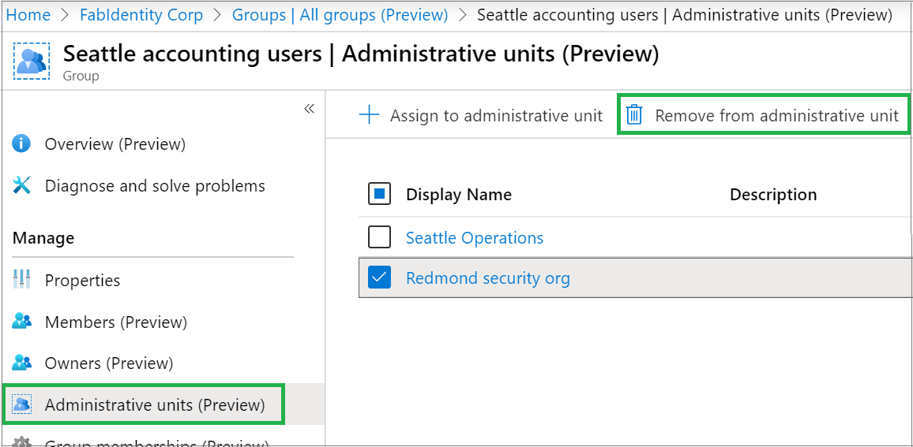

# Add and manage groups in administrative units in Azure Active Directory

In Azure Active Directory (Azure AD), you can add groups to an administrative unit (AU) for more granular administrative scope of control.

For steps to prepare to use PowerShell and Microsoft Graph for administrative unit management, see [Getting started](roles-aus-manage-admin-units.md#getting-started).

## Add groups to an AU

### Azure portal

In the preview, you can assign groups only individually to an administrative unit. There is no option of bulk assignment of groups to an administrative unit. You can assign a group to an administrative unit in one of the two ways in portal:

1. From the **Azure AD > Groups** page

    Open the Groups overview page in Azure AD and select the group that needs to be assigned to the administrative unit. On the left side, select **Administrative units** to list out the administrative units the group is assigned to. On the top you will find the option Assign to administrative unit and clicking on it will give a panel on right side to choose the administrative unit.

    

1. From the **Azure AD > Administrative units > All Groups** page

    Open the All Groups blade in Azure AD > Administrative Units. If there are groups already assigned to the administrative unit, they will be displayed on the right side. Select **Add** on the top and a right panel will slide in listing the groups available in your Azure AD organization. Select one or more groups to be assigned to the administrative units.

    

### PowerShell

    $administrative unitObj = Get-AzureADAdministrativeUnit -Filter "displayname eq 'Test administrative unit 2'"
    $GroupObj = Get-AzureADGroup -Filter "displayname eq 'TestGroup'"
    Add-AzureADAdministrativeUnitMember -ObjectId $administrative unitObj.ObjectId -RefObjectId $GroupObj.ObjectId

In this example, the cmdlet Add-AzureADAdministrativeUnitMember is used to add the group to the administrative unit. The object ID of the administrative unit and the object ID of the group to be added are taken as argument. The highlighted section may be changed as required for the specific environment.

### Microsoft Graph

    Http request
    POST /administrativeUnits/{Admin Unit id}/members/$ref

    Request body
    {
      "@odata.id":"https://graph.microsoft.com/beta/groups/{id}"
    }

Example:

    {
      "@odata.id":"https://graph.microsoft.com/beta/users/ 871d21ab-6b4e-4d56-b257-ba27827628f3"
    }

## List groups in an AU

### Azure portal

Go to **Azure AD > Administrative units** in the portal. Select the administrative unit for which you want to list the users. By default, **All users** is selected already on the left panel. Select **All groups** and on the right you will find the list of groups that are members of the selected administrative unit.

### PowerShell

    $administrative unitObj = Get-AzureADAdministrativeUnit -Filter "displayname eq 'Test administrative unit 2'"
    Get-AzureADAdministrativeUnitMember -ObjectId $administrative unitObj.ObjectId

This will help you get all the members of the administrative unit. If you want to display all the groups that are members of the administrative unit, you can use the below code snippet:

    foreach ($member in (Get-AzureADAdministrativeUnitMember -ObjectId $administrative unitObj.ObjectId)) 
    {
    if($member.ObjectType -eq "Group")
    {
    Get-AzureADGroup -ObjectId $member.ObjectId
    }
    }

### Microsoft Graph

    HTTP request
    GET /administrativeUnits/{Admin id}/members/$/microsoft.graph.group
    Request body
    {}

## List AUs for a group

### Azure portal

In the Azure AD portal, you can open a group's details by opening **Groups**. Select a group to open the group's profile. Select **Administrative units** to list all the administrative units where the group is a member.

### PowerShell

    Get-AzureADAdministrativeUnit | where { Get-AzureADAdministrativeUnitMember -ObjectId $_.ObjectId | where {$_.ObjectId -eq $groupObjId} }

### Microsoft Graph

    https://graph.microsoft.com/beta/groups/<group-id>/memberOf/$/Microsoft.Graph.AdministrativeUnit

## Remove a group from an AU

### Azure portal

There are two ways you can remove a group from an administrative unit in the Azure portal.

Open **Azure AD** > **Groups** and open the profile for group you want to remove from administrative unit. 
Select **Administrative units** in the left panel to list all the administrative units where the group is a member. Select the administrative unit that you want to remove the group from, and then select **Remove from administrative unit**.

Alternatively, you can go to **Azure AD** > **Administrative units** and select the administrative unit where the group is a member. Select **Groups** in the left panel to list the member groups. Select the group to be removed from the administrative unit and then select **Remove groups**.

(au_remove_group.png)

### PowerShell

    Remove-AzureADAdministrativeUnitMember -ObjectId $auId -MemberId $memberGroupObjId

### Microsoft Graph

    https://graph.microsoft.com/beta/administrativeUnits/<adminunit-id>/members/<group-id>/$ref

## Next steps

- [Assign a role to an administrative unit](roles-aus-assign-roles.md)
- [Manage users in an administrative unit](roles-aus-add-manage-users.md)
