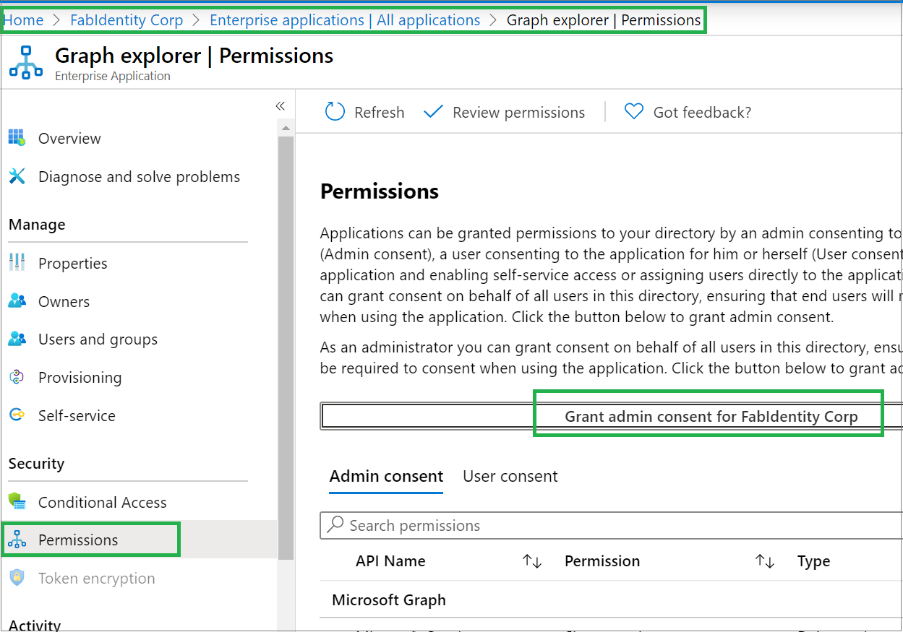
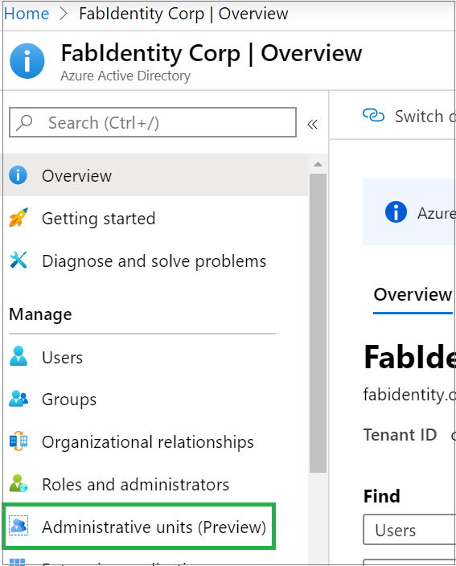
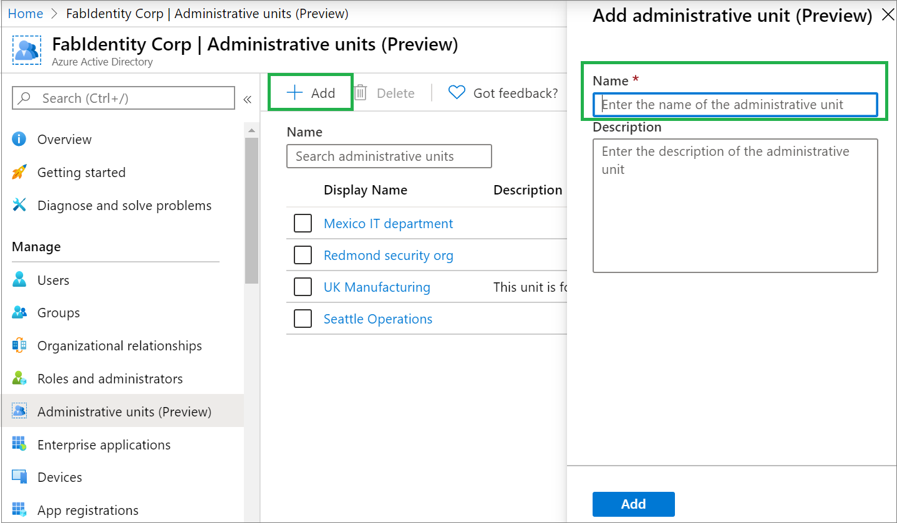
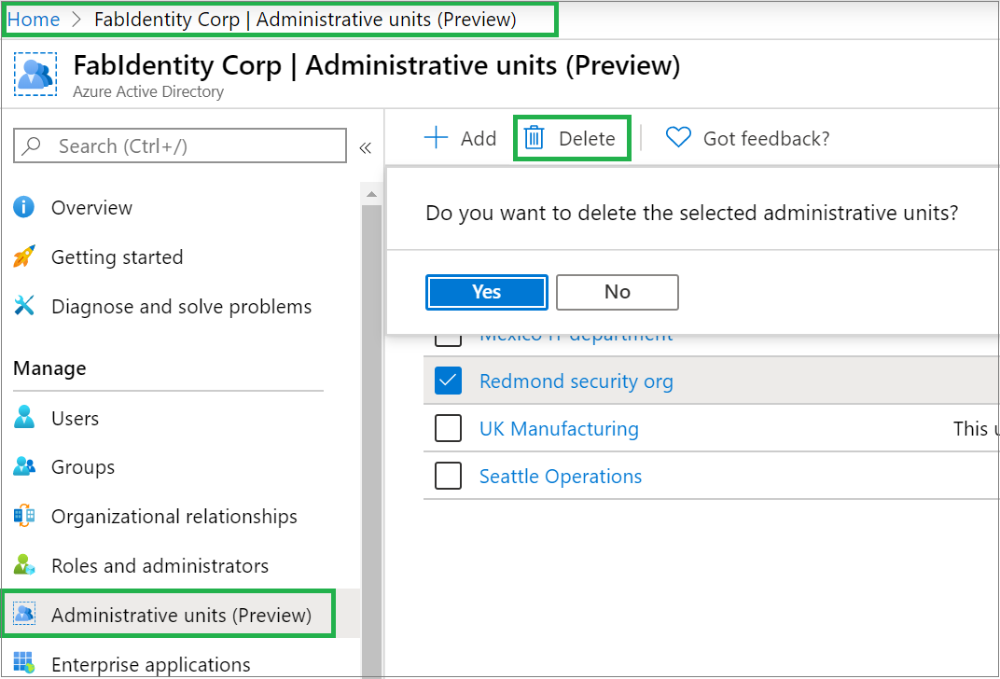

# Manage administrative units in Azure Active Directory

For more granular administrative control in Azure Active Directory (Azure AD), you can assign users to an Azure AD role with a scope limited to one or more administrative units (AUs).

## Getting started

1. To run queries from the following instructions via [Graph Explorer](https://aka.ms/ge), please ensure the following:

    1. Go to Azure AD in the portal, and then in the applications select Graph Explorer and provide admin consent to Graph Explorer.

        

    1. In the Graph Explorer, ensure that you select the beta version.

        

1. Please use the preview version of Azure AD PowerShell. Detailed instructions are here.

## Add an administrative unit

### Azure portal

1. Go to Active Directory in the portal and select Administrative Units in the left panel.

    

1. Select **Add*** and provide the name of the administrative unit and optionally can add a description for the administrative unit.

    

1. Select **Add** to finalize the administrative unit.

### PowerShell

Install Azure AD PowerShell (preview version) before trying to perform the actions below:

    Connect-AzureAD
    New-AzureADAdministrativeUnit -Description "West Coast region" -DisplayName "West Coast"

The values highlighted above can be modified as required.

### The Microsoft Graph

    Http Request
    POST /administrativeUnits
    Request body
    {
        "displayName": "North America Operations",
        "description": "North America Operations administration"
    }

## Remove an administrative unit

In Azure Active Directory (Azure AD), you can remove an admin unit that you no longer need as a unit of scope for administrative roles.

### Azure portal

Go to **Azure AD > Administrative units** in the portal. Select the administrative unit to be deleted and then select **Delete**. After confirming **Yes**, the administrative unit will be deleted.

### PowerShell

    $delau = Get-AzureADAdministrativeUnit -Filter "displayname eq 'DeleteMe Admin Unit'"
    Remove-AzureADAdministrativeUnit -ObjectId $delau.ObjectId

The highlighted section may be changed as required for the specific environment.

### Graph API

    HTTP request
    DELETE /administrativeUnits/{Admin id}
    Request body
    {}

## Next steps

[Managing users in administrative unit]()
[Managing groups in administrative unit]()
