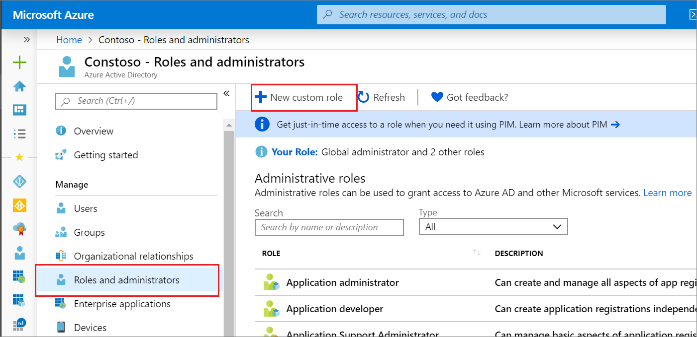

# Create a custom role and assign a resource scope in Azure Active Directory

This article describes how to create new custom roles in Azure Active Directory (Azure AD). Custom roles can be created in the **Roles and administrators** tab on the Azure AD overview page or [the application registration page](https://portal.azure.com/?Microsoft_AAD_IAM_enableCustomRoleManagement=true&Microsoft_AAD_IAM_enableCustomRoleAssignment=true&feature.rbacv2roles=true&feature.rbacv2=true&Microsoft_AAD_RegisteredApps=demo#blade/Microsoft_AAD_IAM/ActiveDirectoryMenuBlade/RegisteredAppsPreview). The role can be assigned either at the directory-level scope or scoped to app registrations only.

For more information, see the [custom roles overview](roles-custom-overview.md) for the basics of custom roles.

## Using the Azure AD portal

### Create a new custom role to grant access to manage app registrations

1. Sign in to the [Azure AD admin center](https://aad.portal.azure.com) with Privileged role administrator or Global administrator permissions in the Azure AD organization.
1. Select **Azure Active Directory** > **Roles and administrators** > **New custom role**.

    

1. On the **Basics** tab, provide a name and description for the role.

    

1. To select the permissions necessary to manage app registration credentials and basic properties such as name:
    1. Enter "credentials" in the search bar and select the `microsoft.directory/applications/credentials/update` permission.

      

    1. Enter "basic" in the search bar, select the `microsoft.directory/applications/basic/update` permission, and then click **Next**.
1. On the **Review + create** tab, review the permissions and select **Create**.

Your custom role will show up in the list of available roles to assign.

## Assign a role scoped to a resource

Like built-in roles, custom roles can be assigned at default organization scope to grant access over all app registrations. But custom roles can also be assigned at object scope. This allows you to give the assignee the permission to update credentials and basic properties of a single app without having to create a second custom role.

1. Sign in to the [Azure AD admin center](https://aad.portal.azure.com) with Application developer permissions in the Azure AD organization.
1. Select **App registrations**.
1. Select the app registration to which you are granting access to manage. You might have to select **All applications** to see the complete list of app registrations in your Azure AD organization.

    

1. In the app registration, select **Roles and administrators**. If you haven't already created one, instructions are in the [preceding procedure](#create-a-new-custom-role-to-grant-access-to-manage-app-registrations).

    If you assign this role from the context of an open app registration, then the assignee has permissions on that single app registration. The role you're assigning shows up in the list on every app registration. This access model, where an owner can be assigned permission to specific Azure AD resources by roles, is similar to the model used in [Azure RBAC](../../role-based-access-control/overview.md) for Azure resource access control.

1. Select the role to open the **Assignments** page.
1. Select **Add assignment** to add a user. The user won't be granted any permissions over any app registration other than the selected one.

## Create a custom role using Azure AD PowerShell

### Prepare PowerShell

First, you must [download the Azure AD PowerShell module](https://www.powershellgallery.com/packages/AzureAD/).

To install the Azure AD PowerShell module, use the following commands:

``` PowerShell
install-module azureadpreview
import-module azureadpreview
```

To verify that the module is ready to use, use the following command:

``` PowerShell
get-module azuread
  ModuleType Version      Name                         ExportedCommands
  ---------- ---------    ----                         ----------------
  Binary     2.0.0.115    azuread                      {Add-AzureADAdministrati...}
```

### Create the custom role

Create a new role using the following PowerShell script:

``` PowerShell
# Basic role information
$description = "Application Support Administrator"
$displayName = "Can manage basic aspects of application registrations."
$templateId = (New-Guid).Guid

# Set of permissions to grant
$allowedResourceAction =
@(
    "microsoft.directory/applications/allProperties/read",
    "microsoft.directory/applications/basic/update",
    "microsoft.directory/applications/credentials/update"
)
$resourceActions = @{'allowedResourceActions'= $allowedResourceAction}
$rolePermission = @{'resourceActions' = $resourceActions}
$rolePermissions = $rolePermission

# Create new custom admin role
$customAdmin = New-AzureAdRoleDefinition -RolePermissions $rolePermissions -DisplayName $displayName -Description $description -TemplateId $templateId -IsEnabled $true
```

## Create a custom role using Microsoft Graph API

1. Create the role definition.

    HTTP request to create a custom role definition.

    POST

    ``` HTTP
    https://graph.microsoft.com/beta/roleManagement/directory/roleDefinitions
    ```

    Body

    ``` HTTP
    {
    "description":"Can manage basic aspects of application registrations.",
    "displayName":"Application Support Administrator",
    "isEnabled":true,
    "rolePermissions":
    [
        {
            "resourceActions":
            {
                "allowedResourceActions":
                [
                    "microsoft.directory/applications/basic/update",
                    "microsoft.directory/applications/credentials/update"
                ]
            },
            "condition":null
        }
    ],
    "templateId":"<GET NEW GUID AND INSERT HERE>",
    "version":"1"
    }
    ```

1. Create the role assignment.

    HTTP request to create a custom role definition.

    POST

    ``` HTTP
    https://graph.microsoft.com/beta/roleManagement/directory/roleDefinitions/roleAssignments
    ```

    Body

    ``` HTTP
    {
    "principalId":"<GUID OF USER>",
    "roleDefinitionId":"<GUID OF ROLE DEFINITION>",
    "resourceScopes":["/<GUID OF APPLICATION REGISTRATION>"]
    }
    ```

## Next steps

- Feel free to share with us on the [Azure AD administrative roles forum](https://feedback.azure.com/forums/169401-azure-active-directory?category_id=166032).
- For more about roles and Administrator role assignment, see [Assign administrator roles](directory-assign-admin-roles.md).
- For default user permissions, see a [comparison of default guest and member user permissions](../fundamentals/users-default-permissions.md).
