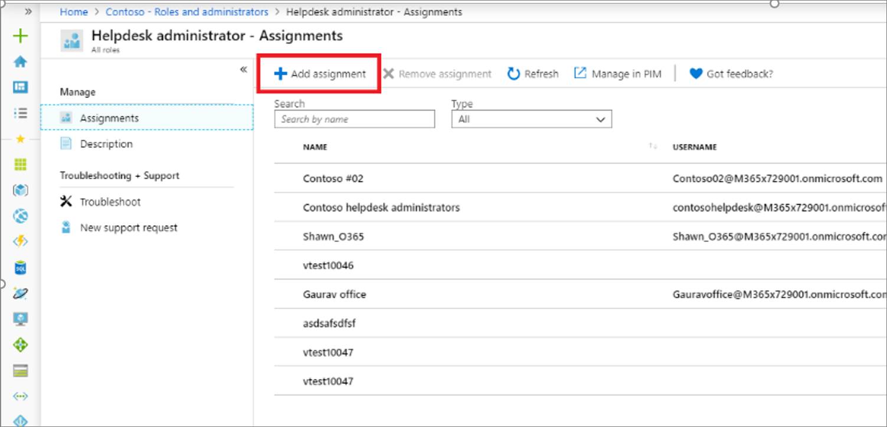
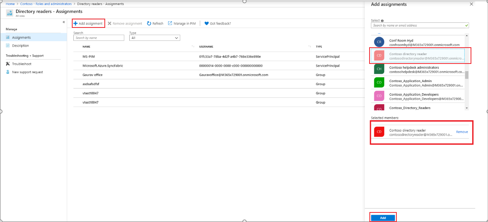

# Assign a role to a cloud group in Azure Active Directory

This section describes how an IT admin can assign Azure Active Directory (Azure AD) role to an Azure AD group.

## Using Azure AD admin center

Assigning a group to an Azure AD role is similar to assigning users and service principals with one difference: Only groups that are assignable (that is, created with "Azure AD roles can be assigned to the group" selected) are shown in the menu.

1. Sign in to the [Azure AD admin center](https://portal.azure.com/#blade/Microsoft_AAD_IAM/ActiveDirectoryMenuBlade/Overview) with Privileged role administrator or Global administrator permissions in the Azure AD organization.

1. Select **Azure Active Directory** > **Roles and administrators**, and select the role you want to assign.

1. On the ***role name*** page, select > **Add assignment**.

   

1. Select the group. Only the groups that can be assigned to Azure AD roles are displayed.

    

1. Select **Add**.

For more information on assigning role permissions, see [Assign administrator and non-administrator roles to users](../fundamentals/active-directory-users-assign-role-azure-portal.md).

## Using PowerShell

### Create a group that can be assigned to role

    $group = New-AzureADMSGroup -DisplayName "Contoso_Helpdesk_Administrators" -Description "This group is assigned to Helpdesk Administrator built-in role in Azure AD." -MailEnabled $true -SecurityEnabled $true -MailNickName "contosohelpdeskadministrators" -IsAssignableToRole $true 

### Get the role definition for the role you want to assign

    $roleDefinition = Get-AzureADMSRoleDefinition -Filter "displayName eq 'Helpdesk Administrator'" 

### Create a role assignment

    $roleAssignment = New-AzureADMSRoleAssignment -ResourceScope '/' -RoleDefinitionId $roleDefinition.Id -PrincipalId $group.Id 

## Using Microsoft Graph API

### Create a group that can be assigned Azure AD role

    POST https://graph.microsoft.com/beta/groups 
    { 
    "description": "This group is assigned to Helpdesk Administrator built-in role of Azure AD.", 
    "displayName": "Contoso_Helpdesk_Administrators", 
    "groupTypes": [ 
    "Unified" 
    ], 
    "mailEnabled": true, 
    "securityEnabled": true 
    "mailNickname": "contosohelpdeskadministrators", 
    "isAssignableToRole": true, 
    } 

### Get the role definition

    GET https://graph.microsoft.com/beta/roleManagement/directory/roleDefinitions?$filter = displayName eq ‘Helpdesk Administrator’ 

### Create the role assignment

    POST https://graph.microsoft.com/beta/roleManagement/directory/roleAssignments 
    { 
    "principalId":"<Object Id of Group>", 
    "roleDefinitionId":"<Id of role definition>", 
    "resourceScope":"/" 
    } 

## Next steps

- [Use cloud groups to manage role assignments](roles-groups-concept.md)
- [Troubleshooting roles assigned to cloud groups](roles-groups-faq-troubleshooting.md)
