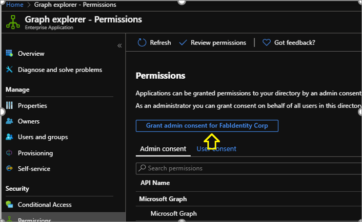
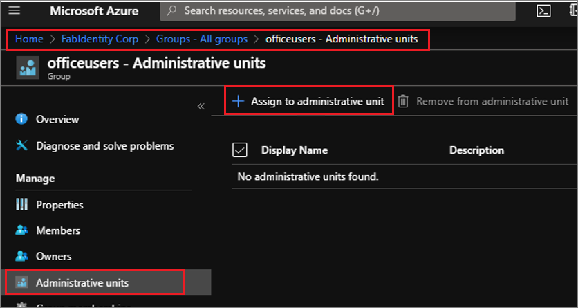

# Add groups to administrative units in Azure AD

In Azure Active Directory (Azure AD), you can add groups to an administrative unit for more granular administrative scope of control.

## Getting started

1. To run queries from the following instructions via [Graph Explorer](https://aka.ms/ge), please ensure the following:

    1. Go to Azure AD in the portal, and then in the applications select Graph Explorer and provide admin consent to Graph Explorer.

        

    1. In the Graph Explorer, ensure that you select the beta version.

        

1. Please use the preview version of Azure AD PowerShell. Detailed instructions are here.

## Azure portal

In the preview, you can assign groups only individually to an administrative unit. There is no option of bulk assignment of groups to an administrative unit. You can assign a group to an administrative unit in one of the two ways in portal:

1. From the **Azure AD > Groups** page

    Open the Groups overview page in Azure AD and select the group that needs to be assigned to the administrative unit. On the left side, select **Administrative units** to list out the administrative units the group is assigned to. On the top you will find the option Assign to administrative unit and clicking on it will give a panel on right side to choose the administrative unit.

    

1. From the **Azure AD > Administrative units > All Groups** page

    Open the All Groups blade in Azure AD > Administrative Units. If there are groups already assigned to the administrative unit, they will be displayed on the right side. Select **Add** on the top and a right panel will slide in listing the groups available in your Azure AD organization. Select one or more groups to be assigned to the administrative units.

    

## PowerShell

    $administrative unitObj = Get-AzureADAdministrativeUnit -Filter "displayname eq 'Test administrative unit 2'"
    $GroupObj = Get-AzureADGroup -Filter "displayname eq 'TestGroup'"
    Add-AzureADAdministrativeUnitMember -ObjectId $administrative unitObj.ObjectId -RefObjectId $GroupObj.ObjectId

In this example, the cmdlet Add-AzureADAdministrativeUnitMember is used to add the group to the administrative unit. The object ID of the Administrative Unit to which user is to be added and the object ID of the group which needs to be added are taken as argument. The highlighted section may be changed as required for the specific environment.

## Graph API

    Http request
    POST /administrativeUnits/{Admin Unit id}/members/$ref

    Request body
    {
      "@odata.id":"https://graph.microsoft.com/beta/groups/{id}"
    }

Example:

    {
      "@odata.id":"https://graph.microsoft.com/beta/users/ 871d21ab-6b4e-4d56-b257-ba27827628f3"
    }

## Next steps

- [Add users to an administrative unit](roles-scope-add-users.md)
