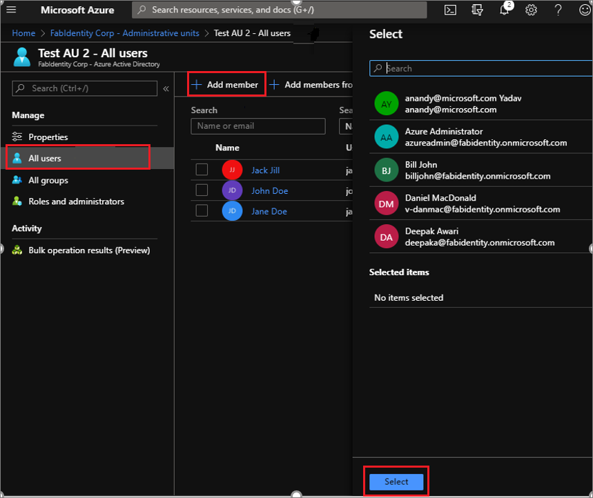
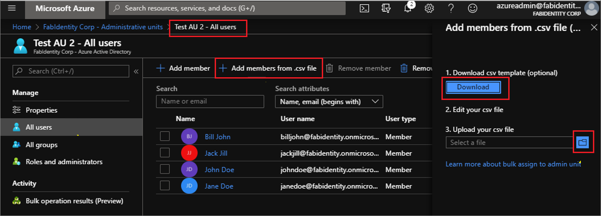

# Add users to an administrative unit in Azure Active Directory

In Azure Active Directory (Azure AD), you can add users to an administrative unit for more granular administrative scope of control.

## Getting started

1. To run queries from the following instructions via [Graph Explorer](https://aka.ms/ge), please ensure the following:

    1. Go to Azure AD in the portal, and then in the applications select Graph Explorer and provide admin consent to Graph Explorer.

        

    1. In the Graph Explorer, ensure that you select the beta version.

        

1. Please use the preview version of Azure AD PowerShell. Detailed instructions are here.

## Azure portal

You can assign users to administrative units in two ways.

1. Individual assignment

    1. You can go to the Azure AD in the portal and select Users and select the user to be assigned to an administrative unit. You can then select Administrative units in the left panel. The user can be assigned to one or more administrative units by clicking on Assign to administrative unit and selecting the administrative units to which the user needs to be assigned.

       

    1. You can go to Azure AD in the portal and select Administrative units in the left pane and then select the administrative unit in which the users need to be assigned. Select All users on the left pane and then select Add member. You can then go ahead and select one or more users to be assigned to the administrative unit from the right pane.

        

1. Bulk assignment
    Go to Azure AD in the portal and select Administrative units. Select the administrative unit in which users need to be added. Proceed by clicking on All users -> Add members from .csv file. You can then download the CSV template and edit the file. The format is simple and needs a single UPN to be added in each line. Once the file is ready, save it at an appropriate location and then upload it in step 3 as highlighted in the snapshot.

        

## PowerShell

    $administrative unitObj = Get-AzureADAdministrativeUnit -Filter "displayname eq 'Test administrative unit 2'"
    $UserObj = Get-AzureADUser -Filter "UserPrincipalName eq 'billjohn@fabidentity.onmicrosoft.com'"
    Add-AzureADAdministrativeUnitMember -ObjectId $administrative unitObj.ObjectId -RefObjectId $UserObj.ObjectId

In the above example, the cmdlet Add-AzureADAdministrativeUnitMember is used to add the user to the administrative unit. The object ID of the Administrative Unit to which user is to be added and the object ID of the user which needs to be added are taken as argument. The highlighted section may be changed as required for the specific environment.

## The Microsoft Graph

    Http request
    POST /administrativeUnits/{Admin Unit id}/members/$ref
    Request body
    {
      "@odata.id":"https://graph.microsoft.com/beta/users/{id}"
    }

Example:

    {
      "@odata.id":"https://graph.microsoft.com/beta/users/johndoe@fabidentity.com"
    }

## Next steps

- [Add groups to an administrative unit](roles-scope-add-groups.md)
