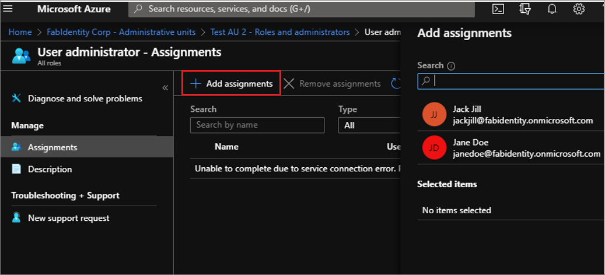

# Assign a role with AU scope

In Azure Active Directory (Azure AD), you can assign users to an Azure AD role with a scope limited to one or more administrative units for more granular administrative control.

## Getting started

1. To run queries from the following instructions via [Graph Explorer](https://aka.ms/ge), please ensure the following:

    1. Go to Azure AD in the portal, and then in the applications select Graph Explorer and provide admin consent to Graph Explorer.

        

    1. In the Graph Explorer, ensure that you select the beta version.

        

1. Please use the preview version of Azure AD PowerShell. Detailed instructions are here.

## Azure portal

Go to **Azure AD > Administrative** units in the portal. Select the administrative unit over which you want to assign the role to a user. On the left pane, select Roles and administrators to list all the available roles.

Select the role to be assigned and then select **Add assignments**. This will slide open a panel on the right where you can select one or more users to be assigned to the role.

## PowerShell

    $administrative unitObj = Get-AzureADAdministrativeUnit -Filter "displayname eq 'Test administrative unit 2'"
    $AdminUser = Get-AzureADUser -ObjectId 'janedoe@fabidentity.onmicrosoft.com'
    $uaRoleMemberInfo = New-Object -TypeName Microsoft.Open.AzureAD.Model.RoleMemberInfo -Property @{ObjectId = $AdminUser.ObjectId}
    Add-AzureADScopedRoleMembership -RoleObjectId $UserAdminRole.ObjectId -ObjectId $administrative unitObj.ObjectId -RoleMemberInfo  $uaRoleMemberInfo

The highlighted section may be changed as required for the specific environment.

## Graph API

<add info>

## Next steps

- [Review Azure AD admin roles](directory-assign-admin-roles.md)
