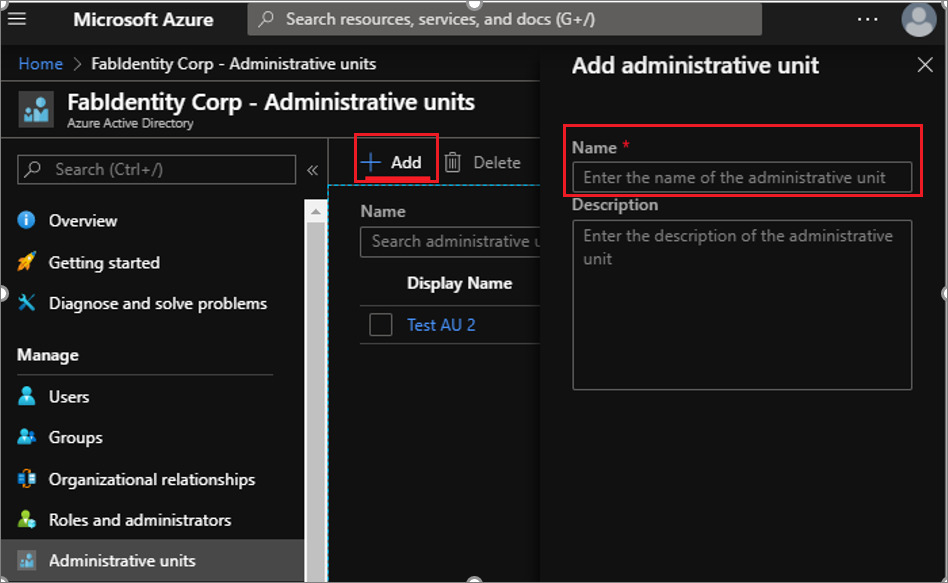

# Create an administrative unit in Azure Active Directory

For more granular administrative control in Azure ACtive Directory (Azure AD), you can assign users to an Azure AD role with a scope limited to one or more administrative units.

## Azure portal

1. Go to Active Directory in the portal and select Administrative Units in the left panel.

    

1. Select **Add*** and provide the name of the administrative unit and optionally can add a description for the administrative unit.

    

1. Select **Add** to finalize the administrative unit.

### PowerShell

Install Azure AD PowerShell (preview version) before trying to perform the actions below:

    Connect-AzureAD
    New-AzureADAdministrativeUnit -Description "West Coast region" -DisplayName "West Coast"

The values highlighted above can be modified as required.

### The Microsoft Graph

    Http Request
    POST /administrativeUnits
    Request body
    {
        "displayName": "North America Operations",
        "description": "North America Operations administration"
    }

## Next steps

- [Administrative unit scope for roles](roles-scope-admin-units.md)
