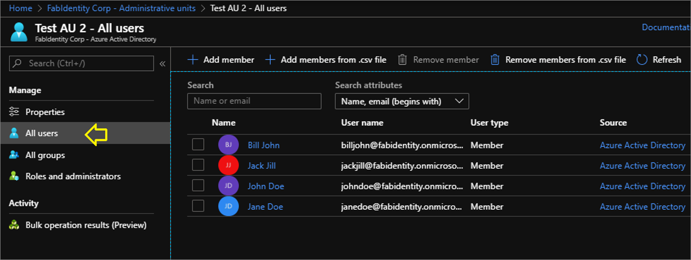

# List users in an administrative unit

## Azure portal

In the portal, there are two ways to list the users in an administrative unit:

1. Users overview page in Azure AD
    Go to **Azure AD > Users** blade. On the right side, you would find a (makeshift) option to select an administrative unit. Select **Choose an administrative unit** and a panel will slide on right. You can now select an administrative unit and the user list will be filtered down to the members of the selected administrative unit.

    

1. Administrative units blade in Azure AD
    Go to **Azure AD > Administrative units** in the portal. Select the administrative unit for which you want to list the users. By default, **All users** is selected already on the left panel and on the right you will find the list of users who are member of the selected administrative unit.

    

## PowerShell

    $administrative unitObj = Get-AzureADAdministrativeUnit -Filter "displayname eq 'Test administrative unit 2'"
    Get-AzureADAdministrativeUnitMember -ObjectId $administrative unitObj.ObjectId

This will help you get all the members of the administrative unit. If you want to display all the users in the administrative unit scope, you can use the below code snippet:

    foreach ($member in (Get-AzureADAdministrativeUnitMember -ObjectId $administrative unitObj.ObjectId)) 
    {
    if($member.ObjectType -eq "User")
    {
    Get-AzureADUser -ObjectId $member.ObjectId
    }
    }

## Graph API

    HTTP request
    GET /administrativeUnits/{Admin id}/members/$/microsoft.graph.user
    Request body
    {}

## Next steps

- [Add users to an administrative unit](roles-scope-add-users.md)
