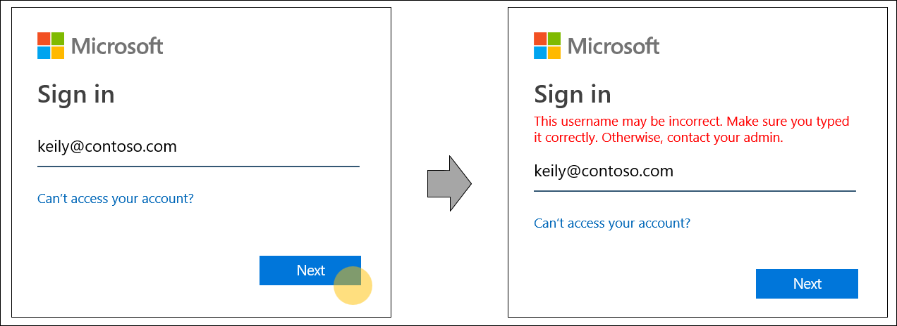
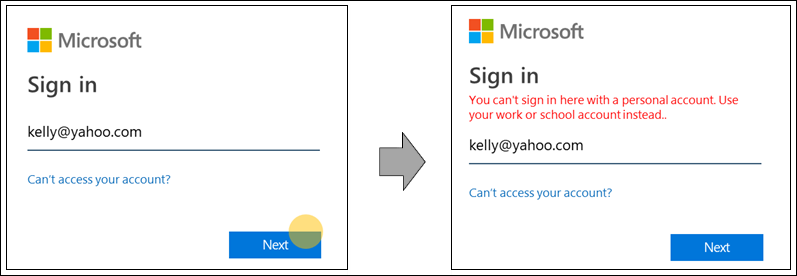

# Home realm discovery for Azure Active directory sign-in pages

We are changing our Azure Active Directory (Azure AD) sign-in behavior to make room for new authentication methods and improve usability. During sign-in, Azure AD determines where a user needs to authenticate. Azure AD makes intelligent decisions by reading organization and user settings for the username entered on the sign-in page. This is a step towards a password-free future that enables additional credentials like FIDO 2.0.

## Home realm discovery behavior

Historically, home realm discovery was governed by the domain that is provided at sign-in or by a Home Realm Discovery policy for some legacy applications. For example, in our discovery behavior an Azure Active Directory user could mistype their username but would still arrive at their organization's credential collection screen. This occurs when the user correctly provides the organization's domain name “contoso.com”. This behavior does not allow the granularity to customize experiences for an individual user.

To support a wider range of credentials and increase usability, Azure Active Directory’s username lookup behavior during the sign-in process is now updated. The new behavior makes intelligent decisions by reading tenant and user level settings based on the username entered on the sign-in page. To make this possible, Azure Active Directory will check to see if the username that is entered on the sign-in page exists in their specified domain or redirects the user to provide their credentials.

An additional benefit of this work is improved error messaging. Here are some examples of the improved error messaging when signing in to an application that supports Azure Active Directory users only.

1. The username is mistyped or the username has not yet been synced to Azure AD:
  
    
  
2. The domain name is mistyped:
  
    
  
3. User tries to sign in with a known consumer domain:
  
    
  
4. The password is mistyped but the username is accurate:  
  
    
  
> [!IMPORTANT]
> This feature will have significant impact on federated domains relying on the old domain level Home Realm Discovery to force federation. Some organizations have trained their employees to sign in with a username that doesn’t exist in Azure Active Directory but contains the proper domain name, because the domain names routes users currently to their organization's domain endpoint. The new sign-in behavior doesn't allow this. The user is notified to correct the user name, and they aren't allowed to sign in with a username that does not exist in Azure Active Directory.
>
> If you or your organization have practices that depend on the old behavior, it is important for organization administrators to update employee sign-in and authentication documentation and to train employees to use their Azure Active Directory username to sign in.
  
If you have concerns with the new behavior, please leave your remarks in the **Feedback** section of this article.  

## Next steps

[Customize your sign-in branding](../fundamentals/add-custom-domain.md)