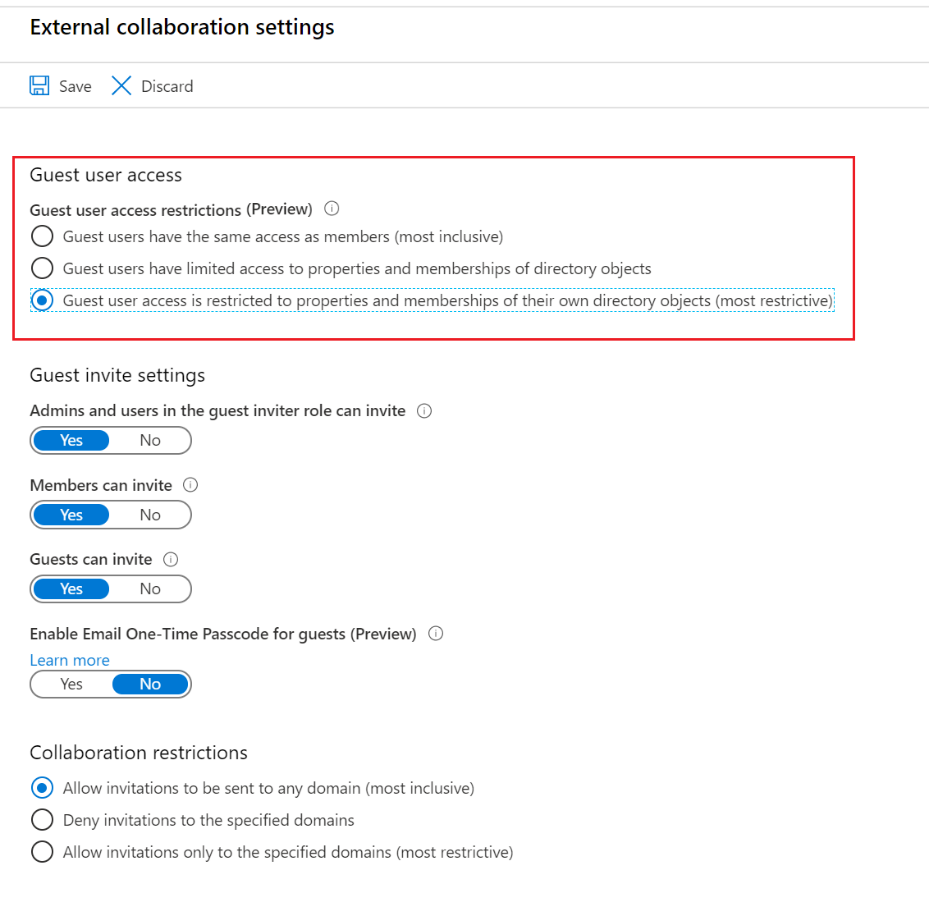

# Restrict guest access permissions (preview) in Azure Active Directory

Azure Active Directory (Azure AD) now allows you to restrict external guest users to view only user and group information within their organization in Azure AD. There's a new guest user access setting in your Azure AD organization's external collaboration settings for even more restricted access, so yur guest access choices now are:

Permission level         | Access level
----------------         | ------------
Same as member users     | Guests have the same access to Azure AD resources as member users
Limited access (default) | Guests can see membership of all non-hidden groups
Restricted access (new)  | Guests can't see membership of any groups

When guest access is restricted, guests can view only their own user profile. Access to other users isn't allowed even if the guest is searching by User Principal Name or objectId. Restricted access also restricts guest users from seeing the membership of groups they're in. For more information about the overall default user permissions, see [What are the default user permissions in Azure Active Directory?](../fundamentals/users-default-permissions.md).

## Permissions and licenses

You must be in the Global Administrator role to configure the external collaboration settings. There are no additional licensing requirements to restrict guest access.

## Update in the Azure portal

We’ve made changes to the existing Azure portal controls for guest user permissions.

1. Sign in to the [Azure AD admin center](https://aad.portal.azure.com) with Global administrator permissions.
1. On the **Azure Active Directory** overview page for your organization, select **User settings**.
1. Under **External users**, select **Manage external collaboration settings**.
1. On the **External collaboration settings** page, select **Guest user access is restricted to properties and memberships of their own directory objects** option.

    

1. Select **Save**. The changes can take up to 15 minutes to take effect for guest users.

## Update with the Microsoft Graph API

We’ve added a new Microsoft Graph API to configure the restricted guest permissions. The following API calls can be made. The value for guestUserRoleId used here is for the new Restricted user setting.
For more information about using the Microsoft Graph to set guest permissions, see [authorizationPolicy resource type](https://docs.microsoft.com/graph/api/resources/authorizationpolicy).

### Configuring for the first time

````PowerShell
POST https://graph.microsoft.com/beta/policies/authorizationPolicy/authorizationPolicy

{
  "guestUserRoleId": "2af84b1e-32c8-42b7-82bc-daa82404023b"
}
````

Response should be Success 204.

### Updating the existing value

````PowerShell
PATCH https://graph.microsoft.com/beta/policies/authorizationPolicy/authorizationPolicy

{
  "guestUserRoleId": "2af84b1e-32c8-42b7-82bc-daa82404023b"
}
````

Response should be Success 204.

### View the current value

````PowerShell
GET https://graph.microsoft.com/beta/policies/authorizationPolicy/authorizationPolicy
````

Example response:

````PowerShell
{
    "@odata.context": "https://graph.microsoft.com/beta/$metadata#policies/authorizationPolicy/$entity",
    "id": "authorizationPolicy",
    "displayName": "Authorization Policy",
    "description": "Used to manage authorization related settings across the company.",
    "enabledPreviewFeatures": [],
    "guestUserRoleId": "10dae51f-b6af-4016-8d66-8c2a99b929b3",
    "permissionGrantPolicyIdsAssignedToDefaultUserRole": [
        "user-default-legacy"
    ]
}
````

## Update with PowerShell cmdlets

With this feature, we’ve added the ability to configure the restricted permissions via PowerShell v2 cmdlets. Get and Set PowerShell cmdlets have been published in version 2.0.2.85.

### Get command: Get-AzureADMSAuthorizationPolicy

Example:

````PowerShell
PS C:\WINDOWS\system32> Get-AzureADMSAuthorizationPolicy

Id                                                : authorizationPolicy
OdataType                                         :
Description                                       : Used to manage authorization related settings across the company.
DisplayName                                       : Authorization Policy
EnabledPreviewFeatures                            : {}
GuestUserRoleId                                   : 10dae51f-b6af-4016-8d66-8c2a99b929b3
PermissionGrantPolicyIdsAssignedToDefaultUserRole : {user-default-legacy}
````

### Set command: Set-AzureADMSAuthorizationPolicy

Example:

````PowerShell
PS C:\WINDOWS\system32> Set-AzureADMSAuthorizationPolicy -GuestUserRoleId '2af84b1e-32c8-42b7-82bc-daa82404023b'
````

> [!NOTE]
> You must enter authorizationPolicy as the ID when requested.

## Supported Microsoft 365 services

### Supported services

By supported we mean that the experience is as expected; specifically, that it is same as current guest experience.

- Teams
- Outlook (OWA)
- SharePoint

### Services currently not supported

Service without current support might have compatibility issues with the new guest restriction setting.

- Planner in Teams
- Planner app
- Project
- Forms

## Frequently Asked Questions

Question | Answer
-------- | ------
Where do these permissions apply? | These directory level permissions are enforced across Azure AD services and portals including the Microsoft Graph, PowerShell v2, the Azure portal, and My Apps portal. Microsoft 365 services leveraging Office 365 groups for collaboration scenarios are also affected, specifically Outlook, Microsoft Teams, and SharePoint.
Which parts of the My Apps portal will this feature affect? | The groups functionality in the My Apps portal will honor these new permissions. This includes all paths to view the groups list and group memberships in My Apps. No changes were made to the group tile availability. The group tile availability is still controlled by the existing group setting in the Azure admin portal.
Do these permissions override SharePoint or Microsoft Teams guest settings? | No. Those existing settings still control the experience and access in those applications. For example, if you see issues in SharePoint, double check your external sharing settings.
Will my existing guest permissions be changed in my tenant? | No changes were made to your current settings. We maintain backward compatibility with your existing settings. You decide when you want make changes.
Will these permissions be set by default? | No. The existing default permissions remain unchanged. You can optionally set the permissions to be more restrictive.
Are there any license requirements for this feature? | No, there are no new licensing requirements with this feature.

## Next steps

- To learn more about existing guest permissions in Azure AD, see [What are the default user permissions in Azure Active Directory?](../fundamentals/users-default-permissions.md).
- To see the Microsoft Graph API methods for restricting guest access, see [authorizationPolicy resource type](https://docs.microsoft.com/graph/api/resources/authorizationpolicy).
- To revoke all access for a user, see [Revoke user access in Azure AD](users-revoke-access.md).
