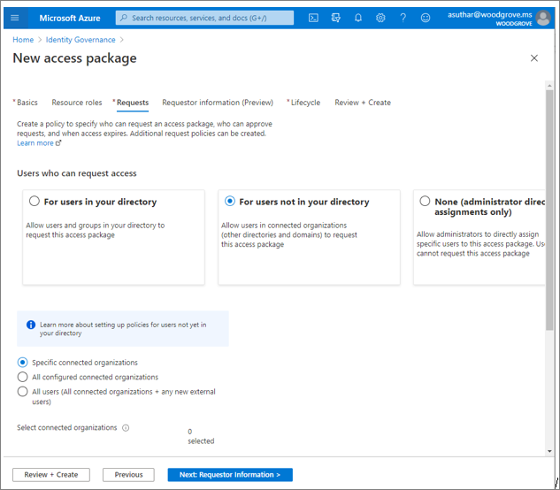

# Discover the current state of external collaboration in your organization

Before you learn about the current state of your external collaboration, determine a security posture. Consider centralized vs. delegated control, also governance, regulatory, and compliance targets.

Learn more: [Determine your security posture for external access with Microsoft Entra ID](1-secure-access-posture.md)

Users in your organization likely collaborate with users from other organizations. Collaboration occurs with productivity applications like Microsoft 365, by email, or sharing resources with external users. These scenarios include users:

* Initiating external collaboration
* Collaborating with external users and organizations
* Granting access to external users

## Before you begin

This article is number 2 in a series of 10 articles. We recommend you review the articles in order. Go to the **Next steps** section to see the entire series.

## Determine who initiates external collaboration

Generally, users seeking external collaboration know the applications to use, and when access ends. Therefore, determine users with delegated permissions to invite external users, create access packages, and complete access reviews.

To find collaborating users:

* Microsoft 365 [Audit log activities](/purview/audit-log-activities?view=o365-worldwide&preserve-view=true) - search for events and discover activities audited in Microsoft 365
* [Auditing and reporting a B2B collaboration user](~/external-id/auditing-and-reporting.md) - verify guest user access, and see records of system and user activities

## Enumerate guest users and organizations

External users might be Microsoft Entra B2B users with partner-managed credentials, or external users with locally provisioned credentials. Typically, these users are the Guest UserType. To learn about inviting guests users and sharing resources, see [B2B collaboration overview](~/external-id/what-is-b2b.md).

You can enumerate guest users with:

* [Microsoft Graph API](/graph/api/user-list?tabs=http)
* [PowerShell](/graph/api/user-list?tabs=http)
* [Azure portal](~/identity/users/users-bulk-download.md)

Use the following tools to identify Microsoft Entra B2B collaboration, external Microsoft Entra tenants, and users accessing applications:

* PowerShell module, [Get MsIdCrossTenantAccessActivity](https://github.com/AzureAD/MSIdentityTools/wiki/Get-MSIDCrossTenantAccessActivity)
* [Cross-tenant access activity workbook](~/identity/monitoring-health/workbook-cross-tenant-access-activity.md)

### Discover email domains and companyName property

You can determine external organizations with the domain names of external user email addresses. This discovery might not be possible with consumer identity providers. We recommend you write the companyName attribute to identify external organizations.

### Use allowlist, blocklist, and entitlement management

Use the allowlist or blocklist to enable your organization to collaborate with, or block, organizations at the tenant level. Control B2B invitations and redemptions regardless of source (such as Microsoft Teams, SharePoint, or the Azure portal). 

See, [Allow or block invitations to B2B users from specific organizations](~/external-id/allow-deny-list.md)

If you use entitlement management, you can confine access packages to a subset of partners with the **Specific connected organizations** option, under New access packages, in Identity Governance.

   

## Determine external user access

With an inventory of external users and organizations, determine the access to grant to the users. You can use the Microsoft Graph API to determine Microsoft Entra group membership or application assignment.

* [Working with groups in Microsoft Graph](/graph/api/resources/groups-overview?context=graph/context&view=graph-rest-1.0&preserve-view=true)
* [Applications API overview](/graph/applications-concept-overview?view=graph-rest-1.0&preserve-view=true)

### Enumerate application permissions

Investigate access to your sensitive apps for awareness about external access. See, [Grant or revoke API permissions programmatically](/graph/permissions-grant-via-msgraph?view=graph-rest-1.0&tabs=http&pivots=grant-application-permissions&preserve-view=true).

### Detect informal sharing

If your email and network plans are enabled, you can investigate content sharing through email or unauthorized software as a service (SaaS) apps. 

* Identify, prevent, and monitor accidental sharing
  * [Learn about data loss prevention](/purview/dlp-learn-about-dlp?view=o365-worldwide&preserve-view=true)
* Identify unauthorized apps
  * [Microsoft Defender for Cloud Apps overview](/defender-cloud-apps/what-is-defender-for-cloud-apps)

## Next steps

Use the following series of articles to learn about securing external access to resources. We recommend you follow the listed order.

1. [Determine your security posture for external access with Microsoft Entra ID](1-secure-access-posture.md)

2. [Discover the current state of external collaboration in your organization](2-secure-access-current-state.md) (You're here)

3. [Create a security plan for external access to resources](3-secure-access-plan.md)

4. [Secure external access with groups in Microsoft Entra ID and Microsoft 365](4-secure-access-groups.md)

5. [Transition to governed collaboration with Microsoft Entra B2B collaboration](5-secure-access-b2b.md)

6. [Manage external access with Microsoft Entra entitlement management](6-secure-access-entitlement-managment.md)

7. [Manage external access to resources with Conditional Access policies](7-secure-access-conditional-access.md)

8. [Control external access to resources in Microsoft Entra ID with sensitivity labels](8-secure-access-sensitivity-labels.md) 

9. [Secure external access to Microsoft Teams, SharePoint, and OneDrive for Business with Microsoft Entra ID](9-secure-access-teams-sharepoint.md) 

10. [Convert local guest accounts to Microsoft Entra B2B guest accounts](10-secure-local-guest.md)
