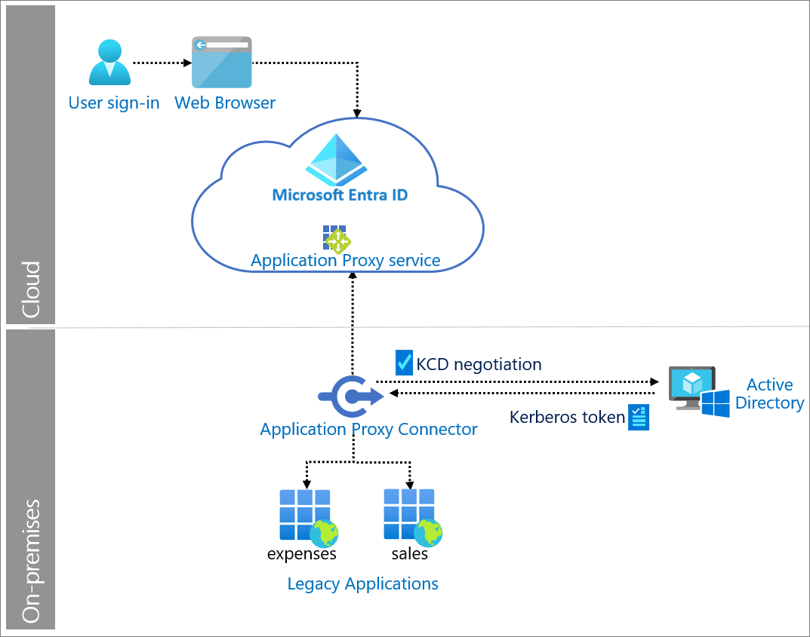

# Windows authentication - Kerberos constrained delegation with Microsoft Entra ID

Based on Service Principle Names, Kerberos Constrained Delegation (KCD) provides constrained delegation between resources. It requires domain administrators to create the delegations and is limited to a single domain. You can use resource-based KCD to provide Kerberos authentication for a web application that has users in multiple domains within an Active Directory forest.

Microsoft Entra application proxy can provide single sign-on (SSO) and remote access to KCD-based applications that require a Kerberos ticket for access and Kerberos Constrained Delegation (KCD).

To enable SSO to your on-premises KCD applications that use integrated Windows authentication (IWA), give Application Proxy connectors permission to impersonate users in Active Directory. The Application Proxy connector uses this permission to send and receive tokens on the users' behalf.

## When to use KCD

Use KCD when there's a need to provide remote access, protect with pre-authentication, and provide SSO to on-premises IWA applications.

## Components of system

* **User**: Accesses legacy application that Application Proxy serves.
* **Web browser**: The component that the user interacts with to access the external URL of the application.
* **Microsoft Entra ID**: Authenticates the user. 
* **Application Proxy service**: Acts as reverse proxy to send requests from the user to the on-premises application. It sits in Microsoft Entra ID. Application Proxy can enforce Conditional Access policies.
* **Application Proxy connector**: Installed on Windows on premises servers to provide connectivity to the application. Returns the response to Microsoft Entra ID. Performs KCD negotiation with Active Directory, impersonating the user to get a Kerberos token to the application.
* **Active Directory**: Sends the Kerberos token for the application to the Application Proxy connector.
* **Legacy applications**: Applications that receive user requests from Application Proxy. The legacy applications return the response to the Application Proxy connector.

## Implement Windows authentication (KCD) with Microsoft Entra ID

Explore the following resources to learn more about implementing Windows authentication (KCD) with Microsoft Entra ID.

* [Kerberos-based single sign-on (SSO) in Microsoft Entra ID with Application Proxy](~/identity/app-proxy/how-to-configure-sso-with-kcd.md) describes prerequisites and configuration steps.
* The [Tutorial - Add an on-premises app - Application Proxy in Microsoft Entra ID](~/identity/app-proxy/application-proxy-add-on-premises-application.md) helps you to prepare your environment for use with Application Proxy.

## Next steps

* [Microsoft Entra authentication and synchronization protocol overview](auth-sync-overview.md) describes integration with authentication and synchronization protocols. Authentication integrations enable you to use Microsoft Entra ID and its security and management features with little or no changes to your applications that use legacy authentication methods. Synchronization integrations enable you to sync user and group data to Microsoft Entra ID and then user Microsoft Entra management capabilities. Some sync patterns enable automated provisioning.
* [Understand single sign-on with an on-premises app using Application Proxy](~/identity/app-proxy/how-to-configure-sso.md) describes how SSO allows your users to access an application without authenticating multiple times. SSO occurs in the cloud against Microsoft Entra ID and allows the service or Connector to impersonate the user to complete authentication challenges from the application.
* [SAML single sign-on for on-premises apps with Microsoft Entra application proxy](~/identity/app-proxy/conceptual-sso-apps.md) describes how you can provide remote access to on-premises applications that are secured with SAML authentication through Application Proxy.
