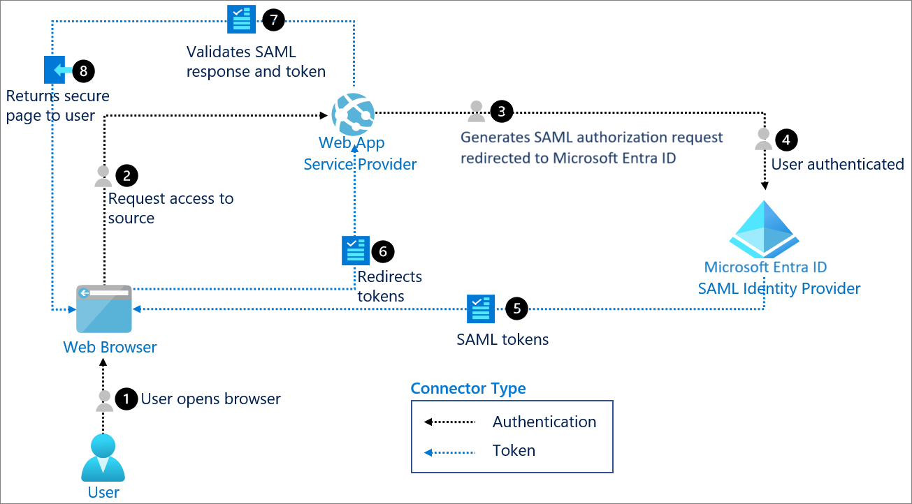

# SAML authentication with Microsoft Entra ID

Security Assertion Markup Language (SAML) is an open standard for exchanging authentication and authorization data between an identity provider and a service provider. SAML is an XML-based markup language for security assertions, which are statements that service providers use to make access-control decisions. 

The SAML specification defines three roles:

* The principal, generally a user
* The identity provider (IdP)
* The  service provider (SP)

## Use when

There's a need to provide a single sign-on (SSO) experience for an enterprise SAML application.

While one of most important use cases that SAML addresses is SSO, especially by extending SSO across security domains, there are other use cases (called profiles) as well. 

## Components of system

* **User**: Requests a service from the application.

* **Web browser**: The component that the user interacts with.

* **Web app**: Enterprise application that supports SAML and uses Microsoft Entra ID as IdP.

* **Token**: A SAML assertion (also known as SAML tokens) that carries sets of claims made by the IdP about the principal (user). It contains authentication information, attributes, and authorization decision statements.

* **Microsoft Entra ID**: Enterprise cloud IdP that provides SSO and Multi-factor authentication for SAML apps. It synchronizes, maintains, and manages identity information for users while providing authentication services to relying applications. 

## Implement SAML authentication with Microsoft Entra ID

* [Tutorials for integrating SaaS applications using Microsoft Entra ID](../saas-apps/tutorial-list.md) 

* [Configuring SAML based single sign-on for non-gallery applications](~/identity/enterprise-apps/add-application-portal.md) 

* [How Microsoft Entra ID uses the SAML protocol](~/identity-platform/saml-protocol-reference.md)
