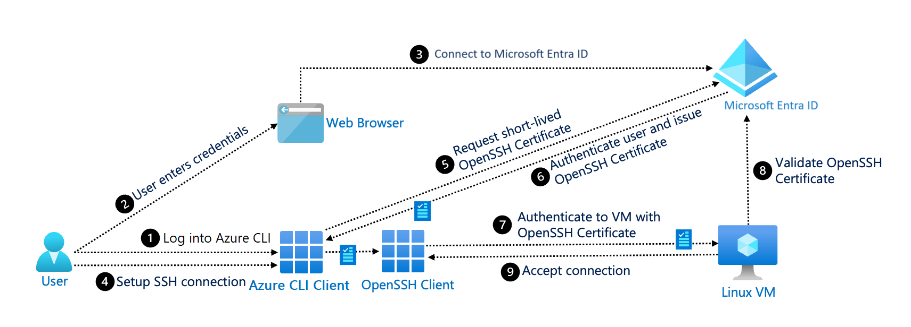

# SSH authentication with Microsoft Entra ID  

Secure Shell (SSH) is a network protocol that provides encryption for operating network services securely over an unsecured network. It's commonly used in systems like Unix and Linux. SSH replaces the Telnet protocol, which doesn't provide encryption in an unsecured network. 

Microsoft Entra ID provides a virtual machine (VM) extension for Linux-based systems that run on Azure. It also provides a client extension that integrates with the [Azure CLI](/cli/azure/) and the OpenSSH client.

You can use SSH authentication with Active Directory when you're:

* Working with Linux-based VMs that require remote command-line sign-in.

* Running remote commands in Linux-based systems.

* Securely transferring files in an unsecured network.

## Components of the system 

The following diagram shows the process of SSH authentication with Microsoft Entra ID: 

The system includes the following components:

* **User**: The user starts the Azure CLI and the SSH client to set up a connection with the Linux VMs. The user also provides credentials for authentication.

* **Azure CLI**: The user interacts with the Azure CLI to start a session with Microsoft Entra ID, request short-lived OpenSSH user certificates from Microsoft Entra ID, and start the SSH session.

* **Web browser**: The user opens a browser to authenticate the Azure CLI session. The browser communicates with the identity provider (Microsoft Entra ID) to securely authenticate and authorize the user.

* **OpenSSH client**: The Azure CLI (or the user) uses the OpenSSH client to start a connection to the Linux VM.

* **Microsoft Entra ID**: Microsoft Entra authenticates the identity of the user and issues short-lived OpenSSH user certificates to the Azure CLI client.

* **Linux VM**: The Linux VM accepts the OpenSSH user certificate and provides a successful connection.

## Next steps

* To implement SSH with Microsoft Entra ID for your users or guest users, see [Log in to a Linux VM by using Microsoft Entra credentials](~/identity/devices/howto-vm-sign-in-azure-ad-linux.md). 
