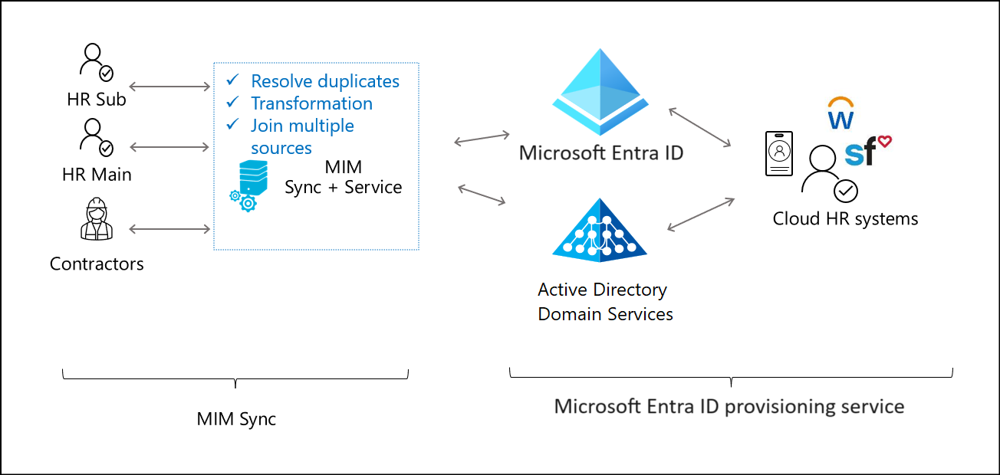
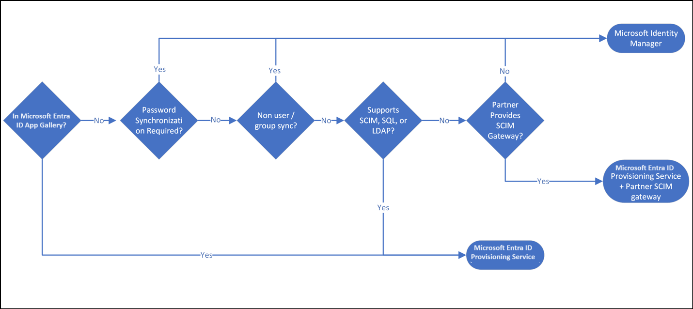
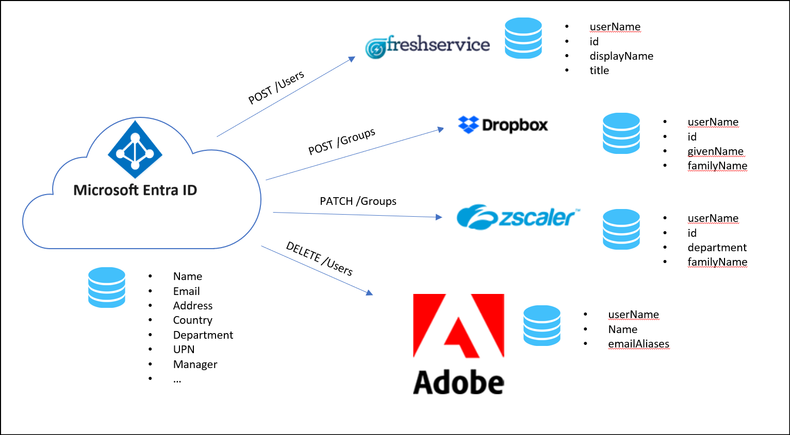
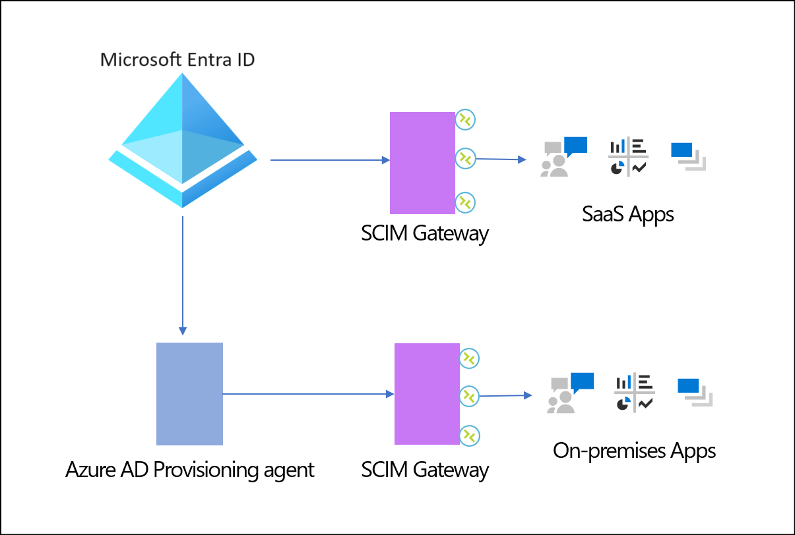
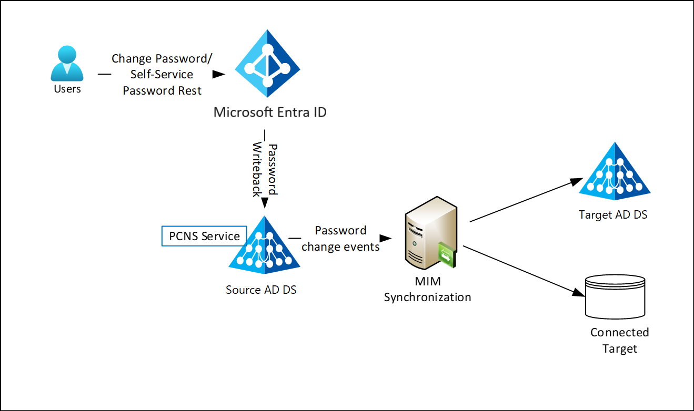

# Solutions

This article presents solutions that enable you to:

* Connect identities with your system of record
* Synchronize identities between Active Directory Domain Services (AD DS) and Microsoft Entra ID
* Automate provisioning of users into non-Microsoft applications  

## Connect identities with your system of record

In most designs, the human resources (HR) system is the source-of-authority for newly created digital identities. The HR system is often the starting point for many provisioning processes. For example, if a new user joins a company, they have a record in the HR system. That user likely needs an account to access Microsoft 365 services such as Teams and SharePoint, or non-Microsoft applications.

### Synchronizing identities with cloud HR

The Microsoft Entra provisioning service enables organizations to [bring identities from popular HR systems](~/identity/app-provisioning/what-is-hr-driven-provisioning.md) (examples: [Workday](~/identity/saas-apps/workday-inbound-tutorial.md) and [SuccessFactors](~/identity/saas-apps/sap-successfactors-inbound-provisioning-cloud-only-tutorial.md)), into Microsoft Entra ID directly, or into AD DS. This provisioning capability enables new hires to access the resources they need from the first day of work.

### On-premises HR + joining multiple data sources

To create a full user profile for an employee identity, organizations often merge information from multiple HR systems, databases, and other user data stores. MIM provides a rich set of [connectors](/microsoft-identity-manager/supported-management-agents) and integration solutions interoperating with heterogeneous platforms both on-premises and in the cloud.

MIM offers [rule extension](/previous-versions/windows/desktop/forefront-2010/ms698810(v=vs.100)?redirectedfrom=MSDN) and [workflow capabilities](https://microsoft.github.io/MIMWAL/) features for advanced scenarios requiring data transformation and consolidation from multiple sources. These connectors, rule extensions, and workflow capabilities enable organizations to aggregate user data in the MIM metaverse to form a single identity for each user. The identity can be [provisioned into downstream systems](/microsoft-identity-manager/microsoft-identity-manager-2016-supported-platforms) such as AD DS.

## Synchronize identities between Active Directory Domain Services (AD DS) and Microsoft Entra ID

As customers move applications to the cloud, and integrate with Microsoft Entra ID, users often need accounts in Microsoft Entra ID, and AD to access the applications for their work. Here are five common scenarios in which objects need to be synchronized between AD and Microsoft Entra ID.

The scenarios are divided by the direction of synchronization needed, and are listed, one through five. Use the table following the scenarios to determine what technical solution provides the synchronization.

Use the numbered sections in the next two section to cross reference the following table.

**Synchronize identities from AD DS into Microsoft Entra ID**

1. For users in AD that need access to Office 365 or other applications that are connected to Microsoft Entra ID, Microsoft Entra Connect cloud sync is the first solution to explore. It provides a lightweight solution to create users in Microsoft Entra ID, manage password rests, and synchronize groups. Configuration and management are primarily done in the cloud, minimizing your on-premises footprint. It provides high-availability and automatic failover, ensuring password resets and synchronization continue, even if there's an issue with on-premises servers.

1. For complex, large-scale AD to Azure AD Sync needs such as synchronizing groups over 50,000 and device sync, customers can use Microsoft Entra Connect Sync to meet their needs.

**Synchronize identities from Microsoft Entra ID into AD DS**

As customers transition identity management to the cloud, more users and groups are created directly in Microsoft Entra ID. However, they still need a presence on-premises in AD DS to access various resources.

3. When an external user from a partner organization is created in Microsoft Entra ID using B2B, MIM can automatically provision them [into AD DS](/microsoft-identity-manager/microsoft-identity-manager-2016-graph-b2b-scenario) and give those guests access to [on-premises Windows-Integrated Authentication or Kerberos-based applications](~/external-id/hybrid-cloud-to-on-premises.md). Alternatively, customers can user [PowerShell scripts](https://github.com/Azure-Samples/B2B-to-AD-Sync) to automate the creation of guest accounts on-premises. 

1. When a group is created in Microsoft Entra ID, it can be automatically synchronized to AD DS using [Microsoft Entra Connect Sync](~/identity/hybrid/connect/how-to-connect-group-writeback-v2.md).

1. When users need access to cloud apps that still rely on legacy access protocols (for example, LDAP and Kerberos/NTLM), [Microsoft Entra Domain Services](https://azure.microsoft.com/services/active-directory-ds/) synchronizes identities between Microsoft Entra ID and a managed AD domain.

|No.| What | From | To | Technology |
| - | - | - | - | - |
| 1 |Users, groups| AD DS| Microsoft Entra ID| [Microsoft Entra Connect cloud sync](~/identity/hybrid/cloud-sync/what-is-cloud-sync.md) |
| 2 |Users, groups, devices| AD DS| Microsoft Entra ID| [Microsoft Entra Connect Sync](~/identity/hybrid/connect/whatis-azure-ad-connect.md) |
| 3 |Groups| Microsoft Entra ID| AD DS| [Microsoft Entra Connect Sync](~/identity/hybrid/connect/how-to-connect-group-writeback-v2.md) |
| 4 |Guest accounts| Microsoft Entra ID| AD DS| [MIM](/microsoft-identity-manager/microsoft-identity-manager-2016-graph-b2b-scenario), [PowerShell](https://github.com/Azure-Samples/B2B-to-AD-Sync)|
| 5 |Users, groups| Microsoft Entra ID| Managed AD| [Microsoft Entra Domain Services](https://azure.microsoft.com/services/active-directory-ds/) |

The table depicts common scenarios and the recommended technology.

## Automate provisioning users into non-Microsoft applications

After identities are in Microsoft Entra ID through HR-provisioning or Microsoft Entra Connect cloud sync / Microsoft Entra Connect Sync, the employee can use the identity to access Teams, SharePoint, and Microsoft 365 applications. However, employees still need access to many Microsoft applications to perform their work.

### Automate provisioning to apps and clouds that support the SCIM standard

Microsoft Entra ID supports the System for Cross-Domain Identity Management ([SCIM 2.0](https://aka.ms/scimoverview)) standard and integrates with hundreds of popular SaaS applications such as [Dropbox](~/identity/saas-apps/dropboxforbusiness-provisioning-tutorial.md) and [Atlassian](~/identity/saas-apps/atlassian-cloud-provisioning-tutorial.md) or other clouds such as [Amazon Web Services (AWS)](~/identity/saas-apps/aws-single-sign-on-provisioning-tutorial.md), [Google Cloud](~/identity/saas-apps/g-suite-provisioning-tutorial.md). Application developers can use the System for Cross-Domain Identity Management (SCIM) user management API to automate provisioning users and groups between Microsoft Entra ID and your application.

In addition to the pre-integrated gallery applications, Microsoft Entra ID supports provisioning to SCIM enabled line of business applications, whether hosted [on-premises](~/identity/app-provisioning/on-premises-scim-provisioning.md) or in the cloud. The Microsoft Entra provisioning service creates users and groups in these applications, and manages updates such as when a user is promoted or leaves the company).

[Learn more about provisioning to SCIM enabled applications](~/identity/app-provisioning/use-scim-to-provision-users-and-groups.md)

### Automate provisioning to on-premises applications

Many applications don't support the SCIM standard, and customers have historically used connectors developed for MIM to connect to them. The Microsoft Entra provisioning service supports reusing connectors built for MIM, without needing a MIM sync deployment. This opens up connectivity to a wide range of on-premises and SaaS applications.

|Protocol |Connector|
|-----|-----|
| LDAP | [LDAP](~/identity/app-provisioning/on-premises-ldap-connector-configure.md)|
| SQL  | [SQL](~/identity/app-provisioning/tutorial-ecma-sql-connector.md) |
| REST | [Web Services](~/identity/app-provisioning/on-premises-web-services-connector.md)|
| SOAP | [Web Services](~/identity/app-provisioning/on-premises-web-services-connector.md)|
| Flat-file| [PowerShell](~/identity/app-provisioning/on-premises-powershell-connector.md) |
| Custom | [Custom ECMA connectors](~/identity/app-provisioning/on-premises-custom-connector.md) |

[Learn more about on-premises application provisioning](~/identity/app-provisioning/user-provisioning.md)

### Use integrations developed by partners

Microsoft partners have developed SCIM gateways that allow you to synchronize users between Microsoft Entra ID and various systems such as mainframes, HR systems, and legacy databases. In the image below, the SCIM Gateways are built and managed by partners.

[Learn more about partner driven integrations](~/identity/app-provisioning/partner-driven-integrations.md)

### Manage local app passwords

Many applications have a local authentication store and a UI that only checks the user’s supplied credentials against that store. As a result, these applications can't support Multi Factor Authentication (MFA) through Microsoft Entra ID and pose a security risk. Microsoft recommends enabling single sign-on and MFA for all your applications. Based on our studies, your account is more than 99.9% less likely to be compromised if you [use MFA](https://aka.ms/securitysteps). However, in cases where the application can’t externalize authentication, customers can use MIM to sync password changes to these applications.

[Learn more about the MIM password change notification service](/microsoft-identity-manager/infrastructure/mim2016-password-management) 

### Define and provision access for a user based on organizational data

MIM enables you to import organizational data such as job codes and locations. That information can then be used to automatically set up access rights for that user.

### Automate common business workflows

After users are provisioned into Microsoft Entra ID, use Lifecycle Workflows (LCW) to automate appropriate actions at key moments in a user’s lifecycle such as joiner, mover, and leaver. These custom workflows can be triggered by Microsoft Entra LCW automatically, or on demand to enable or disable accounts, generate Temporary Access Passes, update Teams and/or group membership, send automated emails, and trigger a Logic App. This can help organizations ensure:

* **Joiner**: When a user joins the organization, they're ready to go on day one. They have the correct access to the information and applications they need. They have the required hardware necessary to do their job.

* **Leaver**: When users leave the company for various reasons (termination, separation, leave of absence or retirement), have their access revoked in a timely manner.

[Learn more about Microsoft Entra Lifecycle Workflows](~/id-governance/what-are-lifecycle-workflows.md)

> [!Note]
> For scenarios not covered by LCW, customers can leverage the extensibility of [Logic Applications](/azure/logic-apps/logic-apps-overview).

### Reconcile changes made directly in the target system

Organizations often need a complete audit trail of what users have access to applications containing data subject to regulation. To provide an audit trail, any access provided to a user directly must be traceable through the system of record. MIM provides the reconciliation capabilities to detect changes made directly in a target system and roll back the changes. In addition to detecting changes in target applications, MIM can import identities from third party applications to Microsoft Entra ID. These applications often augment the set of user records that originated in the HR system.

### Next steps

1. Automate provisioning with any of your applications that are in the [Microsoft Entra app gallery](~/identity/saas-apps/tutorial-list.md), support [SCIM](~/identity/app-provisioning/use-scim-to-provision-users-and-groups.md), [SQL](~/identity/app-provisioning/on-premises-sql-connector-configure.md), or [LDAP](~/identity/app-provisioning/on-premises-ldap-connector-configure.md).
2. Evaluate [Microsoft Entra Connect cloud sync](~/identity/hybrid/cloud-sync/what-is-cloud-sync.md) for synchronization between AD DS and Microsoft Entra ID
3. Use the [Microsoft Identity Manager](/microsoft-identity-manager/microsoft-identity-manager-2016) for complex provisioning scenarios
