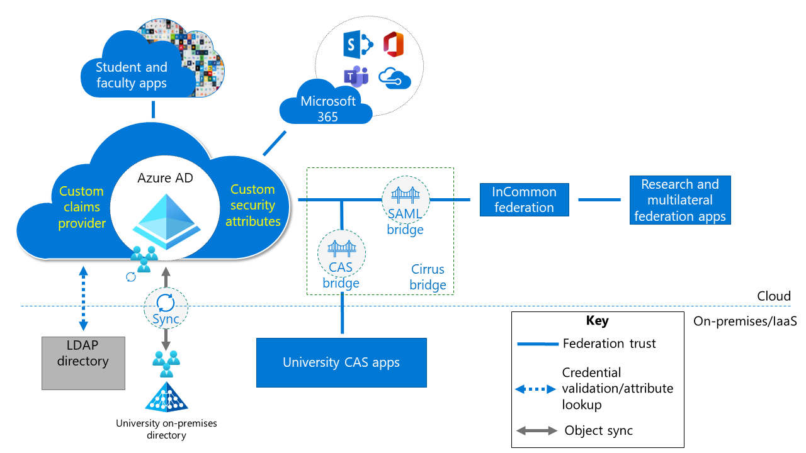

# Solution 1: Microsoft Entra ID with Cirrus Bridge

Solution 1 uses Microsoft Entra ID as the primary identity provider (IdP) for all applications. A managed service provides multilateral federation. In this example, Cirrus Bridge is the managed service for integration of Central Authentication Service (CAS) and multilateral federation apps.

If you're also using an on-premises Active Directory instance, you can [configure Active Directory](~/identity/hybrid/whatis-hybrid-identity.md) with hybrid identities. Implementing a solution of using Microsoft Entra ID with Cirrus Bridge provides:

* **Security Assertion Markup Language (SAML) bridge**: Configure multilateral federation and participation in InCommon and eduGAIN. You can also use the SAML bridge to configure Microsoft Entra Conditional Access policies, app assignment, governance, and other features for each multilateral federation app.

* **CAS bridge**: Provide protocol translation to support on-premises CAS apps to authenticate with Microsoft Entra ID. You can use the CAS bridge to configure Microsoft Entra Conditional Access policies, app assignment, and governance for all CAS apps as a whole.

When you implement Microsoft Entra ID with Cirrus Bridge, you can take advantage of more capabilities in Microsoft Entra ID:

* **Custom claims provider support**: With the [Microsoft Entra custom claims provider](~/identity-platform/custom-claims-provider-overview.md), you can use an external attribute store (like an external LDAP directory) to add claims into tokens for individual apps. The custom claims provider uses a custom extension that calls an external REST API to fetch claims from external systems.

* **Custom security attributes**: You can add custom attributes to objects in the directory and control who can read them. [Custom security attributes](~/fundamentals/custom-security-attributes-overview.md) enable you to store more of your attributes directly in Microsoft Entra ID.

## Advantages

Here are some of the advantages of implementing Microsoft Entra ID with Cirrus Bridge:

* **Seamless cloud authentication for all apps**

  * All apps authenticate through Microsoft Entra ID.  

  * Elimination of all on-premises identity components in a managed service can potentially lower your operational and administrative costs, reduce security risks, and free up resources for other efforts.  

* **Streamlined configuration, deployment, and support model**

  * [Cirrus Bridge](~/identity/saas-apps/cirrus-identity-bridge-for-azure-ad-tutorial.md) is registered in the Microsoft Entra app gallery.

  * You benefit from an established process for configuring and setting up the bridge solution.

  * Cirrus Identity provides continuous support.

* **Conditional Access support for multilateral federation apps**

  * Implementation of Conditional Access controls helps you comply with [NIH](https://auth.nih.gov/CertAuthV3/forms/help/compliancecheckhelp.html) and [REFEDS](https://refeds.org/category/research-and-scholarship) requirements.

  * This solution is the only architecture that enables you to configure granular Microsoft Entra Conditional Access for both multilateral federation apps and CAS apps.  

* **Use of other Microsoft Entra related solutions for all apps**

  * You can use Intune and Microsoft Entra join for device management.

  * Microsoft Entra join enables you to use Windows Autopilot, Microsoft Entra multifactor authentication, and passwordless features. Microsoft Entra join supports achieving a Zero Trust posture.

    > [!NOTE]
    > Switching to Microsoft Entra multifactor authentication might help you save significant costs over other solutions that you have in place.

## Considerations and trade-offs

Here are some of the trade-offs of using this solution:

* **Limited ability to customize the authentication experience**: This scenario provides a managed solution. It might not offer you the flexibility or granularity to build a custom solution by using federation provider products.

* **Limited third-party MFA integration**: The number of integrations available to third-party MFA solutions might be limited.

* **One-time integration effort required**: To streamline integration, you need to perform a one-time migration of all student and faculty apps to Microsoft Entra ID. You also need to set up Cirrus Bridge.

* **Subscription required for Cirrus Bridge**: The subscription fee for Cirrus Bridge is based on anticipated annual authentication usage of the bridge.

## Migration resources

The following resources help with your migration to this solution architecture.

| Migration resource   | Description           |
| - | - |
| [Resources for migrating applications to Microsoft Entra ID](~/identity/enterprise-apps/migration-resources.md) | List of resources to help you migrate application access and authentication to Microsoft Entra ID |
| [Microsoft Entra custom claims provider](~/identity-platform/custom-claims-provider-overview.md)| Overview of the Microsoft Entra custom claims provider |
| [Custom security attributes](~/fundamentals/custom-security-attributes-manage.md) | Steps for managing access to custom security attributes |
| [Microsoft Entra single sign-on integration with Cirrus Bridge](~/identity/saas-apps/cirrus-identity-bridge-for-azure-ad-tutorial.md) | Tutorial to integrate Cirrus Bridge with Microsoft Entra ID |
| [Cirrus Bridge overview](https://blog.cirrusidentity.com/documentation/azure-bridge-setup-rev-6.0) | Cirrus Identity documentation for configuring Cirrus Bridge with Microsoft Entra ID |
| [Microsoft Entra multifactor authentication deployment considerations](~/identity/authentication/howto-mfa-getstarted.md) | Guidance for configuring Microsoft Entra multifactor authentication  |

## Next steps

See these related articles about multilateral federation:

[Multilateral federation introduction](multilateral-federation-introduction.md)

[Multilateral federation baseline design](multilateral-federation-baseline.md)

[Multilateral federation Solution 2: Microsoft Entra ID with Shibboleth as a SAML proxy](multilateral-federation-solution-two.md)

[Multilateral federation Solution 3: Microsoft Entra ID with AD FS and Shibboleth](multilateral-federation-solution-three.md)

[Multilateral federation decision tree](multilateral-federation-decision-tree.md)
