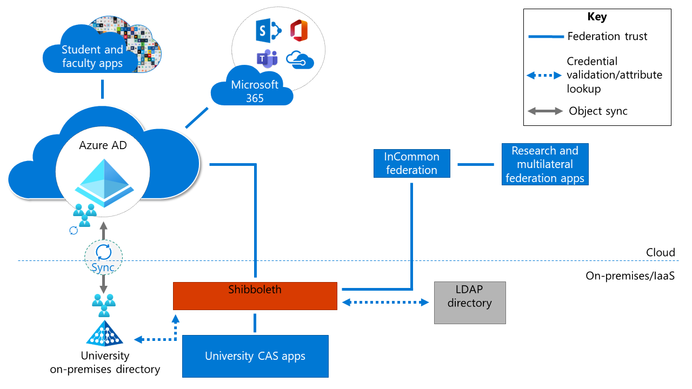

# Solution 2: Microsoft Entra ID with Shibboleth as a SAML proxy

In Solution 2, Microsoft Entra ID acts as the primary identity provider (IdP). The federation provider acts as a Security Assertion Markup Language (SAML) proxy to the Central Authentication Service (CAS) apps and the multilateral federation apps. In this example, [Shibboleth acts as the SAML proxy](https://shibboleth.atlassian.net/wiki/spaces/KB/pages/1467056889/Using+SAML+Proxying+in+the+Shibboleth+IdP+to+connect+with+Azure+AD) to provide a reference link.

Because Microsoft Entra ID is the primary IdP, all student and faculty apps are integrated with Microsoft Entra ID. All Microsoft 365 apps are also integrated with Microsoft Entra ID. If Microsoft Entra Domain Services is in use, it also is synchronized with Microsoft Entra ID.

The SAML proxy feature of Shibboleth integrates with Microsoft Entra ID. In Microsoft Entra ID, Shibboleth appears as a non-gallery enterprise application. Universities can get single sign-on (SSO) for their CAS apps and can participate in the InCommon environment. Additionally, Shibboleth provides integration for Lightweight Directory Access Protocol (LDAP) directory services.

## Advantages

Advantages of using this solution include:

* **Cloud authentication for all apps**: All apps authenticate through Microsoft Entra ID.

* **Ease of execution**: This solution provides short-term ease of execution for universities that are already using Shibboleth.

## Considerations and trade-offs

Here are some of the trade-offs of using this solution:

* **Higher complexity and security risk**: An on-premises footprint might mean higher complexity for the environment and extra security risks, compared to a managed service. Increased overhead and fees might also be associated with managing on-premises components.

* **Suboptimal authentication experience**: For multilateral federation and CAS apps, the authentication experience for users might not be seamless because of redirects through Shibboleth. The options for customizing the authentication experience for users are limited.

* **Limited third-party multifactor authentication integration**: The number of integrations available to third-party MFA solutions might be limited.

* **No granular Conditional Access support**: Without granular Conditional Access support, you have to choose between the least common denominator (optimize for less friction but have limited security controls) or the highest common denominator (optimize for security controls at the expense of user friction). Your ability to make granular decisions is limited.

## Migration resources

The following resources can help with your migration to this solution architecture.

| Migration resource   | Description           |
| - | - |
| [Resources for migrating applications to Microsoft Entra ID](~/identity/enterprise-apps/migration-resources.md) | List of resources to help you migrate application access and authentication to Microsoft Entra ID |
| [Configuring Shibboleth as a SAML proxy](https://shibboleth.atlassian.net/wiki/spaces/KB/pages/1467056889/Using+SAML+Proxying+in+the+Shibboleth+IdP+to+connect+with+Azure+AD) | Shibboleth article that describes how to use the SAML proxying feature to connect the Shibboleth IdP to Microsoft Entra ID |
| [Microsoft Entra multifactor authentication deployment considerations](~/identity/authentication/howto-mfa-getstarted.md) | Guidance for configuring Microsoft Entra multifactor authentication |

## Next steps

See these related articles about multilateral federation:

[Multilateral federation introduction](multilateral-federation-introduction.md)

[Multilateral federation baseline design](multilateral-federation-baseline.md)

[Multilateral federation Solution 1: Microsoft Entra ID with Cirrus Bridge](multilateral-federation-solution-one.md)

[Multilateral federation Solution 3: Microsoft Entra ID with AD FS and Shibboleth](multilateral-federation-solution-three.md)

[Multilateral federation decision tree](multilateral-federation-decision-tree.md)
