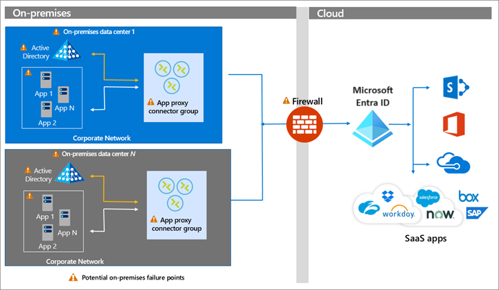

# Build resilience in application access with Application Proxy

Application Proxy is a feature of Microsoft Entra ID that enables users to access on premises web applications from a remote client. Application Proxy includes the Application Proxy service in the cloud and the Application Proxy connectors that run on an on premises server. 

Users access on premises resources through a URL published via Application Proxy. They're redirected to the Microsoft Entra sign-in page. The Application Proxy service in Microsoft Entra ID then sends a token to the Application Proxy connector in the corporate network that passes the token to the on premises Active Directory. The authenticated user can then access the on premises resource. In the diagram below, [connectors](../app-proxy/application-proxy-connectors.md) are shown in a [connector group](../app-proxy/application-proxy-connector-groups.md).

> [!IMPORTANT]
> When you publish your applications via Application Proxy, you must implement [capacity planning and appropriate redundancy for the Application Proxy connectors](../app-proxy/application-proxy-connectors.md#capacity-planning).

)

## How do I implement Application Proxy?

To implement remote access with Microsoft Entra application proxy, see the following resources.

* [Planning an Application Proxy deployment](../app-proxy/application-proxy-deployment-plan.md)
* [High availability and load balancing best practices](../app-proxy/application-proxy-high-availability-load-balancing.md)
* [Configure proxy servers](../app-proxy/application-proxy-configure-connectors-with-proxy-servers.md)
* [Design a resilient access control strategy](~/identity/authentication/concept-resilient-controls.md)

## Next steps

### Resilience resources for administrators and architects
 
* [Build resilience with credential management](resilience-in-credentials.md)
* [Build resilience with device states](resilience-with-device-states.md)
* [Build resilience by using Continuous Access Evaluation (CAE)](resilience-with-continuous-access-evaluation.md)
* [Build resilience in external user authentication](resilience-b2b-authentication.md)
* [Build resilience in your hybrid authentication](resilience-in-hybrid.md)

### Resilience resources for developers

* [Build IAM resilience in your applications](resilience-app-development-overview.md)
* [Build resilience in your CIAM systems](resilience-b2c.md)
