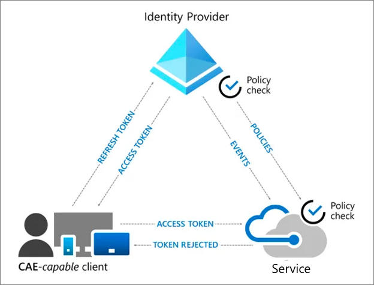

# Build resilience by using Continuous Access Evaluation

[Continuous Access Evaluation](../conditional-access/concept-continuous-access-evaluation.md) (CAE) allows Microsoft Entra applications to subscribe to critical events that can then be evaluated and enforced. CAE includes evaluation of the following events:

* User account deleted or disabled
* Password for user changed
* MFA enabled for user
* Administrator explicitly revokes a token
* Elevated user risk detected

As a result, applications can reject unexpired tokens based on the events signaled by Microsoft Entra ID as depicted in the following diagram.

## How does CAE help?

The CAE mechanism allows Microsoft Entra ID to issue longer-lived tokens while enabling applications to revoke access and force reauthentication only when needed. The net result of this pattern is fewer calls to acquire tokens, which means that the end-to-end flow is more resilient. 

To use CAE, both the service and the client must be CAE-capable. Microsoft 365 services such as Exchange Online, Teams, and SharePoint Online support CAE. On the client side, browser-based experiences that use these Office 365 services (such as Outlook Web App) and specific versions of Office 365 native clients are CAE-capable. More Microsoft cloud services will become CAE-capable.

Microsoft is working with the industry to build [standards](https://openid.net/wg/sse/) that will allow third party applications to use CAE capability. You can also develop applications that are CAE-capable.  For more information about CAE-capable application development, see [How to build resilience in your application](resilience-app-development-overview.md).

## How do I implement CAE?

* [Update your code to use CAE-enabled APIs](~/identity-platform/app-resilience-continuous-access-evaluation.md).
* [Enable CAE](../conditional-access/concept-continuous-access-evaluation.md) in the Microsoft Entra Security Configuration.
* Ensure that your organization is using [compatible versions](../conditional-access/concept-continuous-access-evaluation.md) of Microsoft Office native applications.
* [Optimize your reauthentication prompts](~/identity/authentication/concepts-azure-multi-factor-authentication-prompts-session-lifetime.md).

## Next steps

### Resilience resources for administrators and architects
 
* [Build resilience with credential management](resilience-in-credentials.md)
* [Build resilience with device states](resilience-with-device-states.md)
* [Build resilience in external user authentication](resilience-b2b-authentication.md)
* [Build resilience in your hybrid authentication](resilience-in-hybrid.md)
* [Build resilience in application access with Application Proxy](resilience-on-premises-access.md)

### Resilience resources for developers

* [Build IAM resilience in your applications](resilience-app-development-overview.md)
* [Build resilience in your CIAM systems](resilience-b2c.md)
