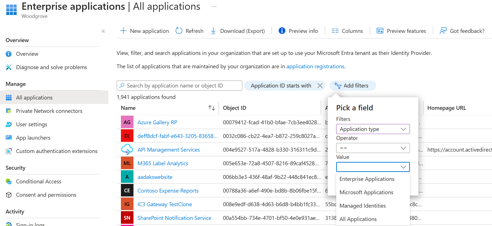

# Securing managed identities in Microsoft Entra ID

In this article, learn about managing secrets and credentials to secure communication between services. Managed identities provide an automatically managed identity in Microsoft Entra ID. Applications use managed identities to connect to resources that support Microsoft Entra authentication, and to obtain Microsoft Entra tokens, without credentials management.

## Benefits of managed identities

Benefits of using managed identities:

* With managed identities, credentials are fully managed, rotated, and protected by Azure. Identities are provided and deleted with Azure resources. Managed identities enable Azure resources to communicate with services that support Microsoft Entra authentication.

* No one, including the Global Administrator, has access to the credentials, which can't be accidentally leaked by being included in code.

## Using managed identities

Managed identities are best for communications among services that support Microsoft Entra authentication. A source system requests access to a target service. Any Azure resource can be a source system. For example, an Azure virtual machine (VM), Azure Function instance, and Azure App Services instances support managed identities.

Learn more in the video, [What can a managed identity be used for?](https://www.youtube.com/embed/5lqayO_oeEo)

### Authentication and authorization

With managed identities, the source system obtains a token from Microsoft Entra ID without owner credential management. Azure manages the credentials. Tokens obtained by the source system are presented to the target system for authentication. 

The target system authenticates and authorizes the source system to allow access. If the target service supports Microsoft Entra authentication, it accepts an access token issued by Microsoft Entra ID. 

Azure has a control plane and a data plane. You create resources in the control plane, and access them in the data plane. For example, you create an Azure Cosmos DB database in the control plane, but query it in the data plane.

After the target system accepts the token for authentication, it supports mechanisms for authorization for its control plane and data plane.

Azure control plane operations are managed by Azure Resource Manager and use Azure role-based access control (Azure RBAC). In the data plane, target systems have authorization mechanisms. Azure Storage supports Azure RBAC on the data plane. For example, applications using Azure App Services can read data from Azure Storage, and applications using Azure Kubernetes Service can read secrets stored in Azure Key Vault.

Learn more:
* [What is Azure Resource Manager?](/azure/azure-resource-manager/management/overview)
* [What is Azure role-based Azure RBAC?](/azure/role-based-access-control/overview)
* [Azure control plane and data plane](/azure/azure-resource-manager/management/control-plane-and-data-plane)
* [Azure services that can use managed identities to access other services](~/identity/managed-identities-azure-resources/managed-identities-status.md)

## System-assigned and user-assigned managed identities

There are two types of managed identities, system- and user-assigned.

System-assigned managed identity:

* One-to-one relationship with the Azure resource
  * For example, there's a unique managed identity associated with each VM
* Tied to the Azure resource lifecycle. When the resource is deleted, the managed identity associated with it, is automatically deleted.
* This action eliminates the risk from orphaned accounts 

User-assigned managed identity

* The lifecycle is independent from an Azure resource. You manage the lifecycle. 
  * When the Azure resource is deleted, the assigned user-assigned managed identity isn't automatically deleted
* Assign user-assigned managed identity to zero or more Azure resources
* Create an identity ahead of time, and then assigned it to a resource later

## Find managed identity service principals in Microsoft Entra ID

To find managed identities, you can use:

* Enterprise applications page in the Azure portal
* Microsoft Graph

### The Azure portal

1. In the Azure portal, in the left navigation, select **Microsoft Entra ID**.
2. In the left navigation, select **Enterprise applications**.
3. In the **Application type** column, under **Value**, select the down-arrow to select **Managed Identities**.

   

### Microsoft Graph

Use the following GET request to Microsoft Graph to get a list of managed identities in your tenant.

`https://graph.microsoft.com/v1.0/servicePrincipals?$filter=(servicePrincipalType eq 'ManagedIdentity')`

You can filter these requests. For more information, see [GET servicePrincipal](/graph/api/serviceprincipal-get?view=graph-rest-1.0&tabs=http&preserve-view=true).

## Assess managed identity security

To assess managed identity security:

* Examine privileges to ensure the least-privileged model is selected
  * Use the following PowerShell cmdlet to get the permissions assigned to your managed identities:

   `Get-AzureADServicePrincipal | % { Get-AzureADServiceAppRoleAssignment -ObjectId $_ }`

* Ensure the managed identity is not part of a privileged group, such as an administrators group. 
  * To enumerate the members of your highly privileged groups with PowerShell:

   `Get-AzureADGroupMember -ObjectId <String> [-All <Boolean>] [-Top <Int32>] [<CommonParameters>]`

* Confirm what resources the managed identity accesses
  * See, [List Azure role assignments using Azure PowerShell](/azure/role-based-access-control/role-assignments-list-powershell).

## Move to managed identities

If you're using a  service principal or a Microsoft Entra user account, evaluate the use of managed identities. You can eliminate the need to protect, rotate, and manage credentials. 

## Next steps

* [What are managed identities for Azure resources?](~/identity/managed-identities-azure-resources/overview.md) 
* [Configure managed identities for Azure resources on a VM using the Azure portal](~/identity/managed-identities-azure-resources/qs-configure-portal-windows-vm.md)

**Service accounts**

* [Securing cloud-based service accounts](secure-service-accounts.md)
* [Securing service principals](service-accounts-principal.md)
* [Governing Microsoft Entra service accounts](govern-service-accounts.md)
* [Securing on-premises service accounts](service-accounts-on-premises.md)
