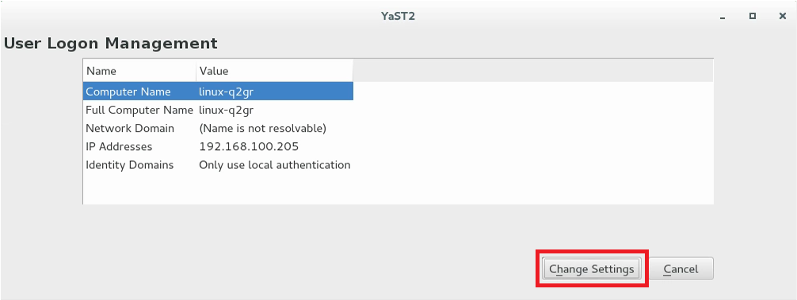
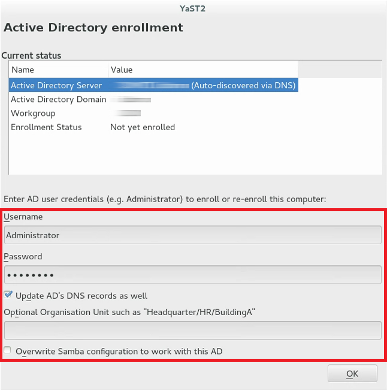
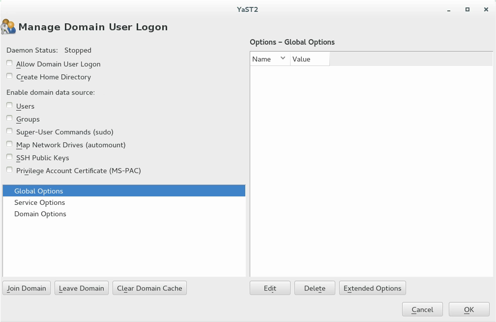
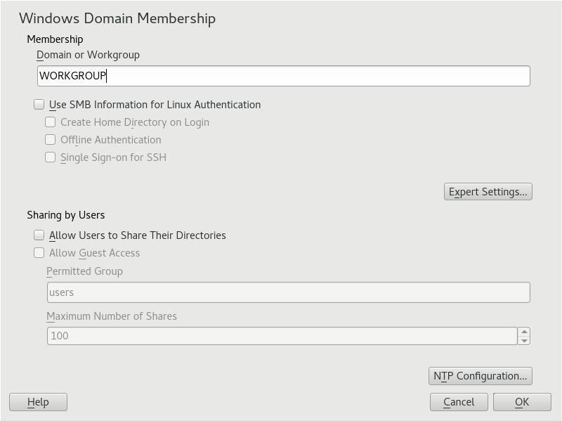
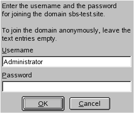

# Join a SUSE Linux Enterprise virtual machine to an Azure Active Directory Domain Services managed domain

To let users sign in to virtual machines (VMs) in Azure using a single set of credentials, you can join VMs to an Azure Active Directory Domain Services (Azure AD DS) managed domain. When you join a VM to an Azure AD DS managed domain, user accounts and credentials from the domain can be used to sign in and manage servers. Group memberships from the managed domain are also applied to let you control access to files or services on the VM.

This article shows you how to join a SUSE Linux Enterprise (SLE) VM to a managed domain.

## Prerequisites

To complete this tutorial, you need the following resources and privileges:

* An active Azure subscription.
    * If you don't have an Azure subscription, [create an account](https://azure.microsoft.com/free/?WT.mc_id=A261C142F).
* An Azure Active Directory tenant associated with your subscription, either synchronized with an on-premises directory or a cloud-only directory.
    * If needed, [create an Azure Active Directory tenant][create-azure-ad-tenant] or [associate an Azure subscription with your account][associate-azure-ad-tenant].
* An Azure Active Directory Domain Services managed domain enabled and configured in your Azure AD tenant.
    * If needed, the first tutorial [creates and configures an Azure Active Directory Domain Services managed domain][create-azure-ad-ds-instance].
* A user account that's a part of the managed domain.

## Create and connect to a SLE Linux VM

If you have an existing SLE Linux VM in Azure, connect to it using SSH, then continue on to the next step to [start configuring the VM](#configure-the-hosts-file).

If you need to create a SLE Linux VM, or want to create a test VM for use with this article, you can use one of the following methods:

* [Azure portal](../virtual-machines/linux/quick-create-portal.md)
* [Azure CLI](../virtual-machines/linux/quick-create-cli.md)
* [Azure PowerShell](../virtual-machines/linux/quick-create-powershell.md)

When you create the VM, pay attention to the virtual network settings to make sure that the VM can communicate with the managed domain:

* Deploy the VM into the same, or a peered, virtual network in which you have enabled Azure AD Domain Services.
* Deploy the VM into a different subnet than your Azure AD Domain Services managed domain.

Once the VM is deployed, follow the steps to connect to the VM using SSH.

## Configure the hosts file

To make sure that the VM host name is correctly configured for the managed domain, edit the */etc/hosts* file and set the hostname:

```console
sudo vi /etc/hosts
```

In the *hosts* file, update the *localhost* address. In the following example:

* *aaddscontoso.com* is the DNS domain name of your managed domain.
* *linux-q2gr* is the hostname of your SLE VM that you're joining to the managed domain.

Update these names with your own values:

```console
127.0.0.1 linux-q2gr linux-q2gr.aaddscontoso.com
```

When done, save and exit the *hosts* file using the `:wq` command of the editor.

## Join VM to the managed domain using SSSD

To join the managed domain using **SSSD** and the *User Logon Management* module of YaST, proceed as follows:

1. Install the *User Logon Management* YaST module:

    ```bash
    sudo zypper install yast2-auth-client
    ```

1. Open YaST.

1. To be able to use DNS auto-discovery later, set up the managed domain IP addresses (the *Active Directory server*) as the name server for your client.

    In YaST, select **System > Network Settings**.

1. Select the *Hostname/DNS* tab, then enter the IP address of the managed domain into the text box *Name Server 1*.

    Save the setting with **OK**.

1. From the YaST main window, start the module *Network Services* > *User Logon Management*.

    The module opens with an overview showing different network properties of your computer and the authentication method currently in use, as shown in the following example screenshot:

    

    To start editing, select **Change Settings**.

Now join the the VM to the managed domain. Complete the following steps:

1. In the dialog box, select **Add Domain**.

1. Specify the correct *Domain name*, then specify the services to use for identity data and authentication. Select *Microsoft Active Directory* for both.

    Ensure that *Enable the domain* is activated.

1. When ready, select **OK**.

1. Usually, you can keep the default settings in the following dialog. However, you may want to make changes for the following reasons:

    * *If the Local Host Name Does Not Match the Host Name Set on the Domain Controller:*  Find out if the host name of your computer matches the name your computer in the managed domain. In a terminal, run the command `hostname`, then compare its output to the configuration of the Active Directory Domain Controller.

        If the values differ, specify the host name from the Active Directory configuration under AD hostname. Otherwise, leave the appropriate text box empty.

    * *If You Do Not Want to Use DNS Auto-Discovery.*  Specify the *Host names of Active Directory servers* that you want to use. If there are multiple Domain Controllers, separate their host names with commas.

1. To continue, select **OK**.

1. The VM installs additional software as needed, then checks to see if the managed domain is available.

    If everything is correct, the following example dialog is shown show to indicate the VM has discovered the managed domain but that you're *Not yet enrolled*.

    

1. In the dialog, specify the *Username* and *Password* of a user that's a part of the managed domain. If needed, [add a user account to a group in Azure AD](../active-directory/fundamentals/active-directory-groups-members-azure-portal.md).

    To make sure that the current domain is enabled for Samba, activate *Overwrite Samba configuration to work with this AD*.

1. To enroll, select **OK**.

1. A message is shown to confirm that you are successfully enrolled. To finish, select **OK**.

After the VM is enrolled in the managed domain, configure the client using the window *Manage Domain User Logon*.



1. To allow sign-ins using login data provided by the managed domain, check the box for *Allow Domain User Logon*.

1. Optionally, under *Enable domain data source*, check additional data sources such as information on which users are allowed to use **sudo** or which network drives are available.

1. To allow users in the managed domain to have home directories on the VM, check the box for *Create Home Directories*. The path for home directories can be set in multiple ways—on the client, on the server, or both ways:

    * To configure the home directory paths on the Domain Controller, set an appropriate value for the attribute *UnixHomeDirectory* for each user. Additionally, make sure that this attribute replicated to the global catalog. For information on achieving that under Windows, see https://support.microsoft.com/en-us/kb/248717.

    * To configure home directory paths on the client in such a way that precedence will be given to the path set on the domain controller, use the option *fallback_homedir*.

    * To configure home directory paths on the client in such a way that the client setting will override the server setting, use *override_homedir*.

    As settings on the Domain Controller are outside of the scope of this documentation, only the configuration of the client-side options will be described in the following.

1. From the side bar, select **Service Options › Name switch**, then *Extended Options*. From that window, select either *fallback_homedir* or *override_homedir*, then select **Add**.

1. Specify a value. To have home directories follow the format */home/USER_NAME*, use */home/%u*. For more information about possible variables, see the man page sssd.conf (`man 5 sssd.conf`), section *override_homedir*.

1. Select **OK**.

1. To save the changes, select **OK**. Then make sure that the values displayed now are correct. To leave the dialog, select **Cancel**.

1. If you intend to run SSSD and Winbind simultaneously (such as when joining via SSSD, but then running a Samba file server), the samba option *kerberos method* should be set to *secrets and keytab* in smb.conf, and the SSSD option *ad_update_samba_machine_account_password* should be set to *true* in sssd.conf. These will prevent the system keytab from going out of sync.

## Join VM to the managed domain using Winbind

To join the managed domain using **winbind** and the *Windows Domain Membership* module of YaST, complete the following steps:

1. Sign in as **root** and start YaST.

1. Start **Network Services > Windows Domain Membership**.

1. Enter the domain to join at *Domain or Workgroup* in the *Windows Domain Membership* screen (see the figure below).

    If the DNS settings on your host are properly integrated with the Windows DNS server, enter the managed domain name, such as *aaddscontoso.com*.

    

1. To use the SMB source for Linux authentication, activate *Use SMB Information for Linux Authentication*.

1. To automatically create a local home directory for managed domain users on the Linux machine, activate *Create Home Directory on Login*.

1. Check *Offline Authentication* to allow your domain users to sign in even if the managed domain is temporarily unavailable.

1. To change the UID and GID ranges for the Samba users and groups, select *Expert Settings*.

1. Configure NTP time synchronization for your managed domain by selecting *NTP Configuration* and entering an appropriate server name or IP address. This step is obsolete if you have already entered the appropriate settings in the stand-alone YaST NTP configuration module.

1. Select **OK** and confirm the domain join when prompted for it.

1. Provide the password for an administrator in the managed domain and select **OK**.

    

After you have joined the managed domain, you can log in to it from your workstation using the display manager of your desktop or the console.

## Allow password authentication for SSH

By default, users can only sign in to a VM using SSH public key-based authentication. Password-based authentication fails. When you join the VM to a managed domain, those domain accounts need to use password-based authentication. Update the SSH configuration to allow password-based authentication as follows.

1. Open the *sshd_conf* file with an editor:

    ```console
    sudo vi /etc/ssh/sshd_config
    ```

1. Update the line for *PasswordAuthentication* to *yes*:

    ```console
    PasswordAuthentication yes
    ```

    When done, save and exit the *sshd_conf* file using the `:wq` command of the editor.

1. To apply the changes and let users sign in using a password, restart the SSH service:

    ```console
    sudo systemctl restart sshd
    ```

## Grant the 'AAD DC Administrators' group sudo privileges

To grant members of the *AAD DC Administrators* group administrative privileges on the SLE VM, add an entry to the */etc/sudoers*. Once added, members of the *AAD DC Administrators* group can use the `sudo` command on the SLE VM.

1. Open the *sudoers* file for editing:

    ```console
    sudo visudo
    ```

1. Add the following entry to the end of */etc/sudoers* file. The *AAD DC Administrators* group contains whitespace in the name, so include the backslash escape character in the group name. Add your own domain name, such as *aaddscontoso.com*:

    ```console
    # Add 'AAD DC Administrators' group members as admins.
    %AAD\ DC\ Administrators@aaddscontoso.com ALL=(ALL) NOPASSWD:ALL
    ```

    When done, save and exit the editor using the `:wq` command of the editor.

## Sign in to the VM using a domain account

To verify that the VM has been successfully joined to the managed domain, start a new SSH connection using a domain user account. Confirm that a home directory has been created, and that group membership from the domain is applied.

1. Create a new SSH connection from your console. Use a domain account that belongs to the managed domain using the `ssh -l` command, such as `contosoadmin@aaddscontoso.com` and then enter the address of your VM, such as *linux-q2gr.aaddscontoso.com*. If you use the Azure Cloud Shell, use the public IP address of the VM rather than the internal DNS name.

    ```console
    ssh -l contosoadmin@AADDSCONTOSO.com linux-q2gr.aaddscontoso.com
    ```

2. When you've successfully connected to the VM, verify that the home directory was initialized correctly:

    ```console
    pwd
    ```

    You should be in the */home* directory with your own directory that matches the user account.

3. Now check that the group memberships are being resolved correctly:

    ```console
    id
    ```

    You should see your group memberships from the managed domain.

4. If you signed in to the VM as a member of the *AAD DC Administrators* group, check that you can correctly use the `sudo` command:

    ```console
    sudo zypper update
    ```

## Next steps

If you have problems connecting the VM to the managed domain or signing in with a domain account, see [Troubleshooting domain join issues](join-windows-vm.md#troubleshoot-domain-join-issues).

<!-- INTERNAL LINKS -->
[create-azure-ad-tenant]: ../active-directory/fundamentals/sign-up-organization.md
[associate-azure-ad-tenant]: ../active-directory/fundamentals/active-directory-how-subscriptions-associated-directory.md
[create-azure-ad-ds-instance]: tutorial-create-instance.md
