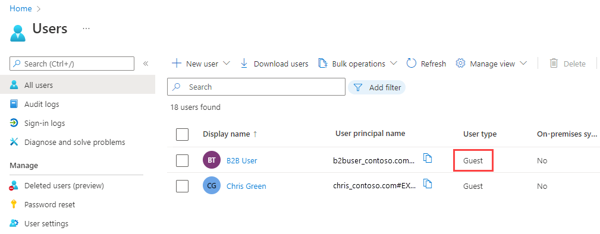
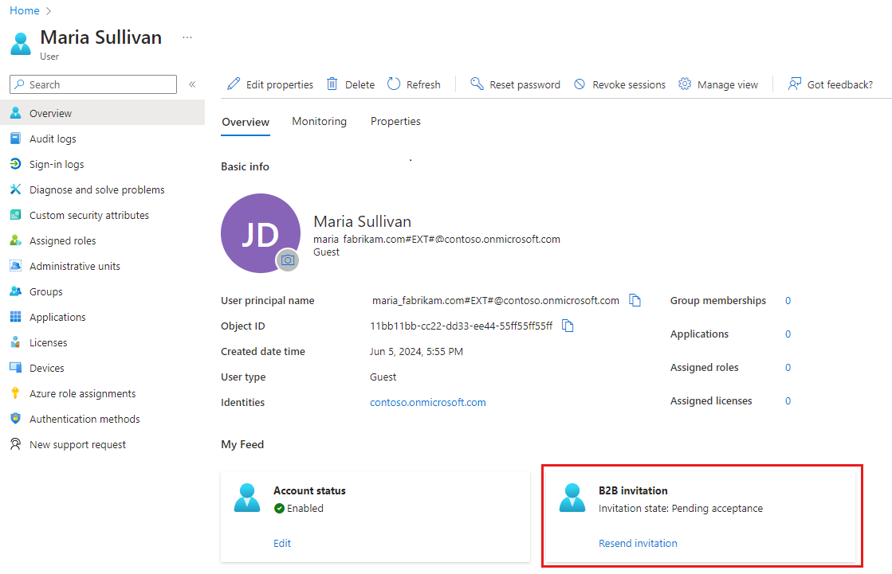

---

title: Add B2B collaboration users in the Microsoft Entra admin center
description: Shows how an admin can add guest users to their directory from a partner organization using Microsoft Entra B2B collaboration.

services: active-directory
ms.service: active-directory
ms.subservice: B2B
ms.topic: how-to
ms.date: 04/21/2023

ms.author: cmulligan
author: csmulligan
manager: celestedg
ms.collection: M365-identity-device-management
---

# Add Microsoft Entra B2B collaboration users in the Microsoft Entra admin center

As a user who is assigned any of the limited administrator directory roles, you can use the Microsoft Entra admin center to invite B2B collaboration users. You can invite guest users to the directory, to a group, or to an application. After you invite a user through any of these methods, the invited user's account is added to Microsoft Entra ID, with a user type of *Guest*. The guest user must then redeem their invitation to access resources. An invitation of a user doesn't expire.

After you add a guest user to the directory, you can either send the guest user a direct link to a shared app, or the guest user can select the redemption URL in the invitation email. For more information about the redemption process, see [B2B collaboration invitation redemption](redemption-experience.md).

> [!IMPORTANT]
> You should follow the steps in [How-to: Add your organization's privacy info in Microsoft Entra ID](~/fundamentals/properties-area.md) to add the URL of your organization's privacy statement. As part of the first time invitation redemption process, an invited user must consent to your privacy terms to continue. 

The updated experience for creating new users covered in this article is available as a Microsoft Entra ID preview feature. This feature is enabled by default, but you can opt out by going to **Identity** > **Overview** > **Preview features** and disabling the **Create user experience** feature. For more information about previews, see [Universal License Terms for Online Services](https://www.microsoft.com/licensing/terms/product/ForOnlineServices/all).

Instructions for the legacy create user process can be found in the [Add or delete users](~/fundamentals/add-users.md) article.

## Before you begin

Make sure your organization's external collaboration settings are configured such that you're allowed to invite guests. By default, all users and admins can invite guests. But your organization's external collaboration policies might be configured to prevent certain types of users or admins from inviting guests. To find out how to view and set these policies, see [Enable B2B external collaboration and manage who can invite guests](external-collaboration-settings-configure.md).

## Add guest users to the directory

[!INCLUDE [portal updates](~/includes/portal-update.md)]

To add B2B collaboration users to the directory, follow these steps:

1. Sign in to the [Microsoft Entra admin center](https://entra.microsoft.com) as at least a [User administrator](~/identity/role-based-access-control/permissions-reference.md#user-administrator).

1. Browse to **Identity** > **Users** > **All users**.

1. Select **New user** > **Invite external user** from the menu. 

    

### Basics

In this section, you're inviting the guest to your tenant using *their email address*. If you need to create a guest user with a domain account, use the [create new user process](~/fundamentals/how-to-create-delete-users.md#create-a-new-user) but change the **User type** to **Guest**. 

- **Email**: Enter the email address for the guest user you're inviting.

- **Display name**: Provide the display name.

-  **Invitation message**: Select the **Send invite message** checkbox to customize a brief message to the guest. Provide a Cc recipient, if necessary.

Either select the **Review + invite** button to create the new user or **Next: Properties** to complete the next section.

### Properties

There are six categories of user properties you can provide. These properties can be added or updated after the user is created. To manage these details, go to **Identity** > **Users** > **All users** and select a user to update.

- **Identity:** Enter the user's first and last name. Set the User type as either Member or Guest. For more information about the difference between external guests and members, see [B2B collaboration user properties](user-properties.md)

- **Job information:** Add any job-related information, such as the user's job title, department, or manager.

- **Contact information:** Add any relevant contact information for the user.

- **Parental controls:** For organizations like K-12 school districts, the user's age group may need to be provided. *Minors* are 12 and under, *Not adult* are 13-18 years old, and *Adults* are 18 and over. The combination of age group and consent provided by parent options determine the Legal age group classification. The Legal age group classification may limit the user's access and authority.

- **Settings:** Specify the user's global location.

Either select the **Review + invite** button to create the new user or **Next: Assignments** to complete the next section.

### Assignments

You can assign external users to a group, or Microsoft Entra role when the account is created. You can assign the user to up to 20 groups or roles. Group and role assignments can be added after the user is created. The **Privileged Role Administrator** role is required to assign Microsoft Entra roles.

**To assign a group to the new user**:

1. Select **+ Add group**.
1. From the menu that appears, choose up to 20 groups from the list and select the **Select** button.
1. Select the **Review + create** button.

    

**To assign a role to the new user**:

1. Select **+ Add role**.
1. From the menu that appears, choose up to 20 roles from the list and select the **Select** button.
1. Select the **Review + invite** button.

### Review and create

The final tab captures several key details from the user creation process. Review the details and select the **Invite** button if everything looks good. An email invitation is automatically sent to the user. After you send the invitation, the user account is automatically added to the directory as a guest.

 

### External user invitations

When you invite an external guest user by sending an email invitation, you can check the status of the invitation from the user's details. If they haven't redeemed their invitation, you can resend the invitation email.

1. Go to **Identity** > **Users** > **All users** and select the invited guest user.
1. In the **My Feed** section, locate the **B2B collaboration** tile. 
    - If the invitation state is **PendingAcceptance**, select the **Resend invitation** link to send another email and follow the prompts.
    - You can also select the **Properties** for the user and view the **Invitation state**.

   > [!NOTE]
   > Group email addresses aren’t supported; enter the email address for an individual. Also, some email providers allow users to add a plus symbol (+) and additional text to their email addresses to help with things like inbox filtering. However, Microsoft Entra doesn’t currently support plus symbols in email addresses. To avoid delivery issues, omit the plus symbol and any characters following it up to the @ symbol.

The user is added to your directory with a user principal name (UPN) in the format *emailaddress*#EXT#\@*domain*. For example: *john_contoso.com#EXT#\@fabrikam.onmicrosoft.com*, where fabrikam.onmicrosoft.com is the organization from which you sent the invitations. ([Learn more about B2B collaboration user properties](user-properties.md).)

## Add guest users to a group

If you need to manually add B2B collaboration users to a group after the user was invited, follow these steps:

1. Sign in to the [Microsoft Entra admin center](https://entra.microsoft.com) as at least a [User administrator](~/identity/role-based-access-control/permissions-reference.md#user-administrator). 
1. Browse to **Identity** > **Groups** > **All groups**.
4. Select a group (or select **New group** to create a new one). It's a good idea to include in the group description that the group contains B2B guest users.
5. Under **Manage**, select **Members**.
6. Select **Add members**.
7. Complete the following set of steps:

   - *If the guest user is already in the directory:*
      
       a. On the **Add members** page, start typing the name or email address of the guest user.
       
       b. In the search results, choose the user, and then choose **Select**.

You can also use dynamic groups with Microsoft Entra B2B collaboration. For more information, see [Dynamic groups and Microsoft Entra B2B collaboration](use-dynamic-groups.md).

## Add guest users to an application

To add B2B collaboration users to an application, follow these steps:

1. Sign in to the [Microsoft Entra admin center](https://entra.microsoft.com) as at least a [User administrator](~/identity/role-based-access-control/permissions-reference.md#user-administrator).
1. Browse to **Identity** > **Applications** > **Enterprise applications**.
4. On the **All applications** page, select the application to which you want to add guest users.
5. Under **Manage**, select **Users and groups**.
6. Select **Add user/group**.
7. On the **Add Assignment** page, select the link under **Users**.
8. Complete the following set of steps:

   - *If the guest user is already in the directory:*
      
       a. On the **Users** page, start typing the name or email address of the guest user.
      
       b. In the search results, choose the user, and then choose **Select**.
       
       c. On the **Add Assignment** page, choose **Assign** to add the user to the app.

9. The guest user appears in the application's **Users and groups** list with the assigned role of **Default Access**. If the application provides different roles and you want to change the user's role, do the following:

    a. Select the check box next to the guest user, and then select the **Edit** button. 
    
    b. On the **Edit Assignment** page, choose the link under **Select a role**, and select the role you want to assign to the user.
    
    c. Choose **Select**.
    
    d. Select **Assign**.

## Next steps

- To learn how non-Azure AD admins can add B2B guest users, see [How users in your organization can invite guest users to an app](add-users-information-worker.md)
- For information about the invitation email, see [The elements of the B2B collaboration invitation email](invitation-email-elements.md).
- To learn about the B2B collaboration user types, see the [B2B collaboration user properties](user-properties.md) article.
