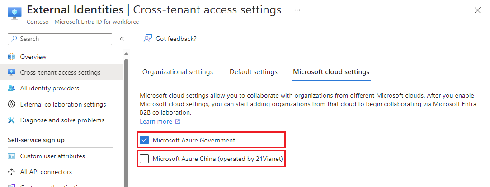
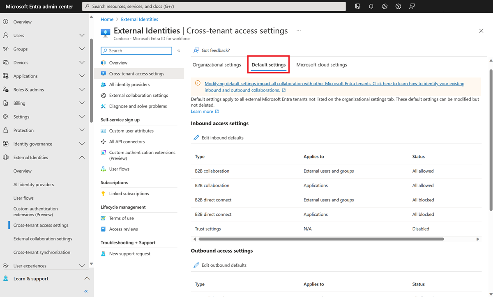
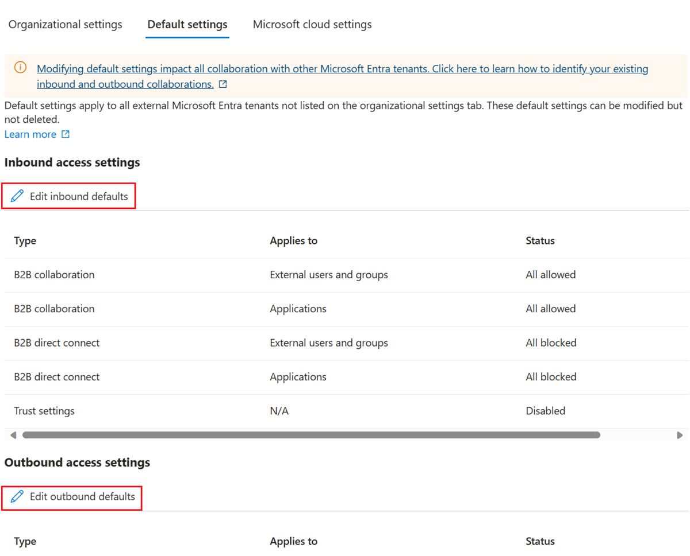
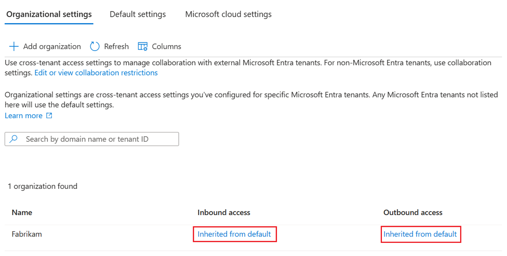

# Configure cross-cloud settings for B2B collaboration (Preview)

> [!NOTE]
> Cross-cloud settings are preview features of Azure Active Directory. For more information about previews, see [Supplemental Terms of Use for Microsoft Azure Previews](https://azure.microsoft.com/support/legal/preview-supplemental-terms/).

When Azure AD organizations in separate Microsoft Azure clouds need to collaborate, they can enable cross-cloud Azure AD B2B collaboration. B2B collaboration is available between the following sovereign Microsoft Azure clouds:

- Microsoft Azure global cloud
- Microsoft Azure Government
- Microsoft Azure China 21Vianet

you'll need to enable that cloud in your [cross-cloud settings](cross-tenant-access-overview.md#cross-cloud-settings), and then make sure your cross-tenant access default settings or organizational settings are configured to allow B2B collaboration with the tenant. Both tenants must mutually allow B2B collaboration, so an admin in the external tenant will need to do the same for your tenant.

To set up B2B collaboration with a partner organization in an external Microsoft Azure cloud, each partner mutually agrees to configure B2B collaboration with each other. An admin in each organization needs to complete the following steps:

- Configure cross-cloud settings to enable collaboration with the partner's cloud.

- Set the desired defaults that will generally apply to all Azure AD organizations in the partner's cloud.

- Create organizational settings specifically for the partner organization you want to collaborate with. You'll add the organization using their tenant ID and create organization-specific B2B collaboration settings.

After each organization has completed these steps, their users can collaborate using Azure AD B2B collaboration.

## Before you begin

- Be aware that once you enable a cloud, your default cross-tenant access settings will apply to all Azure AD tenants in that cloud. Decide on the default level of access you want to apply to any Azure AD organization for which you don't plan to create **Organizational settings**.
- Obtain the tenant ID for your partner's Azure AD organization. You'll need the tenant ID to create customized **Organizational settings** for the partner's organization. In cross-cloud scenarios, lookup by organization name isn't available.
- If you want to apply access settings to specific users, groups, or applications in the partner organization, you'll need to contact the organization for information before configuring your settings. Obtain their user object IDs, group object IDs, or application IDs (*client app IDs* or *resource app IDs*) so you can target your settings correctly.

## Enable the cloud

In your cross-cloud settings, enable the Microsoft Azure cloud you want to collaborate with. 

1. Sign in to the [Azure portal](https://portal.azure.com) using a Global administrator or Security administrator account. Then open the **Azure Active Directory** service.
1. Select **External Identities**, and then select **Cross-tenant access settings (preview)**.
1. Select **Cross cloud settings**.
1. Select the checkboxes next to the external Microsoft Azure clouds you want to collaborate with.

   

## Configure default settings

 Now that you've enabled an external cloud, your default settings apply to tenants in that cloud. If you want to modify the Azure AD-provided default settings, follow these steps.

1. Sign in to the [Azure portal](https://portal.azure.com) using a Global administrator or Security administrator account. Then open the **Azure Active Directory** service.
1. Select **External Identities**, and then select **Cross-tenant access settings (Preview)**.
1. Select the **Default settings** tab and review the summary page.

   

1. To change the settings, select the **Edit inbound defaults** link or the **Edit outbound defaults** link.

      

1. Modify the default settings by following the detailed steps in these sections:

   - [Modify inbound access settings](cross-tenant-access-settings-b2b-collaboration.md#modify-inbound-access-settings)
   - [Modify outbound access settings](cross-tenant-access-settings-b2b-collaboration.md#modify-outbound-access-settings)

## Add an organization

Follow these steps to add the tenant in the external cloud with which you want to collaborate.

1. Sign in to the [Azure portal](https://portal.azure.com) using a Global administrator or Security administrator account. Then open the **Azure Active Directory** service.
1. Select **External Identities**, and then select **Cross-tenant access settings (preview)**.
1. Select **Organizational settings**.
1. Select **Add organization**.
1. On the **Add organization** pane, type the full domain name (or tenant ID) for the organization.

   

1. Select the organization in the search results, and then select **Add**.
1. The organization appears in the **Organizational settings** list. At this point, all access settings for this organization are inherited from your default settings. To change the settings for this organization, select the **Inherited from default** link under the **Inbound access** or **Outbound access** column.

   

1. Modify the organization's settings by following the detailed steps in these sections:

   - [Modify inbound access settings](cross-tenant-access-settings-b2b-collaboration.md#modify-inbound-access-settings)
   - [Modify outbound access settings](cross-tenant-access-settings-b2b-collaboration.md#modify-outbound-access-settings)

## Next steps

See [Configure external collaboration settings](external-collaboration-settings-configure.md) for B2B collaboration with non-Azure AD identities, social identities, and non-IT managed external accounts.
