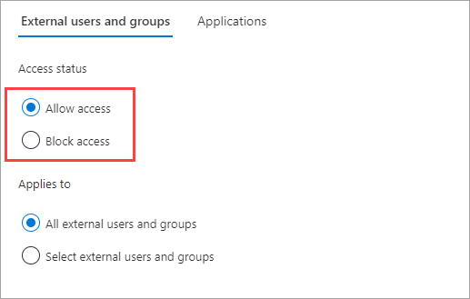
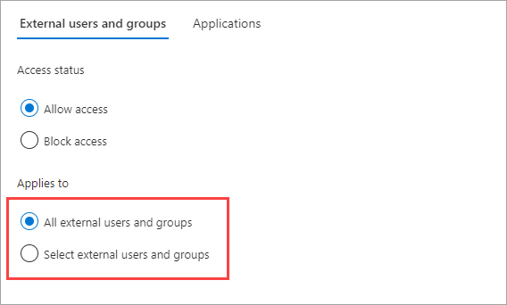
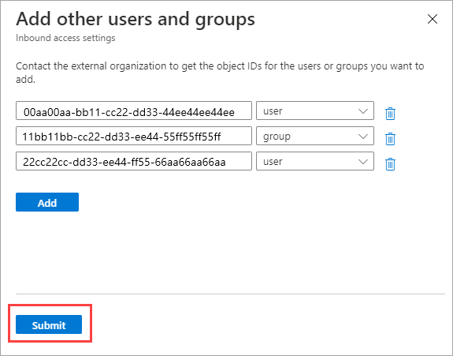
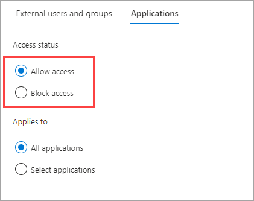
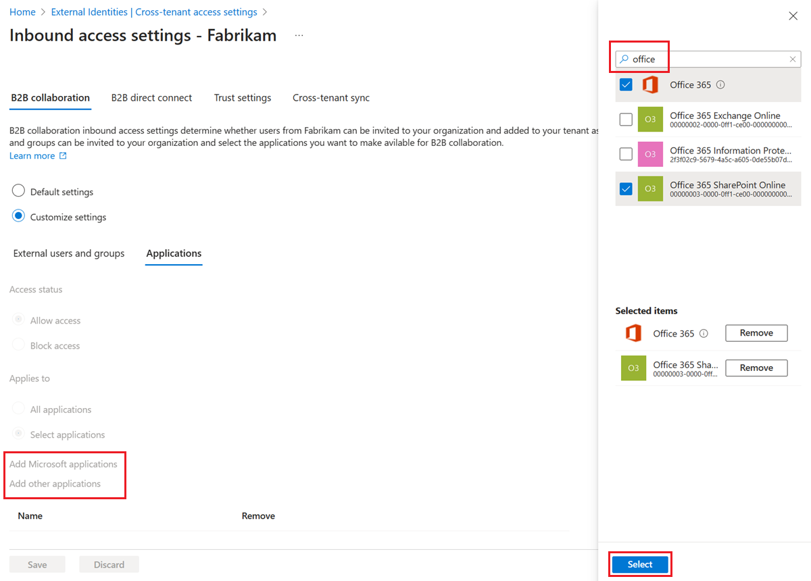
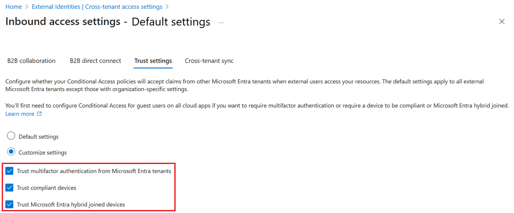
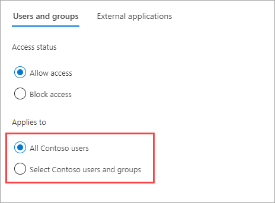
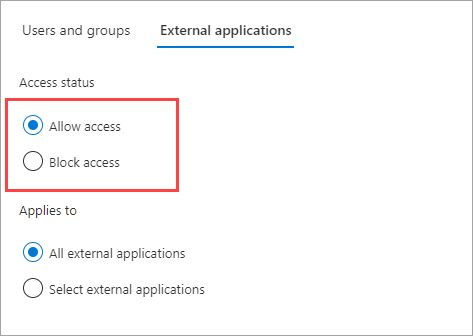
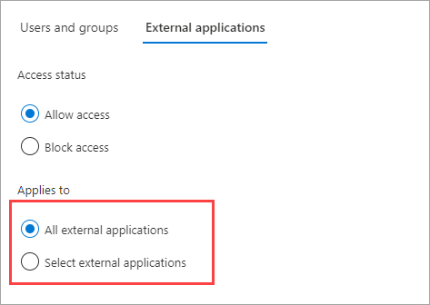
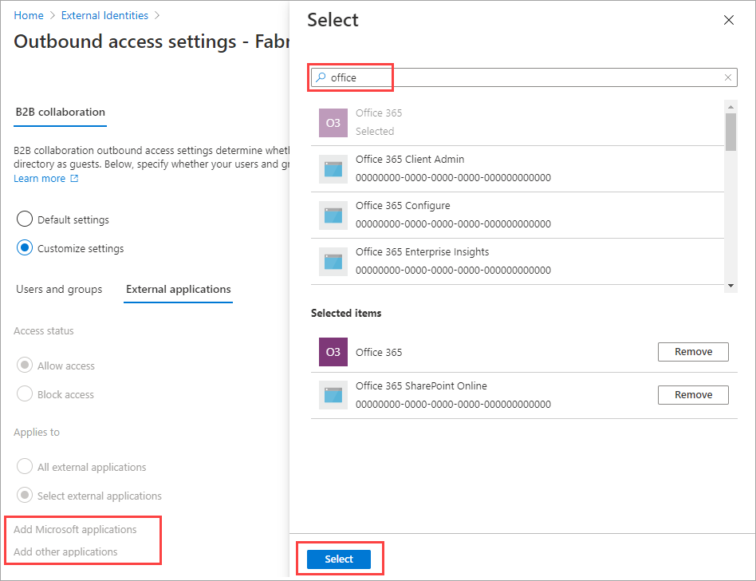

# Configure cross-tenant access settings for B2B collaboration

> [!NOTE]
> Cross-tenant access settings are preview features of Azure Active Directory. For more information about previews, see [Supplemental Terms of Use for Microsoft Azure Previews](https://azure.microsoft.com/support/legal/preview-supplemental-terms/).

Use External Identities cross-tenant access settings to manage how you collaborate with other Azure AD organizations through B2B collaboration. These settings determine both the level of *inbound* access users in external Azure AD organizations have to your resources, as well as the level of *outbound* access your users have to external organizations. They also let you trust multi-factor authentication (MFA) and device claims (compliant and Hybrid Azure AD join claims) from other Azure AD organizations.

- **Default settings**: The default cross-tenant access settings apply to all Azure AD organizations external to your tenant, except those for which you've configured organizational settings. You can change your default settings, but their initial settings are as follows:

  - All your users are enabled for **B2B collaboration** by default. This means your users can invite external guests to access your resources and they can be invited to external organizations as guests. MFA and device claims from other Azure AD organizations are not trusted.
  - No organizations are added to your **Organizational settings** by default. This means all external Azure AD organizations are enabled for B2B collaboration with your organization.

- **Organizational settings**: You can configure organization-specific settings by adding an organization and modifying the inbound and outbound settings for that organization. Organizational settings take precedence over default settings.

This article describes how to configure both default and organizational cross-tenant access settings to manage collaboration with external users from Azure AD organizations.

## Important considerations

  > [!CAUTION]
  > Changing the default inbound or outbound settings to **Block access** could block existing business-critical access to apps in your organization or partner organizations. Be sure to use the tools described in this article and consult with your business stakeholders to identify the required access.
 
- The cross-tenant access settings described in this article are used to manage B2B collaboration with other Azure AD organizations. For non-Azure AD identities (for example, social identities or non-IT managed external accounts), use [external collaboration settings](external-collaboration-settings-configure.md). External collaboration settings include options for restricting guest user access, specifying who can invite guests, and allowing or blocking domains.
- The access settings you configure for users and groups must match the access settings for applications. Conflicting settings aren't allowed, and you’ll see warning messages if you try to configure them.
  - *Example 1*: If you block inbound B2B collaboration for all external users and groups, access to all your applications must also be blocked.
  - *Example 2*: If you allow outbound B2B collaboration for all your users (or specific users or groups), you’ll be prevented from blocking all access to external applications; acess to at least one application must be allowed.
- If you block access to all apps by default, users will be unable to read emails encrypted with Microsoft Rights Management Service (also known as OME). To avoid this issue, we recommend configuring your outbound settings to allow your users to access this app ID: 00000012-0000-0000-c000-000000000000. If this is the only application you allow, access to all other apps will be blocked by default.
- To configure cross-tenant access settings in the Azure portal, you'll need an account with a Global administrator or Security administrator role.
- To configure trust settings or apply access settings to specific users, groups, or applications, you'll need an Azure AD Premium P1 license.

## Before you begin

- Use the tools and follow the recommendations in the [Identify inbound and outbound sign-ins](#identify-inbound-and-outbound-sign-ins) section to understand which external Azure AD organizations and resources users are currently accessing.
- Decide on the default level of access you want to apply to all external Azure AD organizations.
- Identify any Azure AD organizations that will need customized settings so you can configure **Organizational settings** for them.
- Obtain any required information from external organizations. If you want to apply access settings to specific users, groups, or applications within an external organization, you'll need to contact the organization to obtain object IDs for those groups, users, and applications before configuring access settings.

## Identify inbound and outbound sign-ins

Several tools are available to help you identify the access your users and partners need before you set inbound and outbound access settings. To ensure you don’t remove access that your users and partners need, you can examine current sign-in behavior. Taking this preliminary step will help prevent loss of desired access for your end users and partner users. However, in some cases these logs are only retained for 30 days, so we strongly recommend you speak with your business stakeholders to ensure required access is not lost.

### Sign-In Logs

To determine your users access to external Azure AD organizations in the last 30 days, run the following PowerShell script:

```powershell
Get-MgAuditLogsSignIn ` 
-Filter “ResourceTenantID ne ‘your tenant id’” ` 
-all:$True| ` 
group ResourceTenantId,AppDisplayName,UserPrincipalName| ` 
select count, @{n=’Ext TenantID/App User Pair’;e={$_.name}}] 
```

The output is a list of outbound sign-ins initiated by your users to apps in external tenants, for example:

```powershell
Count Ext TenantID/App User Pair
----- --------------------------
    6 45fc4ed2-8f2b-42c1-b98c-b254d552f4a7, ADIbizaUX, a@b.com
    6 45fc4ed2-8f2b-42c1-b98c-b254d552f4a7, Azure Portal, a@b.com
    6 45fc4ed2-8f2b-42c1-b98c-b254d552f4a7, Access Panel, a@b.com
    6 45fc4ed2-8f2b-42c1-b98c-b254d552f4a7, MS-PIM, a@b.com
    6 45fc4ed2-8f2b-42c1-b98c-b254d552f4a7, AAD ID Gov, a@b.com
    6 45fc4ed2-8f2b-42c1-b98c-b254d552f4a7, Access Panel, a@b.com
```

For the most up-to-date PowerShell script, see [Identify External Sign-ins PowerShell script](https://aka.ms/cross-tenant-signins-ps).

### Azure Monitor

If your organization subscribes to the Azure Monitor service, you can use the [Identify External Sign-ins Workbook](https://aka.ms/cross-tenant-signins-workbook) to visually explore inbound and outbound sign-ins for longer time periods.  

### Security Information and Event Management (SIEM) Systems

If your organization exports sign-in logs to a Security Information and Event Management (SIEM) system, you can retrieve required information from your SIEM system.

## Configure default settings

 Default cross-tenant access settings apply to all external tenants for which you haven't created organization-specific customized settings. If you want to modify the Azure AD-provided default settings, follow these steps.

> [!CAUTION]
> Changing the default inbound or outbound settings to **Block access** could block existing business-critical access to apps in your organization or partner organizations. Be sure to use the tools described in this article and consult with your business stakeholders to identify the required access.

1. Sign in to the [Azure portal](https://portal.azure.com) using a Global administrator or Security administrator account. Then open the **Azure Active Directory** service.
1. Select **External Identities**, and then select **Cross-tenant access settings (Preview)**.
1. Select the **Default settings** tab and review the summary page.

   

1. To change the settings, select the **Edit inbound defaults** link or the **Edit outbound defaults** link.

      


1. Modify the default settings by following the detailed steps in these sections:

   - [Modify inbound access settings](#modify-inbound-access-settings)
   - [Modify outbound access settings](#modify-outbound-access-settings)

## Add an organization

Follow these steps to configure customized settings for specific organizations.

1. Sign in to the [Azure portal](https://portal.azure.com) using a Global administrator or Security administrator account. Then open the **Azure Active Directory** service.
1. Select **External Identities**, and then select **Cross-tenant access settings (preview)**.
1. Select **Organizational settings**.
1. Select **Add organization**.
1. On the **Add organization** pane, type the full domain name (or tenant ID) for the organization.

   

1. Select the organization in the search results, and then select **Add**.
1. The organization appears in the **Organizational settings** list. At this point, all access settings for this organization are inherited from your default settings. To change the settings for this organization, select the **Inherited from default** link under the **Inbound access** or **Outbound access** column.

   


1. Modify the organization's settings by following the detailed steps in these sections:

   - [Modify inbound access settings](#modify-inbound-access-settings)
   - [Modify outbound access settings](#modify-outbound-access-settings)

## Modify inbound access settings

With inbound settings, you select which external users and groups will be able to access the internal applications you choose. Whether you're configuring default settings or organization-specific settings, the steps for changing inbound cross-tenant access settings are the same. As described in this section, you'll navigate to either the **Default** tab or an organization on the **Organizational settings** tab, and then make your changes.

1. Sign in to the [Azure portal](https://portal.azure.com) using a Global administrator or Security administrator account. Then open the **Azure Active Directory** service.

1. Select **External Identities** > **Cross-tenant access settings (preview)**.

1. Navigate to the settings you want to modify:
   - **Default settings**: To modify default inbound settings, select the **Default settings** tab, and then under **Inbound access settings**, select **Edit inbound defaults**.
   - **Organizational settings**: To modify settings for a specific organization, select the **Organizational settings** tab, find the organization in the list (or [add one](#add-an-organization)), and then select the link in the **Inbound access** column.

1. Follow the detailed steps for the inbound settings you want to change:

   - [To change inbound B2B collaboration settings](#to-change-inbound-b2b-collaboration-settings)
   - [To change inbound trust settings for accepting MFA and device claims](#to-change-inbound-trust-settings-for-mfa-and-device-claims)

### To change inbound B2B collaboration settings

1. Select the **B2B collaboration** tab.

1. (This step applies to **Organizational settings** only.) If you're configuring inbound access settings for a specific organization, select one of the following:

   - **Default settings**: Select this option if you want the organization to use the default inbound settings (as configured on the **Default** settings tab). If customized settings were already configured for this organization, you'll need to select **Yes** to confirm that you want all settings to be replaced by the default settings. Then select **Save**, and skip the rest of the steps in this procedure.

   - **Customize settings**: Select this option if you want to customize the settings for this organization, which will be enforced for this organization instead of the default settings. Continue with the rest of the steps in this procedure.

1. Select **External users and groups**.

1. Under **Access status**, select one of the following:

   - **Allow access**: Allows the users and groups specified under **Target** to be invited for B2B collaboration.
   - **Block access**: Blocks the users and groups specified under **Target** from being invited to B2B collaboration.

   

1. Under **Target**, select one of the following:

   - **All external users and groups**: Applies the action you chose under **Access status** to all users and groups from external Azure AD organizations.
   - **Select external users and groups** (requires an Azure AD premium subscription): Lets you apply the action you chose under **Access status** to specific users and groups within the external organization.

   > [!NOTE]
   > If you block access for all external users and groups, you also need to block access to all your internal applications (on the **Applications** tab).

   

1. If you chose **Select external users and groups**, do the following for each user or group you want to add:

    - Select **Add external users and groups**.
    - In the **Add other users and groups** pane, in the search box, type the user object ID or group object ID you obtained from your partner organization.
    - In the menu next to the search box, choose either **user** or **group**.
    - Select **Add**.

   

1. When you're done adding users and groups, select **Submit**.

   

1. Select the **Applications** tab.

1. Under **Access status**, select one of the following:

   - **Allow access**: Allows the applications specified under **Target** to be accessed by B2B collaboration users.
   - **Block access**: Blocks the applications specified under **Target** from being accessed by B2B collaboration users.

    

1. Under **Target**, select one of the following:

   - **All applications**: Applies the action you chose under **Access status** to all of your applications.
   - **Select applications** (requires an Azure AD premium subscription): Lets you apply the action you chose under **Access status** to specific applications in your organization.

   > [!NOTE]
   > If you block access to all applications, you also need to block access for all external users and groups (on the **External users and groups** tab).

    

1. If you chose **Select applications**, do the following for each application you want to add:

   - Select **Add Microsoft applications** or **Add other applications**.
   - In the applications pane, type the application name in the search box and select the application in the search results.
   - When you're done selecting applications, choose **Select**.

    

1. Select **Save**.

### To change inbound trust settings for MFA and device claims

1. Select the **Trust settings** tab.

1. (This step applies to **Organizational settings** only.) If you're configuring settings for an organization, select one of the following:

   - **Default settings**: The organization will use the settings configured on the **Default** settings tab. If customized settings were already configured for this organization, you'll need to select **Yes** to confirm that you want all settings to be replaced by the default settings. Then select **Save**, and skip the rest of the steps in this procedure.

   - **Customize settings**: You can customize the settings for this organization, which will be enforced for this organization instead of the default settings. Continue with the rest of the steps in this procedure.

1. Select one or more of the following options:

   - **Trust multi-factor authentication from Azure AD tenants**: Select this checkbox if your Conditional Access policies require multi-factor authentication (MFA). This setting allows your Conditional Access policies to trust MFA claims from external organizations. During authentication, Azure AD will check a user's credentials for a claim that the user has completed MFA. If not, an MFA challenge will be initiated in the user's home tenant.  

   - **Trust compliant devices**: Allows your Conditional Access policies to trust compliant device claims from an external organization when their users access your resources.

   - **Trust hybrid Azure AD joined devices**: Allows your Conditional Access policies to trust hybrid Azure AD joined device claims from an external organization when their users access your resources.

    

1. Select **Save**.

## Modify outbound access settings

With outbound settings, you select which of your users and groups will be able to access the external applications you choose. Whether you're configuring default settings or organization-specific settings, the steps for changing outbound cross-tenant access settings are the same. As described in this section, you'll navigate to either the **Default** tab or an organization on the **Organizational settings** tab, and then make your changes.

1. Sign in to the [Azure portal](https://portal.azure.com) using a Global administrator or Security administrator account. Then open the **Azure Active Directory** service.

1. Select **External Identities**, and then select **Cross-tenant access settings (Preview)**.

1. Navigate to the settings you want to modify:

   - To modify default outbound settings, select the **Default settings** tab, and then under **Outbound access settings**, select **Edit outbound defaults**.

   - To modify settings for a specific organization, select the **Organizational settings** tab, find the organization in the list (or [add one](#add-an-organization)) and then select the link in the **Outbound access** column.

1. Select the **B2B collaboration** tab.

1. (This step applies to **Organizational settings** only.) If you're configuring settings for an organization, select one of the following:

   - **Default settings**: The organization will use the settings configured on the **Default** settings tab. If customized settings were already configured for this organization, you'll need to select **Yes** to confirm that you want all settings to be replaced by the default settings. Then select **Save**, and skip the rest of the steps in this procedure.

   - **Customize settings**: You can customize the settings for this organization, which will be enforced for this organization instead of the default settings. Continue with the rest of the steps in this procedure.

1. Select **Users and groups**.

1. Under **Access status**, select one of the following:

   - **Allow access**: Allows your users and groups specified under **Target** to be invited to external organizations for B2B collaboration.
   - **Block access**: Blocks your users and groups specified under **Target** from being invited to B2B collaboration. If you block access for all users and groups, this will also block all external applications from being accessed via B2B collaboration.

    

1. Under **Target**, select one of the following:

   - **All \<your organization\> users**: Applies the action you chose under **Access status** to all your users and groups.
   - **Select \<your organization\> users and groups** (requires an Azure AD premium subscription): Lets you apply the action you chose under **Access status** to specific users and groups.

   > [!NOTE]
   > If you block access for all of your users and groups, you also need to block access to all external applications (on the **External applications** tab).

   

1. If you chose **Select \<your organization\> users and groups**, do the following for each user or group you want to add:

   - Select **Add \<your organization\> users and groups**.
   - In the **Select** pane, type the user name or group name in the search box.
   - Select the user or group in the search results.
   - When you're done selecting the users and groups you want to add, choose **Select**.

1. Select the **External applications** tab.

1. Under **Access status**, select one of the following:

   - **Allow access**: Allows the external applications specified under **Target** to be accessed by your users via B2B collaboration.
   - **Block access**: Blocks the external applications specified under **Target** from being accessed by your users via B2B collaboration.

    

1. Under **Target**, select one of the following:

   - **All external applications**: Applies the action you chose under **Access status** to all external applications.
   - **Select external applications**: Applies the action you chose under **Access status** to all external applications.

   > [!NOTE]
   > If you block access to all external applications, you also need to block access for all of your users and groups (on the **Users and groups** tab).

    

1. If you chose **Select external applications**, do the following for each application you want to add:

   - Select **Add Microsoft applications** or **Add other applications**.
   - In the applications pane, type the application name in the search box and select the application in the search results.
   - When you're done selecting applications, choose **Select**.

    

1. Select **Save**.

## Next steps

See [Configure external collaboration settings](external-collaboration-settings-configure.md) for B2B collaboration with non-Azure AD identities, social identities, and non-IT managed external accounts.
