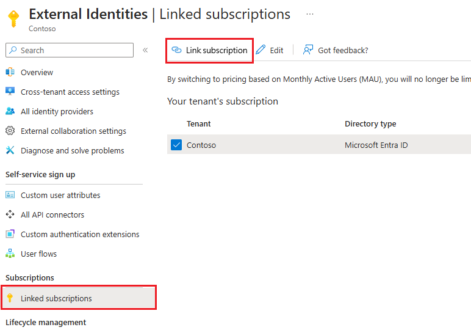

# Monthly active user (MAU) pricing for External Identities

Azure Active Directory (Azure AD) External Identities offers billing on a monthly active user (MAU) basis. With this model, billing is based on the count of unique users with authentication activity within a calendar month, known as monthly active users (MAU). You're not charged for inactive users or for multiple authentications by the same user within the month.

In this article, learn how the MAU billing model works and how to link to a subscription to your tenant.

> [!NOTE]
> This article does not contain pricing information. For the latest information about usage billing and pricing, see [Azure AD External Identities pricing](link).

## About MAU billing for External Identities

Starting **01 September 2020**, B2B collaboration usage for newly created Azure AD tenants are billed on a per-MAU basis. The MAU model replaces the 1:5 ratio billing model (1 Azure AD Premium license per 5 guest users). To take advantage of the MAU billing model, you need to make sure your tenant is linked to a subscription and select MAU billing. If you switch to the MAU model, you’ll no longer be billed using a 1:5 ratio of Azure AD Premium licenses to invited guest users.

The pricing tier that applies to your guest users is based on the highest pricing tier assigned to your Azure AD tenant. For example, if the highest pricing tier in your tenant is Azure AD Premium P1, the Premium P1 pricing tier will also apply to your guest users. If the highest pricing is Azure AD Free, you'll be asked to upgrade to a premium pricing tier when you try to use premium features for guest users, such as Conditional Access.

## Link your Azure AD tenant to a subscription

A tenant must be linked to an Azure subscription for proper billing and access to features included in the subscription.

1. Sign in to the [Azure portal](https://portal.azure.com/) with an Azure account that's been assigned at least the [Contributor](../role-based-access-control/built-in-roles.md) role within the subscription or a resource group within the subscription.

2. Select the directory that contains your subscription: In the Azure portal toolbar, select the **Directory + Subscription** icon, and then select the directory that contains your subscription.

    

3. In the left pane, select **Azure Active Directory**.

4. Select **External Identities**.

5. Under **Subscriptions**, select **Linked subscriptions**.

6. In the tenant list, select the checkbox next to the tenant, and then select **Link subscription**.

    

7. In the Link a subscription pane, select a **Subscription** and a **Resource group**.

    

After you complete these steps, your Azure subscription is billed in accordance with your Azure Direct or Enterprise Agreement details, if applicable.

## Next steps

See the following resources on Azure AD B2B collaboration:

* [Azure Active Directory pricing](https://azure.microsoft.com/pricing/details/active-directory/)
