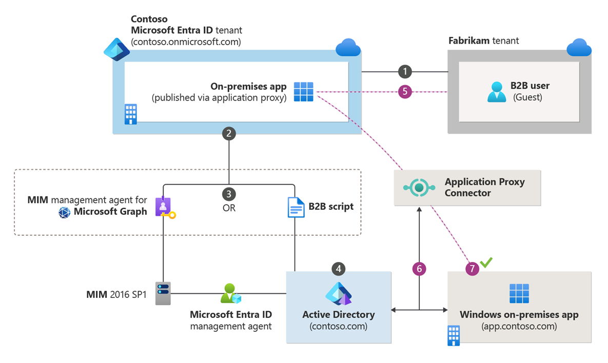

# Grant Microsoft Entra B2B users access to your on-premises applications

As an organization that uses Microsoft Entra B2B collaboration capabilities to invite guest users from partner organizations, you can now provide these B2B users access to on-premises apps. These on-premises apps can use SAML-based authentication or integrated Windows authentication (IWA) with Kerberos constrained delegation (KCD).

## Access to SAML apps

If your on-premises app uses SAML-based authentication, you can easily make these apps available to your Microsoft Entra B2B collaboration users through the Microsoft Entra admin center using Microsoft Entra application proxy.

You must do the following:

- Enable Application Proxy and install a connector. For instructions, see [Publish applications using Microsoft Entra application proxy](~/identity/app-proxy/application-proxy-add-on-premises-application.md).
- Publish the on-premises SAML-based application through Microsoft Entra application proxy by following the instructions in [SAML single sign-on for on-premises applications with Application Proxy](~/identity/app-proxy/application-proxy-configure-single-sign-on-on-premises-apps.md).
- Assign Microsoft Entra B2B Users to the SAML Application.

When you've completed the steps above, your app should be up and running. To test Microsoft Entra B2B access:
1. Open a browser and navigate to the external URL that you created when you published the app.
2. Sign in with the Microsoft Entra B2B account that you assigned to the app. You should be able to open the app and access it with single sign-on.

## Access to IWA and KCD apps

To provide B2B users access to on-premises applications that are secured with integrated Windows authentication and Kerberos constrained delegation, you need the following components:

- **Authentication through Microsoft Entra application proxy**. B2B users must be able to authenticate to the on-premises application. To do this, you must publish the on-premises app through the Microsoft Entra application proxy. For more information, see [Tutorial: Add an on-premises application for remote access through Application Proxy](~/identity/app-proxy/application-proxy-add-on-premises-application.md).
- **Authorization via a B2B user object in the on-premises directory**. The application must be able to perform user access checks, and grant access to the correct resources. IWA and KCD require a user object in the on-premises Windows Server Active Directory to complete this authorization. As described in [How single sign-on with KCD works](~/identity/app-proxy/application-proxy-configure-single-sign-on-with-kcd.md#how-single-sign-on-with-kcd-works), Application Proxy needs this user object to impersonate the user and get a Kerberos token to the app. 

   > [!NOTE]
   > When you configure the Microsoft Entra application proxy, ensure that **Delegated Logon Identity** is set to **User principal name** (default) in the single sign-on configuration for integrated Windows authentication (IWA).

   For the B2B user scenario, there are two methods you can use to create the guest user objects that are required for authorization in the on-premises directory:

   - Microsoft Identity Manager (MIM) and the MIM management agent for Microsoft Graph.
   - A PowerShell script, which is a more lightweight solution that doesn't require MIM.

The following diagram provides a high-level overview of how Microsoft Entra application proxy and the generation of the B2B user object in the on-premises directory work together to grant B2B users access to your on-premises IWA and KCD apps. The numbered steps are described in detail below the diagram.

1. A user from a partner organization (the Fabrikam tenant) is invited to the Contoso tenant.
2. A guest user object is created in the Contoso tenant (for example, a user object with a UPN of guest_fabrikam.com#EXT#@contoso.onmicrosoft.com).
3. The Fabrikam guest is imported from Contoso through MIM or through the B2B PowerShell script.
4. A representation or “footprint” of the Fabrikam guest user object (Guest#EXT#) is created in the on-premises directory, Contoso.com, through MIM or through the B2B PowerShell script.
5. The guest user accesses the on-premises application, app.contoso.com.
6. The authentication request is authorized through Application Proxy, using Kerberos constrained delegation. 
7. Because the guest user object exists locally, the authentication is successful.

### Lifecycle management policies

You can manage the on-premises B2B user objects through lifecycle management policies. For example:

- You can set up multi-factor authentication (MFA) policies for the Guest user so that MFA is used during Application Proxy authentication. For more information, see [Conditional Access for B2B collaboration users](authentication-conditional-access.md).
- Any sponsorships, access reviews, account verifications, etc. that are performed on the cloud B2B user applies to the on-premises users. For example, if the cloud user is deleted through your lifecycle management policies, the on-premises user is also deleted by MIM Sync or through the Microsoft Entra B2B script. For more information, see [Manage guest access with Microsoft Entra access reviews](~/id-governance/manage-guest-access-with-access-reviews.md).

### Create B2B guest user objects through a Microsoft Entra B2B script

You can use an [Microsoft Entra B2B sample script](https://github.com/Azure-Samples/B2B-to-AD-Sync) to create shadow Microsoft Entra accounts synced from Microsoft Entra B2B accounts. You can then use the shadow accounts for on-premises apps that use KCD.

### Create B2B guest user objects through MIM

You can use MIM and the MIM connector for Microsoft Graph to create the guest user objects in the on-premises directory.  To learn more, see [Microsoft Entra business-to-business (B2B) collaboration with Microsoft Identity Manager (MIM) 2016 SP1 with Azure Application Proxy](/microsoft-identity-manager/microsoft-identity-manager-2016-graph-b2b-scenario).

## License considerations

Make sure that you have the correct Client Access Licenses (CALs) or External Connectors for external guest users who access on-premises apps or whose identities are managed on-premises. For more information, see the "External Connectors" section of [Client Access Licenses and Management Licenses](https://www.microsoft.com/licensing/product-licensing/client-access-license.aspx). Consult your Microsoft representative or local reseller regarding your specific licensing needs.

## Next steps

- [Grant local users access to cloud apps](hybrid-on-premises-to-cloud.md)
- [Microsoft Entra B2B collaboration for hybrid organizations](hybrid-organizations.md)
