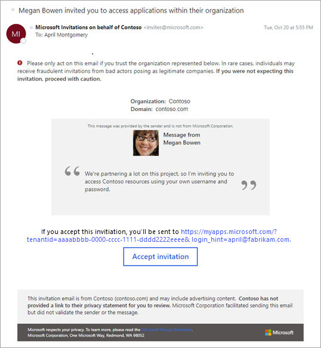
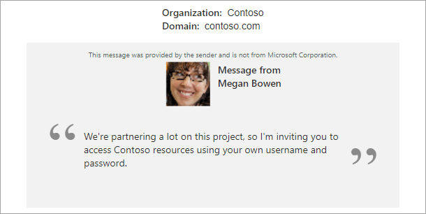

# The elements of the B2B collaboration invitation email

[!INCLUDE [applies-to-workforce-only](./includes/applies-to-workforce-only.md)]

Invitation emails play a key role in welcoming partners as Microsoft Entra B2B collaboration users. While [not mandatory](redemption-experience.md#redemption-process-through-a-direct-link), these emails provide essential information to help recipients make an informed decision about accepting your invitation. They also include a link for easy future access to your resources.

## Explaining the email

Let's look at a few elements of the email so you know how best to use their capabilities. These elements might look slightly different in some email clients. 

### Subject

The subject of the email follows this pattern:

&lt;username&gt; invited you to access applications within their organization.

### From address

We use a LinkedIn-like pattern for the From address. This pattern should make it clear that although the email comes from invites@microsoft.com, the invitation is from another organization. The format is: Microsoft Invitations <invites@microsoft.com> or Microsoft invitations on behalf of &lt;tenantname&gt; <invites@microsoft.com>. 

> [!NOTE]
> For the Azure service operated by [21Vianet in China](/azure/china/), the sender address is Invites@oe.21vianet.com.  
> For [Microsoft Entra ID for government](/azure/azure-government/), the sender address is invites@azuread.us.

### Reply To

The reply-to email is set to the inviter's email when available, so that replying to the email sends an email back to the inviter.

### Phishing warning

The email starts with a brief warning to the user about phishing, alerting them that they should only accept invitations they're expecting. It’s good practice to let partners know in advance to expect your invitation.

### Inviter's information and invitation message

The email includes the name and primary domain associated with the organization sending the invitation. This information should help the invitee make an informed decision about accepting the invitation. The inviter can include a message as part of their invitation to the [directory, group, or app](add-users-administrator.yml), or when they [use the invitation API](customize-invitation-api.md). The message is highlighted in the main section of the email. The inviter’s name and profile image are also included if they have one. The message itself is a text area, so for security reasons, it doesn't process HTML tags.

### Accept invitation button or link and redirect URL

The next section of the email contains information about where the invitee will be taken after they accept the invitation, and a button or link to do so. In the future, the invitee can always use this link to return to your resources directly.

### Footer section

The footer contains more information about the invitation being sent. There's always an option for the invitee to block future invitations. If the organization [configured a privacy statement](~/fundamentals/properties-area.yml), the link to the statement is displayed here. Otherwise, a note indicates the organization's privacy statement isn't available.

### Blocking an organization (unsubscribing)

In the invitation from an organization, the footer contains an option to **Block future invitations**. A guest user can select this link to block any future invitations from the organization. This action also adds the organization to the user's unsubscribed list at [https://invitations.microsoft.com/unsubscribe/manage](https://invitations.microsoft.com/unsubscribe/manage).

### Viewing organizations you blocked

A guest user can follow these steps to view or export the organizations they blocked:

1. Go to [https://invitations.microsoft.com/unsubscribe/manage](https://invitations.microsoft.com/unsubscribe/manage).
2. Enter your email and follow the sign-in steps for email one-time passcode authentication.
3. View the organizations you blocked, or export the names using copy and paste.
   > [!NOTE]
   > If you want to allow an organization you’ve blocked to invite you again, you can choose the organization and select **Next**.

## How the language is determined

The following settings determine the language that is presented to the guest user in the invitation email. These settings are listed in order of precedence. If a setting isn’t configured, the next setting in the list determines the language.

- The **messageLanguage** property of the [invitedUserMessageInfo](/graph/api/resources/invitedusermessageinfo) object if the [Create invitation API](/graph/api/invitation-post) is used
-	The **preferredLanguage** property specified in the guest's [user object](/graph/api/resources/user)
-	The **Notification language** set in the properties of the guest user’s home tenant (for Microsoft Entra tenants only)
-	The **Notification language** set in the properties of the resource tenant

If none of these settings are configured, the language defaults to English (US).

## Next steps

- [B2B collaboration invitation redemption](redemption-experience.md)
