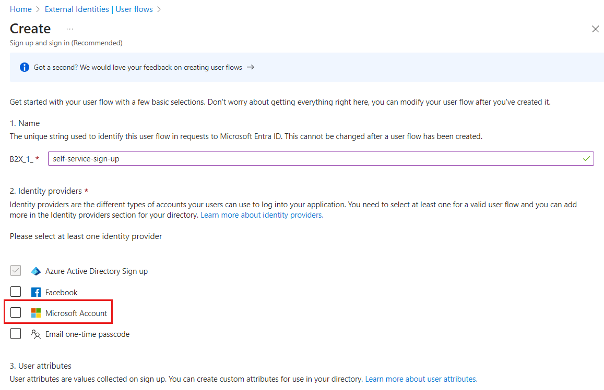

---

title: Microsoft Account (MSA) identity provider in Azure AD
description: Use Azure AD to enable an external user (guest) to sign in to your Azure AD apps with their Microsoft account (MSA).

services: active-directory
ms.service: active-directory
ms.subservice: B2B
ms.topic: how-to
ms.date: 03/02/2021

ms.author: mimart
author: msmimart
manager: celestedg
ms.collection: M365-identity-device-management
---

# Microsoft Account (MSA) identity provider for External Identities (Preview)

> [!NOTE]
> The Microsoft Account identity provider is a public preview feature of Azure Active Directory. For more information about previews, see [Supplemental Terms of Use for Microsoft Azure Previews](https://azure.microsoft.com/support/legal/preview-supplemental-terms/).

Your B2B guest users can use their own personal Microsoft accounts for B2B collaboration. Without any further configuration, Microsoft Account is available as an identity provider for your self-service sign-up user flows. Guest users can redeem your B2B collaboration invitations or complete your sign-up user flows using their personal Microsoft account.

Microsoft accounts are set up by a user to get access to consumer-oriented Microsoft products and cloud services, such as Outlook, OneDrive, Xbox LIVE, or Microsoft 365. The account is created and stored in the Microsoft consumer identity account system that's run by Microsoft.

## Guest sign-in using Microsoft accounts

Microsoft Account is available in the list of External Identities identity providers by default. With no further configuration, you can [invite a guest user](add-users-administrator.md) to B2B collaboration and they can redeem the invitation using their personal Microsoft account.

## Adding Microsoft Account to user flows

Microsoft Account is an identity provider option for your self-service sign-up user flows. Users can sign up for your applications using their own Microsoft accounts. To let users sign in using Microsoft accounts, you'll first need to [enable self-service sign-up](self-service-sign-up-user-flow.md) for your tenant. Then you can set up a user flow for the application and select Microsoft Account as one of the sign-in options.

## Next steps

- [Add Azure Active Directory B2B collaboration users](add-users-administrator.md)
- [Add self-service sign-up to an app](self-service-sign-up-user-flow.md)