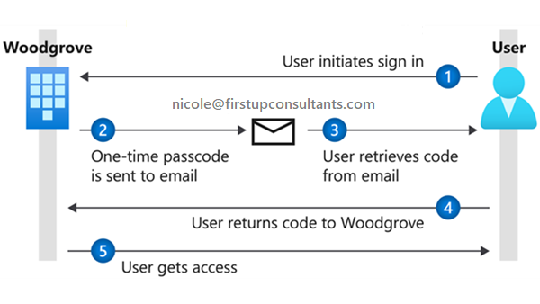
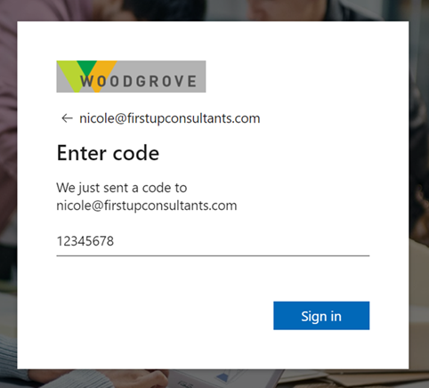

---

title: One-time passcode authentication for B2B guest users - Azure AD
description: How to use Email one-time passcode to authenticate B2B guest users without the need for a Microsoft account.

services: active-directory
ms.service: active-directory
ms.subservice: B2B
ms.topic: how-to
ms.date: 08/31/2022
ms.author: mimart
author: msmimart
manager: CelesteDG
ms.reviewer: mal
ms.custom: "it-pro, seo-update-azuread-jan, seoapril2019, contperf-fy21q4-portal"
ms.collection: M365-identity-device-management
---

# Email one-time passcode authentication

The email one-time passcode feature is a way to authenticate B2B collaboration users when they can't be authenticated through other means, such as Azure AD, Microsoft account (MSA), or social identity providers. When a B2B guest user tries to redeem your invitation or sign in to your shared resources, they can request a temporary passcode, which is sent to their email address. Then they enter this passcode to continue signing in.

> [!IMPORTANT]
>
> - The email one-time passcode feature is now turned on by default for all new tenants and for any existing tenants where you haven’t explicitly turned it off. This feature provides a seamless fallback authentication method for your guest users. If you don’t want to use this feature, you can [disable it](#disable-email-one-time-passcode), in which case users will be prompted to create a Microsoft account instead.

## Sign-in endpoints

Email one-time passcode guest users can now sign in to your multi-tenant or Microsoft first-party apps by using a [common endpoint](redemption-experience.md#redemption-and-sign-in-through-a-common-endpoint) (in other words, a general app URL that doesn't include your tenant context). During the sign-in process, the guest user chooses **Sign-in options**, and then selects **Sign in to an organization**. The user then types the name of your organization and continues signing in using one-time passcode.

Email one-time passcode guest users can also use application endpoints that include your tenant information, for example:

  * `https://myapps.microsoft.com/?tenantid=<your tenant ID>`
  * `https://myapps.microsoft.com/<your verified domain>.onmicrosoft.com`
  * `https://portal.azure.com/<your tenant ID>`

You can also give email one-time passcode guest users a direct link to an application or resource by including your tenant information, for example `https://myapps.microsoft.com/signin/Twitter/<application ID?tenantId=<your tenant ID>`.

## User experience for one-time passcode guest users

When the email one-time passcode feature is enabled, newly invited users [who meet certain conditions](#when-does-a-guest-user-get-a-one-time-passcode) will use one-time passcode authentication. Guest users who redeemed an invitation before email one-time passcode was enabled will continue to use their same authentication method.

With one-time passcode authentication, the guest user can redeem your invitation by clicking a direct link or by using the invitation email. In either case, a message in the browser indicates that a code will be sent to the guest user's email address. The guest user selects **Send code**:

   

A passcode is sent to the user’s email address. The user retrieves the passcode from the email and enters it in the browser window:

   

The guest user is now authenticated, and they can see the shared resource or continue signing in.

> [!NOTE]
> One-time passcodes are valid for 30 minutes. After 30 minutes, that specific one-time passcode is no longer valid, and the user must request a new one. User sessions expire after 24 hours. After that time, the guest user receives a new passcode when they access the resource. Session expiration provides added security, especially when a guest user leaves their company or no longer needs access.

## When does a guest user get a one-time passcode?

When a guest user redeems an invitation or uses a link to a resource that has been shared with them, they’ll receive a one-time passcode if:

- They don't have an Azure AD account.
- They don't have a Microsoft account.
- The inviting tenant didn't set up federation with social (like [Google](google-federation.md)) or other identity providers.
- They don't have any other authetication method, any password-backed accounts.
- Email one-time passcode is enabled.

At the time of invitation, there's no indication that the user you're inviting will use one-time passcode authentication. But when the guest user signs in, one-time passcode authentication will be the fallback method if no other authentication methods can be used.

> [!NOTE]
> When a user redeems a one-time passcode and later obtains an MSA, Azure AD account, or other federated account, they'll continue to be authenticated using a one-time passcode. If you want to update the user's authentication method, you can [reset their redemption status](reset-redemption-status.md).

### Example

Guest user teri@gmail.com is invited to Fabrikam, which doesn't have Google federation set up. Teri doesn't have a Microsoft account. They'll receive a one-time passcode for authentication.

## Enable email one-time passcode

1. Sign in to the [Azure portal](https://portal.azure.com/) as an Azure AD global administrator.

1. In the navigation pane, select **Azure Active Directory**.

1. Select **External Identities** > **All identity providers**.

1. Select **Email one-time passcode** to open the configuration pane.

1. Under **Email one-time passcode for guests**, select one of the following:

   - **Automatically enable email one-time passcode for guests starting October 2021** if you don't want to enable the feature immediately and want to wait for the automatic enablement date.
   - **Enable email one-time passcode for guests effective now** to enable the feature now.
   - **Yes** to enable the feature now if you see a Yes/No toggle (this toggle appears if the feature was previously disabled).

   

1. Select **Save**.

> [!NOTE]
> Email one-time passcode settings can also be configured with the [emailAuthenticationMethodConfiguration](/graph/api/resources/emailauthenticationmethodconfiguration) resource type in the Microsoft Graph API.

## Disable email one-time passcode

The email one-time passcode feature is now turned on by default for all new tenants and for any existing tenants where you haven't explicitly turned it off. This feature provides a seamless fallback authentication method for your guest users. If you don't want to use this feature, you can disable it, in which case users will be prompted to create a Microsoft account.

> [!NOTE]
>
> If the email one-time passcode feature has been enabled in your tenant and you turn it off, any guest users who have redeemed a one-time passcode will not be able to sign in. You can [reset their redemption status](reset-redemption-status.md) so they can sign in again using another authentication method.

### To disable the email one-time passcode feature

1. Sign in to the [Azure portal](https://portal.azure.com/) as an Azure AD global administrator.

1. In the navigation pane, select **Azure Active Directory**.

1. Select **External Identities** > **All identity providers**.

1. Select **Email one-time passcode**, and then under **Email one-time passcode for guests**, select **Disable email one-time passcode for guests** (or **No** if the feature was previously enabled, disabled, or opted into during preview).

   

   > [!NOTE]
   > Email one-time passcode settings have moved in the Azure portal from **External collaboration settings** to **All identity providers**.
   > If you see a toggle instead of the email one-time passcode options, this means you've previously enabled, disabled, or opted into the preview of the feature. Select **No** to disable the feature.

1. Select **Save**.

## Note for public preview customers

If you've previously opted in to the email one-time passcode public preview, automatic feature enablement doesn't apply to you, so your related business processes won't be affected. Additionally, in the Azure portal, under the **Email one-time passcode for guests** properties, you won't see the option to **Automatically enable email one-time passcode for guests starting October 2021**. Instead, you'll see the following **Yes** or **No** toggle:

However, if you'd prefer to opt out of the feature and allow it to be automatically enabled, you can revert to the default settings by using the Microsoft Graph API [email authentication method configuration resource type](/graph/api/resources/emailauthenticationmethodconfiguration). After you revert to the default settings, the following options will be available under **Email one-time passcode for guests**:

- **Automatically enable email one-time passcode for guests starting October 2021**. (Default) If the email one-time passcode feature isn't already enabled for your tenant, it will be automatically turned on. No further action is necessary if you want the feature enabled at that time. If you've already enabled or disabled the feature, this option will be unavailable.

- **Enable email one-time passcode for guests effective now**. Turns on the email one-time passcode feature for your tenant.

- **Disable email one-time passcode for guests**. Turns off the email one-time passcode feature for your tenant, and prevents the feature from turning on at the automatic enablement date.

## Note for Azure US Government customers

The email one-time passcode feature is disabled by default in the Azure US Government cloud. Your partners will be unable to sign in unless this feature is enabled. Unlike the Azure public cloud, the Azure US Government cloud doesn't support redeeming invitations with self-service Azure Active Directory accounts.

 

To enable the email one-time passcode feature in Azure US Government cloud:

1. Sign in to the [Azure portal](https://portal.azure.com) as an Azure AD global administrator.
2. In the navigation pane, select **Azure Active Directory**.
3. Select **Organizational relationships** > **All identity providers**.

   > [!NOTE]
   > - If you don't see **Organizational relationships**, search for "External Identities” in the search bar at the top.

4. Select **Email one-time passcode**, and then select **Yes**.
5. Select **Save**.

For more information about current limitations, see [Azure AD B2B in government and national clouds](b2b-government-national-clouds.md).

## Frequently asked questions

**What happens to my existing guest users if I enable email one-time passcode?**

Your existing guest users won't be affected if you enable email one-time passcode, as your existing users are already past the point of redemption. Enabling email one-time passcode will only affect future redemption activities where new guest users are redeeming into the tenant.

**What is the user experience when email one-time passcode is disabled?**

If you’ve disabled the email one-time passcode feature, the user is prompted to create a Microsoft account.

Also, when email one-time passcode is disabled, users might see a sign-in error when they're redeeming a direct application link and they weren't added to your directory in advance.

For more information about the different redemption pathways, see [B2B collaboration invitation redemption](redemption-experience.md).

**Will the “No account? Create one!” option for self-service sign-up go away?**

No. It’s easy to get [self-service sign-up in the context of External Identities](self-service-sign-up-overview.md) confused with self-service sign-up for email-verified users, but they're two different features. The unmanaged ("viral") feature that's going away is [self-service sign-up with email-verified users](../enterprise-users/directory-self-service-signup.md), which results in your guests creating an unmanaged Azure AD account. However, self-service sign-up for External Identities will continue to be available, which results in your guests signing up to your organization with a [variety of identity providers](identity-providers.md).  

**What does Microsoft recommend we do with existing Microsoft accounts (MSA)?**

When we support the ability to disable Microsoft Account in the Identity providers settings (not available today), we strongly recommend you disable Microsoft Account and enable email one-time passcode. Then you should [reset the redemption status](reset-redemption-status.md) of existing guests with Microsoft accounts so that they can re-redeem using email one-time passcode authentication and use email one-time passcode to sign in going forward.

**Regarding the change to enable email one-time-passcode by default, does this include SharePoint and OneDrive integration with Azure AD B2B?**

No, the global rollout of the change to enable email one-time passcode by default doesn't include enabling SharePoint and OneDrive integration with Azure AD B2B. To learn how to enable integration so that collaboration on SharePoint and OneDrive uses B2B capabilities, or how to disable this integration, see [SharePoint and OneDrive Integration with Azure AD B2B](/sharepoint/sharepoint-azureb2b-integration).

## Next steps

Learn about [Identity Providers for External Identities](identity-providers.md).
