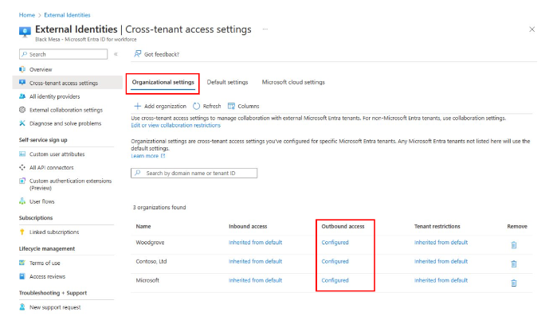
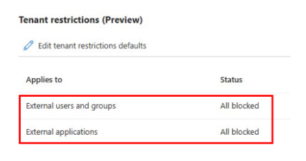
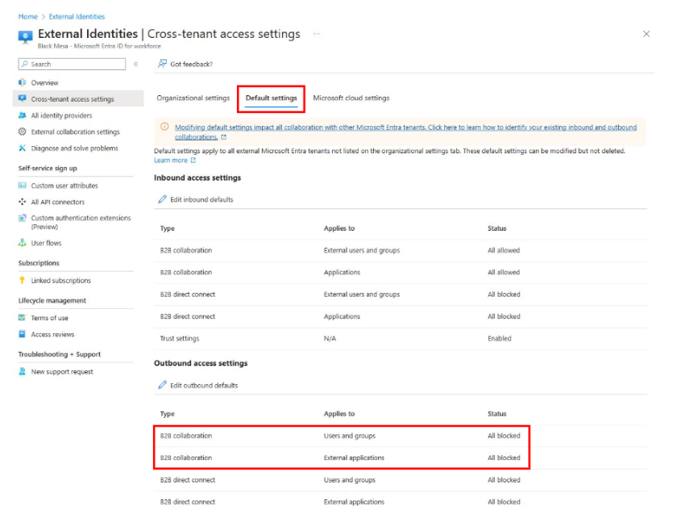

# Plan a tenant restrictions v1 migration to tenant restrictions v2

Administrators use [tenant restrictions v1](~/identity/enterprise-apps/tenant-restrictions.md) to control user access to external tenants on their network. However, [tenant restrictions v2](tenant-restrictions-v2.md) with the cross tenant access settings feature adds tenant-level restrictions and more granularity such as individual user, group, and application controls. Tenant restrictions v2 moves policy management from network proxies to a cloud-based portal. Organizations no longer hit a maximum number of targeted tenants due to proxy header size limitations. 

Migration from tenant restrictions v1 to tenant restrictions v2 is a one-time process with no other licensing requirements. As you plan the migration, include stakeholders from networking and identity teams. 

## Prerequisites

Ensure the following prerequisites are met. 

* Administrator access to proxies injecting the tenant restrictions v1 headers
  * Proxies can use on-premises or a cloud-based service
* [Microsoft Entra ID P1 or P2](~/fundamentals/get-started-premium.md) licenses
* Migration feasiblitiy: [Tenant restrictions v2 unsupported scenarios](tenant-restrictions-v2.md)

## Required roles

This section has the least-privileged roles required for the deployment. Use the Security Administrator role, or a custom role with at least the following permissions. 

Microsoft.directory/crossTenantAccessPolicy/ 

* Standard/read 
* Partners/standard/read 
* Default/standard/read 
* Basic/update 
* Default/tenantRestrictions/update 
* Partners/tenantRestrictions/update 
* Partners/create 
* Partners/b2bCollaboration/update 
* Default/b2bCollaboration/update 

## Create and state new tenant restrictions policy

Obtain the current header string that your proxies inject. Evaluate current policy and remove unwanted tenant IDs, or allowed destinations. After the evaluation, create a list of external tenant IDs and/or external domains. 

Configure the cross-tenant access settings and tenant restrictions v2 policies for the migration. Cross-tenant access outbound settings define tenants that internal identities access. In cross-tenant access settings, tenant restrictions v2 defines which tenants other external identities access while on your managed network. 

## Technical considerations

When you configure cross-tenant access outbound settings, the policy takes effect within one hour and is evaluated in addition to tenant restrictions v1 policy. Cross-tenant access settings and tenant restrictions v1 are evaluated and the most restrictive is applied. Because this action can affect users, mirror the tenant restrictions v1 policy as much as possible in the new policies to avoid negatively impacting users. The tenant restrictions v2 policy you configure in cross-tenant access settings takes effect after you update your proxies with the new header. 

   > [!NOTE]
   > The following section has migration and configuration management for common scenarios. Use this guidance to help craft the policy your organization needs. 

### Allow internal identity access to specific external tenants

Allow internal identities, such as employees, to access specific external tenants on your managed network. Block access to nonallow listed tenants. Block external identities such as contractors and vendors from accessing external tenants. 

1. In **Cross-tenant access settings**, add each domain/tenant as an organization under Organizational settings.
2. To allow all users and groups and allow all applications, for each added organization, [configure outbound access for B2B collaboration](cross-tenant-access-settings-b2b-collaboration.md). 

   

3. To block all users and groups and all applications for B2B collaboration, [configure the default cross-tenant access outbound settings](cross-tenant-access-settings-b2b-collaboration.md). 

   

4. In **Tenant restrictions** defaults, create the policy ID (if not created) and [configure the policy to block all users, groups, and external applications](tenant-restrictions-v2.md).

   

### Allow internal and external identities to access specific external tenants 

Allow internal identities such as employees, and external identities such as contractors and vendors to access specific external tenants on your managed network. Block access to nonallow listed tenants for all identities.  

1. In **Cross-tenant access settings**, [add each domain/tenant ID as an organization under Organizational settings](cross-tenant-access-settings-b2b-collaboration.md).
2. For each added organization to enable internal identities, configure Outbound access for B2B collaboration to allow all users, groups, and applications.
3. For each added organization to enable external identities, [configure the organization tenant restrictions](tenant-restrictions-v2.md) to allow all users, groups, and applications.  

   

4. To block all users, groups, and applications for B2B collaboration, [configure the default Cross Tenant Access outbound access settings](cross-tenant-access-settings-b2b-collaboration.md). 

   

5. In **Tenant restrictions defaults**, create the policy ID (if not created) and configure the policy to block all users, groups, and external applications.  

   

   > [!NOTE]
   > To target consumer Microsoft accounts (MSAs), add an organization with the following tenant ID: 9188040d-6c67-4c5b-b112-36a304b66dad. 

   > [!TIP]
   > The tenant restrictions v2 policy is created but not in effect.

## Enable tenant restrictions v2

Create a new header using your tenant ID and policy ID values. Update your network proxies to inject a new header. 

   > [!NOTE]
   > When you update a network proxy to inject the new sec-Restrict-Tenant-Access-Policy header, remove the two tenant restrictions v1 headers: Restrict-Access-To-Tenants and Restrict-Access-Context.  

   > [!TIP]
   > Update the network proxies in a phased rollout. Save the current tenant restrictions v1 headers and values.  

   > [!IMPORTANT]
   > Create a rollback plan in case you experience issues. 

Confirm proxy support for the following options: 

* **Upgrade one proxy at a time with the tenant restrictions v2 header** - Users who egress through this router receive the updated header and the new policy applies. Monitor for issues. If no issues arise, update the next proxy and continue until you update all proxies. 
* **Update header injection based on users** - Some proxies require authenticated users and might select which header to inject based on users and groups. Roll out the new tenant restrictions v2 header to a test group of users. Monitor for issues. If no issues arise, add more users in phases until 100% of traffic is in scope. 
* **Update the service to apply the new tenant restrictions v2 header all at one time** - This option isn't recommended. 

As you roll out the new header updates, test and validate that users experience the expected behaviors. 

## Monitor

When tenant restrictions v2 and cross-tenant access outbound settings are deployed, monitor your sign-in logs and/or use the [Cross-tenant activity workbook](~/identity/monitoring-health/workbook-cross-tenant-access-activity.md) to verify users don’t access unauthorized tenants. These tools help identify who accesses what external applications. You can configure cross-tenant access outbound settings and tenant restrictions to limit outbound access based on group membership and/or specific applications. 

## Next steps

* [Configure inbound cross-tenant access settings](cross-tenant-access-settings-b2b-collaboration.md)
* [Configure universal tenant restrictions](~/global-secure-access/how-to-universal-tenant-restrictions.md)
