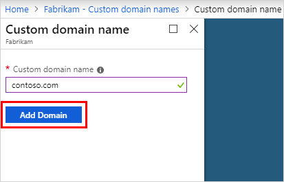
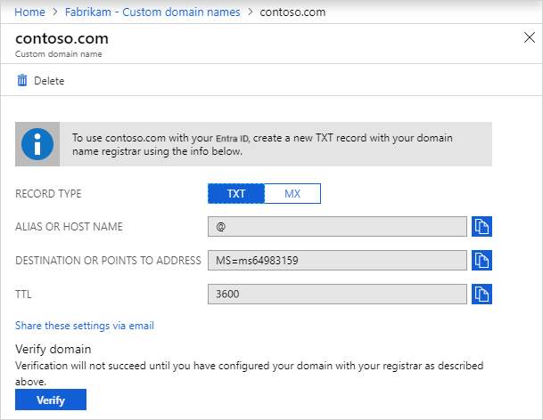
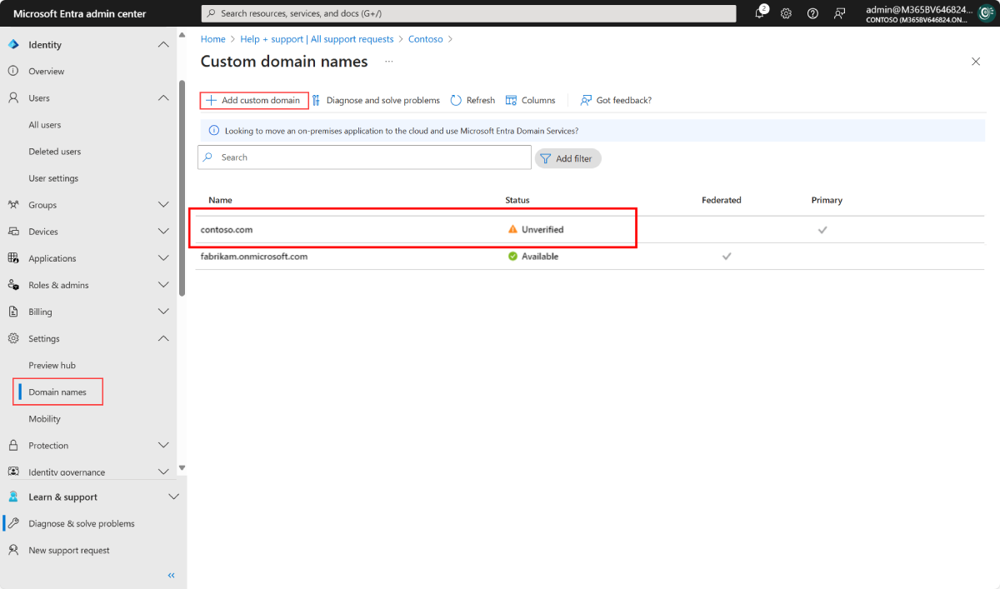
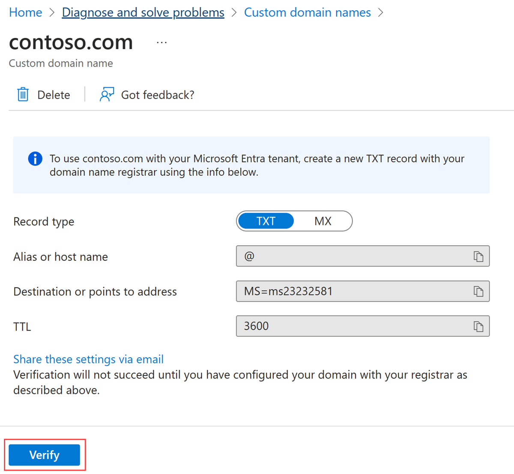

# Add your custom domain name using the Azure Active Directory portal

Every new Azure AD tenant comes with an initial domain name, *domainname*.onmicrosoft.com. You can't change or delete the initial domain name, but you can add your organization's names to the list. Adding custom domain names helps you to create user names that are familiar to your users, such as *alain\@contoso.com*.

## Before you begin

Before you can add a custom domain name, you must create your domain name with a domain registrar. For an accredited domain registrar, see [ICANN-Accredited Registrars](https://www.icann.org/registrar-reports/accredited-list.html).

## Create your directory in Azure AD

After you get your domain name, you can create your first Azure AD directory.

1. Sign in to the [Azure portal](https://portal.azure.com/) for your directory, using an account with the **Owner** role for the subscription, and then select **Azure Active Directory**. For more information about subscription roles, see [Azure RBAC roles](../../role-based-access-control/rbac-and-directory-admin-roles.md#azure-rbac-roles).

    

    >[!TIP]
    > If you plan to federate your on-premises Windows Server AD with Azure AD, then you need to select the **I plan to configure this domain for single sign-on with my local Active Directory** checkbox when you run the Azure AD Connect tool to synchronize your directories. You also need to register the same domain name you select for federating with your on-premises directory in the **Azure AD Domain** step in the wizard. To see what that setup looks like, see [Verify the Azure AD domain selected for federation](../hybrid/how-to-connect-install-custom.md#verify-the-azure-ad-domain-selected-for-federation). If you do not have the Azure AD Connect tool, you can [download it here](https://go.microsoft.com/fwlink/?LinkId=615771).

1. Create your new directory by following the steps in [Create a new tenant for your organization](active-directory-access-create-new-tenant.md#create-a-new-tenant-for-your-organization).

    >[!Important]
    >The person who creates the tenant is automatically the Global administrator for that tenant. The Global administrator can add additional administrators to the tenant.

## Add your custom domain name to Azure AD

After you create your directory, you can add your custom domain name.

1. Sign in to the [Azure portal](https://portal.azure.com/) using a Global administrator account for the directory.

1. Select **Azure Active Directory**, select **Custom domain names**, and then select **Add custom domain**.

    

1. In **Custom domain name**, enter your organization's new name, in this example, *contoso.com*. Select **Add domain**.

    

    >[!Important]
    >You must include .com, .net, or any other top-level extension for this to work properly.

    The unverified domain is added. The **contoso.com** page appears showing you your DNS information. Save this information. You need it later to create a TXT record to configure DNS.

    

## Add your DNS information to the domain registrar

After you add your custom domain name to Azure AD, you must return to your domain registrar and add the Azure AD DNS information from your copied TXT file. Creating this TXT record for your domain "verifies" ownership of your domain name.

Go back to your domain registrar, create a new TXT record for your domain based on your copied DNS information. Set the time to live (TTL) to 3600 seconds (60 minutes), and then save the record.

>[!Important]
>You can register as many domain names as you want. However, each domain gets its own TXT record from Azure AD. Be careful when entering your TXT file information at the domain registrar. If you enter the wrong or duplicate information by mistake, you'll have to wait until the TTL times out (60 minutes) before you can try again.

## Verify your custom domain name

After you register your custom domain name, make sure it's valid in Azure AD. The propagation from your domain registrar to Azure AD can be instantaneous or it can take up to a few days, depending on your domain registrar.

To verify your custom domain name, follow these steps

1. Sign in to the [Azure portal](https://portal.azure.com/) using a Global administrator account for the directory.

1. Select **Azure Active Directory**, and then select **Custom domain names**.

1. In the **Custom domain names** page, select the custom domain name. In this example, select **contoso.com**.

    

1. On the **contoso.com** page, select **Verify** to make sure your custom domain is properly registered and is valid for Azure AD.

    

After you've verified your custom domain name, you can delete your verification TXT or MX file.

## Common verification issues

If Azure AD can't verify a custom domain name, try the following suggestions:

- **Wait at least an hour and try again**. DNS records must propagate before Azure AD can verify the domain and this process can take an hour or more.

- **Make sure the DNS record is correct.** Go back to the domain name registrar site. Make sure the entry is there, and that it matches the DNS entry information provided by Azure AD.

  If you can't update the record on the registrar site, share the entry with someone who has permissions to add the entry and verify it's correct.

- **Make sure the domain name isn't already in use in another directory.** A domain name can only be verified in one directory. If your domain name is currently verified in another directory, it can't also be verified in the new directory. To fix this duplication problem, you must delete the domain name from the old directory. For more information about deleting domain names, see [Manage custom domain names](../users-groups-roles/domains-manage.md).

- **Make sure you don't have any unmanaged Power BI tenants.** If your users have activated Power BI through self-service sign-up and created an unmanaged tenant for your organization, you must take over management as an internal or external admin, using PowerShell. For more information, see [Take over an unmanaged directory as administrator in Azure Active Directory](../users-groups-roles/domains-admin-takeover.md).

## Next steps

- Add another Global administrator to your directory. For more information, see [How to assign roles and administrators](active-directory-users-assign-role-azure-portal.md).

- Add users to your domain, see [How to add or delete users](add-users-azure-active-directory.md).

- Manage your domain name information in Azure AD. For more information, see [Managing custom domain names](../users-groups-roles/domains-manage.md).

- If you have on-premises versions of Windows Server that you want to use alongside Azure Active Directory, see [Integrate your on-premises directories with Azure Active Directory](../connect/active-directory-aadconnect.md).
