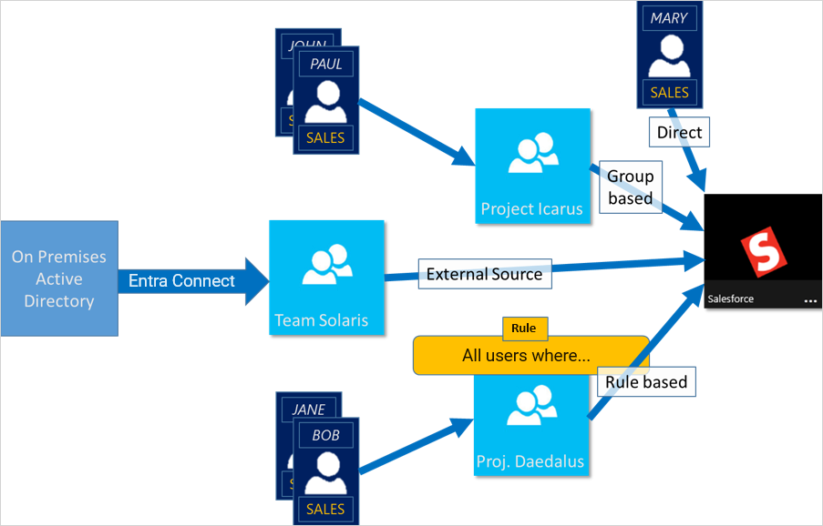
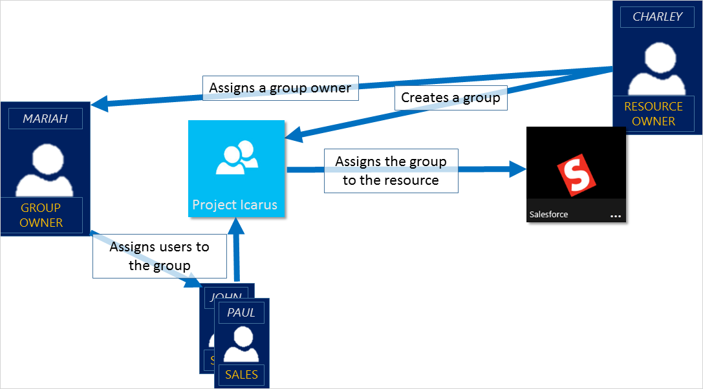

# Learn about groups and access rights in Azure Active Directory

Azure Active Directory (Azure AD) provides several ways to manage access to resources, applications, and tasks. With Azure AD groups you can grant access and permissions to a group of users instead of for each individual user. Limiting access to Azure AD resources to only those users who need it is one of the core security principals of [Zero Trust](https://docs.microsoft.com/security/zero-trust/zero-trust-overview). This article provides an overview of how groups and access rights can be used to together to make managing your Azure AD users easier while also applying security best practices.

Azure AD lets you use groups to manage access to applications, data, and resources. Resources can be:

- Part of the Azure AD organization, such as permissions to manage objects through roles in Azure AD
- External to the organization, such as for Software as a Service (SaaS) apps
- Azure services
- SharePoint sites
- On-premises resources

Some groups can't be managed in the Azure AD portal:

- Groups synced from on-premises Active Directory can be managed only in on-premises Active Directory.
- Distribution lists and mail-enabled security groups are managed only in Exchange admin center or Microsoft 365 admin center. You must sign in to Exchange admin center or Microsoft 365 admin center to manage these groups.

## What to know before creating a group

There are two group types and three group membership types. Review the options to find the right combination for your scenario.

### Group types:

**Security:** Used to manage user and computer access to shared resources.

For example, you can create a security group so that all group members have the same set of security permissions. Members of a security group can include users, devices, other groups, and [service principals](../fundamentals/service-accounts-principal.md), which define access policy and permissions. Owners of a security group can include users and service principals.

**Microsoft 365:** Provides collaboration opportunities by giving group members access to a shared mailbox, calendar, files, SharePoint sites, and more.

This option also lets you give people outside of your organization access to the group. Members of a Microsoft 365 group can only include users. Owners of a Microsoft 365 group can include users and service principals. For more info about Microsoft 365 Groups, see [Learn about Microsoft 365 Groups](https://support.office.com/article/learn-about-office-365-groups-b565caa1-5c40-40ef-9915-60fdb2d97fa2).

### Membership types:
- **Assigned:** Lets you add specific users as members of a group and have unique permissions.
- **Dynamic user:** Lets you use dynamic membership rules to automatically add and remove members. If a member's attributes change, the system looks at your dynamic group rules for the directory to see if the member meets the rule requirements (is added) or no longer meets the rules requirements (is removed).
- **Dynamic device:** Lets you use dynamic group rules to automatically add and remove devices. If a device's attributes change, the system looks at your dynamic group rules for the directory to see if the device meets the rule requirements (is added) or no longer meets the rules requirements (is removed).

    > [!IMPORTANT]
    > You can create a dynamic group for either devices or users, but not for both. You can't create a device group based on the device owners' attributes. Device membership rules can only reference device attributions. For more info about creating a dynamic group for users and devices, see [Create a dynamic group and check status](../enterprise-users/groups-create-rule.md)

## What to know before adding access rights to a group

After creating an Azure AD group, you need to grant it the appropriate access. Each application, resource, and service that requires access permissions needs to be managed separately because the permissions for one may not be the same as another. Grant access using the [principle of least privilege](../develop/secure-least-privileged-access.md) to help reduce the risk of attack or a security breach.

### How access management in Azure AD works

Azure AD helps you give access to your organization's resources by providing access rights to a single user or to an entire Azure AD group. Using groups lets the resource owner or Azure AD directory owner assign a set of access permissions to all the members of the group. The resource or directory owner can also give management rights for the member list to someone else, such as a department manager or a help desk administrator, letting that person add and remove members, as needed. For more information about how to manage group owners, see the [Manage groups](how-to-manage-groups.md) article.

### Ways to assign access rights

After creating a group, you need to decide how to assign access rights. Explore the ways to assign access rights to determine the best process for your scenario. 

- **Direct assignment.** The resource owner directly assigns the user to the resource.

- **Group assignment.** The resource owner assigns an Azure AD group to the resource, which automatically gives all of the group members access to the resource. Group membership is managed by both the group owner and the resource owner, letting either owner add or remove members from the group. For more information about managing group membership, see the [Manage groups](how-to-manage-groups.md) article. 

- **Rule-based assignment.** The resource owner creates a group and uses a rule to define which users are assigned to a specific resource. The rule is based on attributes that are assigned to individual users. The resource owner manages the rule, determining which attributes and values are required to allow access the resource. For more information, see [Create a dynamic group and check status](../enterprise-users/groups-create-rule.md).

- **External authority assignment.** Access comes from an external source, such as an on-premises directory or a SaaS app. In this situation, the resource owner assigns a group to provide access to the resource and then the external source manages the group members.

   

### Can users join groups without being assigned?
The group owner can let users find their own groups to join, instead of assigning them. The owner can also set up the group to automatically accept all users that join or to require approval.

After a user requests to join a group, the request is forwarded to the group owner. If it's required, the owner can approve the request and the user is notified of the group membership. However, if you have multiple owners and one of them disapproves, the user is notified, but isn't added to the group. For more information and instructions about how to let your users request to join groups, see [Set up Azure AD so users can request to join groups](../enterprise-users/groups-self-service-management.md).

## Next steps

- [Create and manage Azure AD groups and group membership](how-to-manage-groups.md)

- [Learn about group-based licensing in Azure AD](active-directory-licensing-whatis-azure-portal.md)

- [Manage access to SaaS apps using groups](../enterprise-users/groups-saasapps.md)

- [Manage dynamic rules for users in a group](../enterprise-users/groups-create-rule.md)

- [Learn about Privileged Identity Management for Azure AD roles](../../active-directory/privileged-identity-management/pim-create-azure-ad-roles-and-resource-roles-review.md)