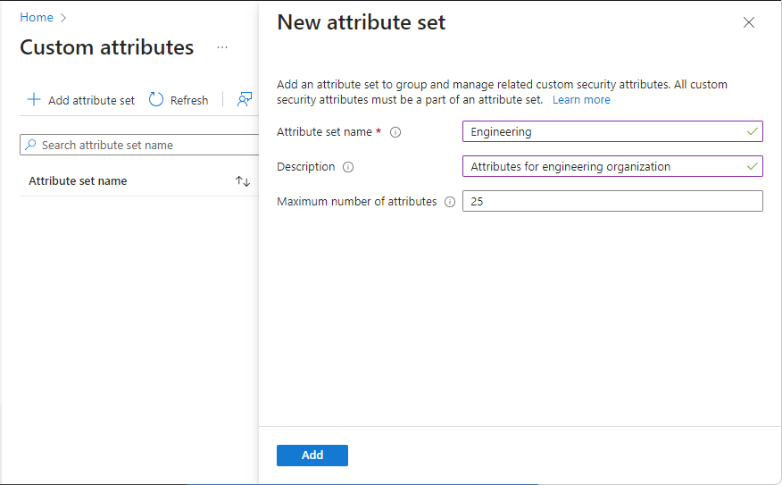
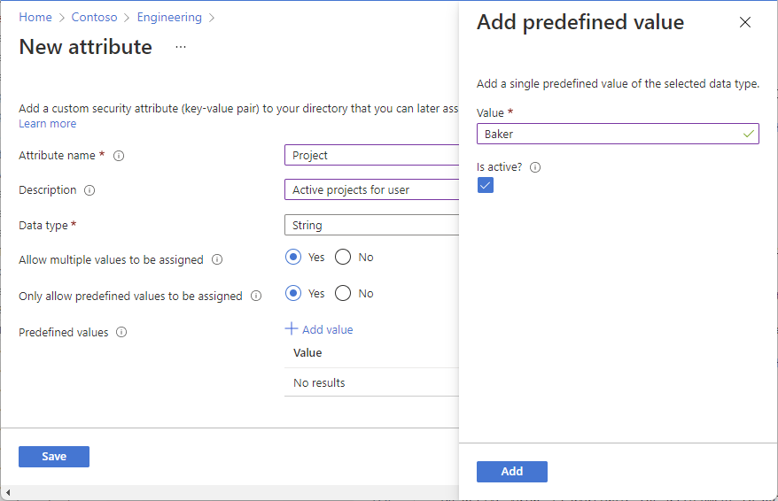
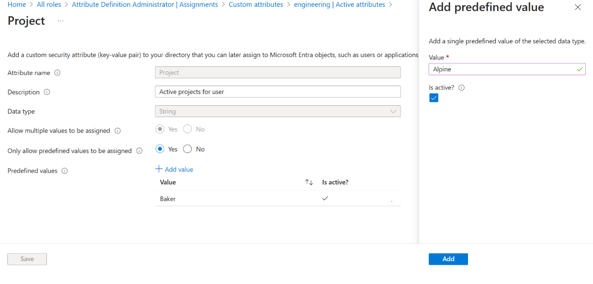

# Add or deactivate custom security attributes in Azure AD (Preview)

> [!IMPORTANT]
> Custom security attributes are currently in PREVIEW.
> See the [Supplemental Terms of Use for Microsoft Azure Previews](https://azure.microsoft.com/support/legal/preview-supplemental-terms/) for legal terms that apply to Azure features that are in beta, preview, or otherwise not yet released into general availability.

[Custom security attributes](custom-security-attributes-overview.md) in Azure Active Directory (Azure AD) are business-specific attributes (key-value pairs) that you can define and assign to Azure AD objects. This article describes how to add, edit, or deactivate custom security attributes.

## Prerequisites

To add or deactivate custom security attributes, you must have:

- Azure AD Premium P1 or P2 license
- [Attribute Definition Administrator](../roles/permissions-reference.md#attribute-definition-administrator)
- [AzureADPreview](https://www.powershellgallery.com/packages/AzureADPreview) version 2.0.2.138 or later when using PowerShell

> [!IMPORTANT]
> By default, [Global Administrator](../roles/permissions-reference.md#global-administrator) and other administrator roles do not have permissions to read, define, or assign custom security attributes.

## Add an attribute set

An attribute set is a collection of related attributes. All custom security attributes must be part of an attribute set. Attribute sets cannot be renamed or deleted.

1. Sign in to the [Azure portal](https://portal.azure.com).

1. Click **Azure Active Directory** > **Custom security attributes (Preview)**.

1. Click **Add attribute set** to add a new attribute set.

    If Add attribute set is disabled, make sure you are assigned the Attribute Definition Administrator role. For more information, see [Troubleshoot custom security attributes](custom-security-attributes-troubleshoot.md).

1. Enter a name, description, and maximum number of attributes.

    An attribute set name can be 32 characters with no spaces or special characters. Once you've specified a name, you can't rename it. For more information, see [Limits and constraints](custom-security-attributes-overview.md#limits-and-constraints).

    

1. When finished, click **Add**.

    The new attribute set appears in the list of attribute sets.

## Add a custom security attribute

1. Sign in to the [Azure portal](https://portal.azure.com).

1. Click **Azure Active Directory** > **Custom security attributes (Preview)**.

1. On the Custom security attributes page, find an existing attribute set or click **Add attribute set** to add a new attribute set.

    All custom security attributes must be part of an attribute set.

1. Click to open the selected attribute set.
 
1. Click **Add attribute** to add a new custom security attribute to the attribute set.

    

1. In the **Attribute name** box, enter a custom security attribute name.

    A custom security attribute name can be 32 characters with no spaces or special characters. Once you've specified a name, you can't rename it. For more information, see [Limits and constraints](custom-security-attributes-overview.md#limits-and-constraints).

1. In the **Description** box, enter an optional description.

    A description can be 128 characters long. If necessary, you can later change the description.

1. From the **Data type** list, select the data type for the custom security attribute.

    | Data type | Description |
    | --- | --- |
    | Boolean | A Boolean value that can be true, True, false, or False. |
    | Integer | A 32-bit integer. |
    | String | A string that can be X characters long. |
    
1. For **Allow multiple values to be assigned**, select **Yes** or **No**.

    Select **Yes** to allow multiple values to be assigned to this custom security attribute. Select **No** to only allow a single value to be assigned to this custom security attribute.

1. For **Only allow predefined values to be assigned**, select **Yes** or **No**.

    Select **Yes** to require that this custom security attribute be assigned values from a predefined values list. Select **No** to allow this custom security attribute to be assigned user-defined values or potentially predefined values.

1. If **Only allow predefined values to be assigned** is **Yes**, click **Add value** to add predefined values.

    An active value is available for assignment to objects. A value that is not active is defined, but not yet available for assignment.

    


1. When finished, click **Save**.

    The new custom security attribute appears in the list of custom security attributes.

1. If you want to include predefined values, follow the steps in the next section.

## Edit a custom security attribute

Once you add a new custom security attribute, you can later edit some of the properties. Some properties are immutable and cannot be changed.

1. Sign in to the [Azure portal](https://portal.azure.com).

1. Click **Azure Active Directory** > **Custom security attributes (Preview)**.

1. Click the attribute set that includes the custom security attribute you want to edit.

1. In the list of custom security attributes, click the ellipsis for the custom security attribute you want to edit and then click **Edit attribute**.
  
1. Edit the properties that are enabled.
  
1. If **Only allow predefined values to be assigned** is **Yes**, click **Add value** to add predefined values. Click an existing predefined value to change the **Is active?** setting.

    

## Deactivate a custom security attribute

Once you add a custom security attribute, you can't delete it. However, you can deactivate a custom security attribute.

1. Sign in to the [Azure portal](https://portal.azure.com).

1. Click **Azure Active Directory** > **Custom security attributes (Preview)**.

1. Click the attribute set that includes the custom security attribute you want to deactivate.

1. In the list of custom security attributes, add a check mark next to the custom security attribute you want to deactivate.

1. Click **Deactivate attribute**.
  
1. In the Deactivate attribute dialog that appears, click **Yes**.

    The custom security attribute is deactivated and moved to the Deactivated attributes list.

## PowerShell or Microsoft Graph API

To manage custom security attributes in your Azure AD organization, you can also use PowerShell or Microsoft Graph API. The following examples manage attribute sets and custom security attributes.

#### Get all attribute sets

The following example gets all attribute sets.

# [PowerShell](#tab/ms-powershell)

[Get-MgDirectoryAttributeSet](/powershell/module/microsoft.graph.identity.directorymanagement/get-mgdirectoryattributeset?branch=main)

```powershell
Get-MgDirectoryAttributeSet | Format-List
```

```Output
Description          : Attributes for engineering team
Id                   : Engineering
MaxAttributesPerSet  : 25
AdditionalProperties : {}

Description          : Attributes for marketing team
Id                   : Marketing
MaxAttributesPerSet  : 25
AdditionalProperties : {}
```

# [Microsoft Graph](#tab/ms-graph)

[List attributeSets](/graph/api/directory-list-attributesets?branch=main)

```http
GET https://graph.microsoft.com/beta/directory/attributeSets
```

# [Azure AD PowerShell](#tab/aad-powershell)

[Get-AzureADMSAttributeSet](/powershell/module/azuread/get-azureadmsattributeset?branch=main)

```powershell
Get-AzureADMSAttributeSet
```

---

#### Get top attribute sets

The following example gets the top attribute sets.

# [PowerShell](#tab/ms-powershell)

[Get-MgDirectoryAttributeSet](/powershell/module/microsoft.graph.identity.directorymanagement/get-mgdirectoryattributeset?branch=main)

```powershell
Get-MgDirectoryAttributeSet -Top 10
```

# [Microsoft Graph](#tab/ms-graph)

[List attributeSets](/graph/api/directory-list-attributesets?branch=main)

```http
GET https://graph.microsoft.com/beta/directory/attributeSets?$top=10
```

---

#### Get attribute sets in order

The following examples gets attribute sets in order.

# [PowerShell](#tab/ms-powershell)

[Get-MgDirectoryAttributeSet](/powershell/module/microsoft.graph.identity.directorymanagement/get-mgdirectoryattributeset?branch=main)

```powershell
Get-MgDirectoryAttributeSet -Sort "Id"
```

# [Microsoft Graph](#tab/ms-graph)

[List attributeSets](/graph/api/directory-list-attributesets?branch=main)

```http
GET https://graph.microsoft.com/beta/directory/attributeSets?$orderBy=id
```

---

#### Get an attribute set

The following example gets an attribute set.

- Attribute set: `Engineering`

# [PowerShell](#tab/ms-powershell)

[Get-MgDirectoryAttributeSet](/powershell/module/microsoft.graph.identity.directorymanagement/get-mgdirectoryattributeset?branch=main)

```powershell
Get-MgDirectoryAttributeSet -AttributeSetId "Engineering"
```

# [Microsoft Graph](#tab/ms-graph)

[Get attributeSet](/graph/api/attributeset-get?branch=main)

```http
GET https://graph.microsoft.com/beta/directory/attributeSets/Engineering
```

# [Azure AD PowerShell](#tab/aad-powershell)

[Get-AzureADMSAttributeSet](/powershell/module/azuread/get-azureadmsattributeset?branch=main)

```powershell
Get-AzureADMSAttributeSet -Id "Engineering"
```

---

#### Add an attribute set

The following example adds a new attribute set.

- Attribute set: `Engineering`

# [PowerShell](#tab/ms-powershell)

[New-MgDirectoryAttributeSet](/powershell/module/microsoft.graph.identity.directorymanagement/new-mgdirectoryattributeset?branch=main)

```powershell
$params = @{
	Id = "Engineering"
	Description = "Attributes for engineering team"
	MaxAttributesPerSet = 25
}
New-MgDirectoryAttributeSet -BodyParameter $params
```

# [Microsoft Graph](#tab/ms-graph)

[Create attributeSet](/graph/api/directory-post-attributesets?branch=main)

```http
POST https://graph.microsoft.com/beta/directory/attributeSets 
{
    "id":"Engineering",
    "description":"Attributes for engineering team",
    "maxAttributesPerSet":25
}
```

# [Azure AD PowerShell](#tab/aad-powershell)

[New-AzureADMSAttributeSet](/powershell/module/azuread/new-azureadmsattributeset?branch=main)

```powershell
New-AzureADMSAttributeSet -Id "Engineering" -Description "Attributes for engineering team" -MaxAttributesPerSet 10 
```

---

#### Update an attribute set

The following example updates an attribute set.

- Attribute set: `Engineering`

# [PowerShell](#tab/ms-powershell)

[Update-MgDirectoryAttributeSet](/powershell/module/microsoft.graph.identity.directorymanagement/update-mgdirectoryattributeset?branch=main)

```powershell
$params = @{
	description = "Attributes for engineering team"
	maxAttributesPerSet = 20
}
Update-MgDirectoryAttributeSet -AttributeSetId "Engineering" -BodyParameter $params
```

# [Microsoft Graph](#tab/ms-graph)

[Update attributeSet](/graph/api/attributeset-update?branch=main)

```http
PATCH https://graph.microsoft.com/beta/directory/attributeSets/Engineering
{
    "description":"Attributes for engineering team",
    "maxAttributesPerSet":20
}
```

# [Azure AD PowerShell](#tab/aad-powershell)

[Set-AzureADMSAttributeSet](/powershell/module/azuread/set-azureadmsattributeset?branch=main)

```powershell
Set-AzureADMSAttributeSet -Id "Engineering" -Description "Attributes for cloud engineering team"
Set-AzureADMSAttributeSet -Id "Engineering" -MaxAttributesPerSet 20
```

---

#### Get all custom security attributes

The following example gets all custom security attribute definitions.

# [PowerShell](#tab/ms-powershell)

[Get-MgDirectoryCustomSecurityAttributeDefinition](/powershell/module/microsoft.graph.identity.directorymanagement/get-mgdirectorycustomsecurityattributedefinition?branch=main)

```powershell
Get-MgDirectoryCustomSecurityAttributeDefinition | Format-List
```

```Output
AllowedValues           :
AttributeSet            : Engineering
Description             : Target completion date
Id                      : Engineering_ProjectDate
IsCollection            : False
IsSearchable            : True
Name                    : ProjectDate
Status                  : Available
Type                    : String
UsePreDefinedValuesOnly : False
AdditionalProperties    : {}

AllowedValues           :
AttributeSet            : Engineering
Description             : Active projects for user
Id                      : Engineering_Project
IsCollection            : True
IsSearchable            : True
Name                    : Project
Status                  : Available
Type                    : String
UsePreDefinedValuesOnly : True
AdditionalProperties    : {}

AllowedValues           :
AttributeSet            : Marketing
Description             : Country where is application is used
Id                      : Marketing_AppCountry
IsCollection            : True
IsSearchable            : True
Name                    : AppCountry
Status                  : Available
Type                    : String
UsePreDefinedValuesOnly : True
AdditionalProperties    : {}
```

# [Microsoft Graph](#tab/ms-graph)

[List customSecurityAttributeDefinitions](/graph/api/directory-list-customsecurityattributedefinitions?branch=main)

```http
GET https://graph.microsoft.com/beta/directory/customSecurityAttributeDefinitions
```

# [Azure AD PowerShell](#tab/aad-powershell)

[Get-AzureADMSCustomSecurityAttributeDefinition](/powershell/module/azuread/get-azureadmscustomsecurityattributedefinition?branch=main)

```powershell
Get-AzureADMSCustomSecurityAttributeDefinition
```

---

#### Filter custom security attributes

The following examples filter custom security attribute definitions.

- Filter: Attribute name eq 'Project' and status eq 'Available'

# [PowerShell](#tab/ms-powershell)

[Get-MgDirectoryCustomSecurityAttributeDefinition](/powershell/module/microsoft.graph.identity.directorymanagement/get-mgdirectorycustomsecurityattributedefinition?branch=main)

```powershell
Get-MgDirectoryCustomSecurityAttributeDefinition -Filter "name eq 'Project' and status eq 'Available'" | Format-List
```

```Output
AllowedValues           :
AttributeSet            : Engineering
Description             : Active projects for user
Id                      : Engineering_Project
IsCollection            : True
IsSearchable            : True
Name                    : Project
Status                  : Available
Type                    : String
UsePreDefinedValuesOnly : True
AdditionalProperties    : {}
```

# [Microsoft Graph](#tab/ms-graph)

[List customSecurityAttributeDefinitions](/graph/api/directory-list-customsecurityattributedefinitions?branch=main)

```http
GET https://graph.microsoft.com/beta/directory/customSecurityAttributeDefinitions?$filter=name+eq+'Project'%20and%20status+eq+'Available'
```

---

- Filter: Attribute set eq 'Engineering' and status eq 'Available' and data type eq 'String'

# [PowerShell](#tab/ms-powershell)

[Get-MgDirectoryCustomSecurityAttributeDefinition](/powershell/module/microsoft.graph.identity.directorymanagement/get-mgdirectorycustomsecurityattributedefinition?branch=main)

```powershell
Get-MgDirectoryCustomSecurityAttributeDefinition -Filter "attributeSet eq 'Engineering' and status eq 'Available' and type eq 'String'" | Format-List
```

```Output
AllowedValues           :
AttributeSet            : Engineering
Description             : Target completion date
Id                      : Engineering_ProjectDate
IsCollection            : False
IsSearchable            : True
Name                    : ProjectDate
Status                  : Available
Type                    : String
UsePreDefinedValuesOnly : False
AdditionalProperties    : {}

AllowedValues           :
AttributeSet            : Engineering
Description             : Active projects for user
Id                      : Engineering_Project
IsCollection            : True
IsSearchable            : True
Name                    : Project
Status                  : Available
Type                    : String
UsePreDefinedValuesOnly : True
AdditionalProperties    : {}
```

# [Microsoft Graph](#tab/ms-graph)

[List customSecurityAttributeDefinitions](/graph/api/directory-list-customsecurityattributedefinitions?branch=main)

```http
GET https://graph.microsoft.com/beta/directory/customSecurityAttributeDefinitions?$filter=attributeSet+eq+'Engineering'%20and%20status+eq+'Available'%20and%20type+eq+'String'
```

---

#### Get a custom security attribute

The following example gets a custom security attribute definition.

- Attribute set: `Engineering`
- Attribute: `ProjectDate`

# [PowerShell](#tab/ms-powershell)

[Get-MgDirectoryCustomSecurityAttributeDefinition](/powershell/module/microsoft.graph.identity.directorymanagement/get-mgdirectorycustomsecurityattributedefinition?branch=main)

```powershell
Get-MgDirectoryCustomSecurityAttributeDefinition -CustomSecurityAttributeDefinitionId "Engineering_ProjectDate" | Format-List
```

```Output
AllowedValues           :
AttributeSet            : Engineering
Description             : Target completion date
Id                      : Engineering_ProjectDate
IsCollection            : False
IsSearchable            : True
Name                    : ProjectDate
Status                  : Available
Type                    : String
UsePreDefinedValuesOnly : False
AdditionalProperties    : {[@odata.context, https://graph.microsoft.com/v1.0/$metadata#directory/customSecurityAttributeDefinitions/$entity]}
```

# [Microsoft Graph](#tab/ms-graph)

[Get customSecurityAttributeDefinition](/graph/api/customsecurityattributedefinition-get?branch=main)

```http
GET https://graph.microsoft.com/beta/directory/customSecurityAttributeDefinitions/Engineering_ProjectDate
```

# [Azure AD PowerShell](#tab/aad-powershell)

[Get-AzureADMSCustomSecurityAttributeDefinition](/powershell/module/azuread/get-azureadmscustomsecurityattributedefinition?branch=main)

```powershell
Get-AzureADMSCustomSecurityAttributeDefinition -Id "Engineering_ProjectDate"
```

---

#### Add a custom security attribute

The following example adds a new custom security attribute definition.

- Attribute set: `Engineering`
- Attribute: `ProjectDate`
- Attribute data type: String

# [PowerShell](#tab/ms-powershell)

[New-MgDirectoryCustomSecurityAttributeDefinition](/powershell/module/microsoft.graph.identity.directorymanagement/new-mgdirectorycustomsecurityattributedefinition?branch=main)

```powershell
$params = @{
	attributeSet = "Engineering"
	description = "Target completion date"
	isCollection = $false
	isSearchable = $true
	name = "ProjectDate"
	status = "Available"
	type = "String"
	usePreDefinedValuesOnly = $false
}
New-MgDirectoryCustomSecurityAttributeDefinition -BodyParameter $params
```

# [Microsoft Graph](#tab/ms-graph)

[Create customSecurityAttributeDefinition](/graph/api/directory-post-customsecurityattributedefinitions?branch=main)

```http
POST https://graph.microsoft.com/beta/directory/customSecurityAttributeDefinitions
{
    "attributeSet":"Engineering",
    "description":"Target completion date",
    "isCollection":false,
    "isSearchable":true,
    "name":"ProjectDate",
    "status":"Available",
    "type":"String",
    "usePreDefinedValuesOnly": false
}
```

# [Azure AD PowerShell](#tab/aad-powershell)

[New-AzureADMSCustomSecurityAttributeDefinition](/powershell/module/azuread/new-azureadmscustomsecurityattributedefinition?branch=main)

```powershell
New-AzureADMSCustomSecurityAttributeDefinition -AttributeSet "Engineering" -Name "ProjectDate" -Description "Target completion date" -Type "String" -Status "Available" -IsCollection $false -IsSearchable $true -UsePreDefinedValuesOnly $false
```

---

#### Add a custom security attribute that supports multiple predefined values

The following example adds a new custom security attribute definition that supports multiple predefined values.

- Attribute set: `Engineering`
- Attribute: `Project`
- Attribute data type: Collection of Strings

# [PowerShell](#tab/ms-powershell)

[New-MgDirectoryCustomSecurityAttributeDefinition](/powershell/module/microsoft.graph.identity.directorymanagement/new-mgdirectorycustomsecurityattributedefinition?branch=main)

```powershell
$params = @{
	attributeSet = "Engineering"
	description = "Active projects for user"
	isCollection = $true
	isSearchable = $true
	name = "Project"
	status = "Available"
	type = "String"
	usePreDefinedValuesOnly = $true
}
New-MgDirectoryCustomSecurityAttributeDefinition -BodyParameter $params
```

# [Microsoft Graph](#tab/ms-graph)

[Create customSecurityAttributeDefinition](/graph/api/directory-post-customsecurityattributedefinitions?branch=main)

```http
POST https://graph.microsoft.com/beta/directory/customSecurityAttributeDefinitions
{
    "attributeSet":"Engineering",
    "description":"Active projects for user",
    "isCollection":true,
    "isSearchable":true,
    "name":"Project",
    "status":"Available",
    "type":"String",
    "usePreDefinedValuesOnly": true
}
```

---

#### Add a custom security attribute with a list of predefined values

The following example adds a new custom security attribute definition with a list of predefined values.

- Attribute set: `Engineering`
- Attribute: `Project`
- Attribute data type: Collection of Strings
- Predefined values: `Alpine`, `Baker`, `Cascade`

# [PowerShell](#tab/ms-powershell)

[New-MgDirectoryCustomSecurityAttributeDefinition](/powershell/module/microsoft.graph.identity.directorymanagement/new-mgdirectorycustomsecurityattributedefinition?branch=main)

```powershell
$params = @{
	attributeSet = "Engineering"
	description = "Active projects for user"
	isCollection = $true
	isSearchable = $true
	name = "Project"
	status = "Available"
	type = "String"
	usePreDefinedValuesOnly = $true
	allowedValues = @(
		@{
			id = "Alpine"
			isActive = $true
		}
		@{
			id = "Baker"
			isActive = $true
		}
		@{
			id = "Cascade"
			isActive = $true
		}
	)
}
New-MgDirectoryCustomSecurityAttributeDefinition -BodyParameter $params
```

# [Microsoft Graph](#tab/ms-graph)

[Create customSecurityAttributeDefinition](/graph/api/directory-post-customsecurityattributedefinitions?branch=main)

```http
POST https://graph.microsoft.com/beta/directory/customSecurityAttributeDefinitions
{
    "attributeSet": "Engineering",
    "description": "Active projects for user",
    "isCollection": true,
    "isSearchable": true,
    "name": "Project",
    "status": "Available",
    "type": "String",
    "usePreDefinedValuesOnly": true,
    "allowedValues": [
        {
            "id": "Alpine",
            "isActive": true
        },
        {
            "id": "Baker",
            "isActive": true
        },
        {
            "id": "Cascade",
            "isActive": true
        }
    ]
}
```

---

#### Update a custom security attribute

The following example updates a custom security attribute definition.

- Attribute set: `Engineering`
- Attribute: `ProjectDate`

# [PowerShell](#tab/ms-powershell)

[Update-MgDirectoryCustomSecurityAttributeDefinition](/powershell/module/microsoft.graph.identity.directorymanagement/update-mgdirectorycustomsecurityattributedefinition?branch=main)

```powershell
$params = @{
	description = "Target completion date (YYYY/MM/DD)"
}
Update-MgDirectoryCustomSecurityAttributeDefinition -CustomSecurityAttributeDefinitionId "Engineering_ProjectDate" -BodyParameter $params
```

# [Microsoft Graph](#tab/ms-graph)

[Update customSecurityAttributeDefinition](/graph/api/customsecurityattributedefinition-update?branch=main)

```http
PATCH https://graph.microsoft.com/beta/directory/customSecurityAttributeDefinitions/Engineering_ProjectDate
{
  "description": "Target completion date (YYYY/MM/DD)",
}
```

# [Azure AD PowerShell](#tab/aad-powershell)

[Set-AzureADMSCustomSecurityAttributeDefinition](/powershell/module/azuread/set-azureadmscustomsecurityattributedefinition?branch=main)

```powershell
Set-AzureADMSCustomSecurityAttributeDefinition -Id "Engineering_ProjectDate" -Description "Target completion date (YYYY/MM/DD)"
```

---

#### Update the predefined values for a custom security attribute

The following example updates the predefined values for a custom security attribute definition.

- Attribute set: `Engineering`
- Attribute: `Project`
- Attribute data type: Collection of Strings
- Update predefined value: `Baker`
- New predefined value: `Skagit`

# [PowerShell](#tab/ms-powershell)

[Update-MgDirectoryCustomSecurityAttributeDefinition](/powershell/module/microsoft.graph.identity.directorymanagement/update-mgdirectorycustomsecurityattributedefinition?branch=main)

```powershell
$params = @{
    allowedValues@delta = @(
        @{
            id = "Baker"
            isActive = $false
        }
        @{
            id = "Skagit"
            isActive = $true
        }
    )
}
Update-MgDirectoryCustomSecurityAttributeDefinition -CustomSecurityAttributeDefinitionId "Engineering_ProjectDate" -BodyParameter $params
```

# [Microsoft Graph](#tab/ms-graph)

[Update customSecurityAttributeDefinition](/graph/api/customsecurityattributedefinition-update?branch=main)

> [!NOTE]
> For this request, you must add the **OData-Version** header and assign it the value `4.01`.

```http
PATCH https://graph.microsoft.com/beta/directory/customSecurityAttributeDefinitions/Engineering_Project
{
    "allowedValues@delta": [
        {
            "id": "Baker",
            "isActive": false
        },
        {
            "id": "Skagit",
            "isActive": true
        }
    ]
}
```

---

#### Deactivate a custom security attribute

The following example deactivates a custom security attribute definition.

- Attribute set: `Engineering`
- Attribute: `Project`

# [PowerShell](#tab/ms-powershell)

[Update-MgDirectoryCustomSecurityAttributeDefinition](/powershell/module/microsoft.graph.identity.directorymanagement/update-mgdirectorycustomsecurityattributedefinition?branch=main)

```powershell
$params = @{
	status = "Deprecated"
}
Update-MgDirectoryCustomSecurityAttributeDefinition -CustomSecurityAttributeDefinitionId "Engineering_ProjectDate" -BodyParameter $params
```

# [Microsoft Graph](#tab/ms-graph)

[Update customSecurityAttributeDefinition](/graph/api/customsecurityattributedefinition-update?branch=main)

```http
PATCH https://graph.microsoft.com/beta/directory/customSecurityAttributeDefinitions/Engineering_Project
{
  "status": "Deprecated"
}
```

# [Azure AD PowerShell](#tab/aad-powershell)

[Set-AzureADMSCustomSecurityAttributeDefinition](/powershell/module/azuread/set-azureadmscustomsecurityattributedefinition?branch=main)

```powershell
Set-AzureADMSCustomSecurityAttributeDefinition -Id "Engineering_Project" -Status "Deprecated"
```

---

#### Get all predefined values

The following example gets all predefined values for a custom security attribute definition.

- Attribute set: `Engineering`
- Attribute: `Project`

# [PowerShell](#tab/ms-powershell)

[Get-MgDirectoryCustomSecurityAttributeDefinitionAllowedValue](/powershell/module/microsoft.graph.identity.directorymanagement/get-mgdirectorycustomsecurityattributedefinitionallowedvalue?branch=main)

```powershell
Get-MgDirectoryCustomSecurityAttributeDefinitionAllowedValue -CustomSecurityAttributeDefinitionId "Engineering_Project" | Format-List
```

```Output
Id                   : Skagit
IsActive             : True
AdditionalProperties : {}

Id                   : Baker
IsActive             : False
AdditionalProperties : {}

Id                   : Cascade
IsActive             : True
AdditionalProperties : {}

Id                   : Alpine
IsActive             : True
AdditionalProperties : {}
```

# [Microsoft Graph](#tab/ms-graph)

[List allowedValues](/graph/api/customsecurityattributedefinition-list-allowedvalues?branch=main)

```http
GET https://graph.microsoft.com/beta/directory/customSecurityAttributeDefinitions/Engineering_Project/allowedValues
```

# [Azure AD PowerShell](#tab/aad-powershell)

[Get-AzureADMSCustomSecurityAttributeDefinitionAllowedValue](/powershell/module/azuread/get-azureadmscustomsecurityattributedefinitionallowedvalue?branch=main)

```powershell
Get-AzureADMSCustomSecurityAttributeDefinitionAllowedValue -CustomSecurityAttributeDefinitionId "Engineering_Project"
```

---

#### Get a predefined value

The following example gets a predefined value for a custom security attribute definition.

- Attribute set: `Engineering`
- Attribute: `Project`
- Predefined value: `Alpine`

# [PowerShell](#tab/ms-powershell)

[Get-MgDirectoryCustomSecurityAttributeDefinitionAllowedValue](/powershell/module/microsoft.graph.identity.directorymanagement/get-mgdirectorycustomsecurityattributedefinitionallowedvalue?branch=main)

```powershell
Get-MgDirectoryCustomSecurityAttributeDefinitionAllowedValue -CustomSecurityAttributeDefinitionId "Engineering_Project" -AllowedValueId "Alpine" | Format-List
```

```Output
Id                   : Alpine
IsActive             : True
AdditionalProperties : {[@odata.context, https://graph.microsoft.com/v1.0/$metadata#directory/customSecurityAttributeDefinitions('Engineering_Project')/al
                       lowedValues/$entity]}
```

# [Microsoft Graph](#tab/ms-graph)

[Get allowedValue](/graph/api/allowedvalue-get?branch=main)

```http
GET https://graph.microsoft.com/beta/directory/customSecurityAttributeDefinitions/Engineering_Project/allowedValues/Alpine
```

# [Azure AD PowerShell](#tab/aad-powershell)

[Get-AzureADMSCustomSecurityAttributeDefinitionAllowedValue](/powershell/module/azuread/get-azureadmscustomsecurityattributedefinitionallowedvalue?branch=main)

```powershell
Get-AzureADMSCustomSecurityAttributeDefinitionAllowedValue -CustomSecurityAttributeDefinitionId "Engineering_Project" -Id "Alpine" 
```

---

#### Add a predefined value

The following example adds a predefined value for a custom security attribute definition.

You can add predefined values for custom security attributes that have `usePreDefinedValuesOnly` set to `true`.

- Attribute set: `Engineering`
- Attribute: `Project`
- Predefined value: `Alpine`

# [PowerShell](#tab/ms-powershell)

[New-MgDirectoryCustomSecurityAttributeDefinitionAllowedValue](/powershell/module/microsoft.graph.identity.directorymanagement/new-mgdirectorycustomsecurityattributedefinitionallowedvalue?branch=main)

```powershell
$params = @{
	id = "Alpine"
	isActive = "true"
}
New-MgDirectoryCustomSecurityAttributeDefinitionAllowedValue -CustomSecurityAttributeDefinitionId "Engineering_Project" -BodyParameter $params
```

# [Microsoft Graph](#tab/ms-graph)

[Create allowedValue](/graph/api/customsecurityattributedefinition-post-allowedvalues?branch=main)

```http
POST https://graph.microsoft.com/beta/directory/customSecurityAttributeDefinitions/Engineering_Project/allowedValues
{
    "id":"Alpine",
    "isActive":"true"
}
```

# [Azure AD PowerShell](#tab/aad-powershell)

[Add-AzureADMScustomSecurityAttributeDefinitionAllowedValues](/powershell/module/azuread/add-azureadmscustomsecurityattributedefinitionallowedvalues?branch=main)

```powershell
Add-AzureADMScustomSecurityAttributeDefinitionAllowedValues -CustomSecurityAttributeDefinitionId "Engineering_Project" -Id "Alpine" -IsActive $true
```

---

#### Deactivate a predefined value

The following example deactivates a predefined value for a custom security attribute definition.

- Attribute set: `Engineering`
- Attribute: `Project`
- Predefined value: `Alpine`

# [PowerShell](#tab/ms-powershell)

[Update-MgDirectoryCustomSecurityAttributeDefinitionAllowedValue](/powershell/module/microsoft.graph.identity.directorymanagement/update-mgdirectorycustomsecurityattributedefinitionallowedvalue?branch=main)

```powershell
$params = @{
	isActive = "false"
}
Update-MgDirectoryCustomSecurityAttributeDefinitionAllowedValue -CustomSecurityAttributeDefinitionId "Engineering_Project" -AllowedValueId "Alpine" -BodyParameter $params
```

# [Microsoft Graph](#tab/ms-graph)

[Update allowedValue](/graph/api/allowedvalue-update?branch=main)

```http
PATCH https://graph.microsoft.com/beta/directory/customSecurityAttributeDefinitions/Engineering_Project/allowedValues/Alpine
{
    "isActive":"false"
}
```

# [Azure AD PowerShell](#tab/aad-powershell)

[Set-AzureADMSCustomSecurityAttributeDefinitionAllowedValue](/powershell/module/azuread/set-azureadmscustomsecurityattributedefinitionallowedvalue?branch=main)

```powershell
Set-AzureADMSCustomSecurityAttributeDefinitionAllowedValue -CustomSecurityAttributeDefinitionId "Engineering_Project" -Id "Alpine" -IsActive $false
```

---

## Frequently asked questions

**Can you delete custom security attribute definitions?**

No, you can't delete custom security attribute definitions. You can only [deactivate custom security attribute definitions](#deactivate-a-custom-security-attribute). Once you deactivate a custom security attribute, it can no longer be applied to the Azure AD objects. Custom security attribute assignments for the deactivated custom security attribute definition are not automatically removed. There is no limit to the number of deactivated custom security attributes. You can have 500 active custom security attribute definitions per tenant with 100 allowed predefined values per custom security attribute definition.

## Next steps

- [Manage access to custom security attributes in Azure AD](custom-security-attributes-manage.md)
- [Assign, update, list, or remove custom security attributes for a user](../enterprise-users/users-custom-security-attributes.md)
- [Assign, update, list, or remove custom security attributes for an application](../manage-apps/custom-security-attributes-apps.md)
