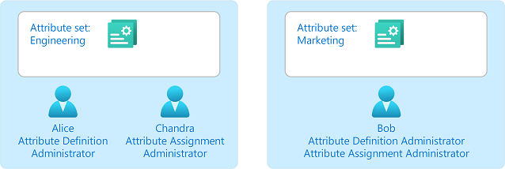
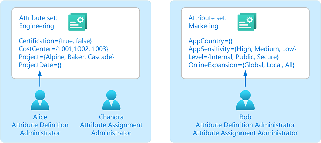

# What are custom security attributes in Azure AD? (Preview)

> [!IMPORTANT]
> Custom security attributes are currently in PREVIEW.
> See the [Supplemental Terms of Use for Microsoft Azure Previews](https://azure.microsoft.com/support/legal/preview-supplemental-terms/) for legal terms that apply to Azure features that are in beta, preview, or otherwise not yet released into general availability.

Custom security attributes is a feature of Azure Active Directory (Azure AD) that enables you to define and assign your own custom security attributes (key-value pairs) to Azure AD objects. For example, your organization might want to add a custom security attribute to the profiles of all your employees or applications.

## Why use custom security attributes?

- Extend user profiles, such as add Employee Hire Date and Hourly Salary to all my employees.
- Ensure only administrators can see the Hourly Salary attribute in my employees' profiles.
- Categorize hundreds or thousands of applications to easily create a filterable inventory for auditing.
- Grant users access to the Azure Storage blobs belonging to a project.

## What can I do with custom security attributes?

- Define business-specific information (attributes) for your tenant.
- Add a set of custom security attributes on users, applications, Azure AD resources, or Azure resources.
- Manage Azure AD objects using custom security attributes with queries and filters.
- Provide attribute governance so attributes determine who can get access.

## Features of custom security attributes

- Available tenant-wide​
- Include a description
- Support different data types: Boolean, integer, string​
- Support single value or multiple values
- Support user-defined free-form values​ or predefined values
- Assign custom security attributes to directory synced users from an on-premises Active Directory

The following example shows how you can specify custom security attribute values that are single, multiple, free-form, or predefined.

## Objects that support custom security attributes

Currently, you can add custom security attributes for the following Azure AD objects:

- Azure AD users
- Azure AD enterprise applications (service principals)
- Managed identities for Azure resources

## How do custom security attributes compare with directory schema extensions?

Here are some ways that custom security attributes compare with [directory schema extensions](../develop/active-directory-schema-extensions.md):

- Directory schema extensions cannot be used for authorization scenarios and attributes because the access control for the extension attributes is tied to the Azure AD object. Custom security attributes can be used for authorization and attributes needing access control because the custom security attributes can be managed and protected through separate permissions.
- Directory schema extensions are tied to an application and share the lifecycle of an application. Custom security attributes are tenant wide and not tied to an application.
- Directory schema extensions support assigning a single value to an attribute. Custom security attributes support assigning multiple values to an attribute.

## Steps to use custom security attributes

1. **Check permissions**

    Check that you are assigned the [Attribute Definition Administrator](../roles/permissions-reference.md#attribute-definition-administrator) or [Attribute Assignment Administrator](../roles/permissions-reference.md#attribute-assignment-administrator) roles. If not, check with your administrator to assign you the appropriate role at tenant or attribute set scope. By default, [Global Administrator](../roles/permissions-reference.md#global-administrator) and other administrator roles do not have permissions to read, define, or assign custom security attributes. If necessary, a Global Administrator can assign these roles to themselves.

    

1. **Add attribute sets**

    Add attribute sets to group and manage related custom security attributes. [Learn more](custom-security-attributes-add.md)

    

1. **Manage attribute sets**

    Specify who can read, define, or assign custom security attributes in an attribute set. [Learn more](custom-security-attributes-manage.md)

    

1. **Define attributes**

    Add your custom security attributes to your directory. You can specify the date type (Boolean, integer, or string) and whether values are predefined, free-form, single, or multiple. [Learn more](custom-security-attributes-add.md)

    

1. **Assign attributes**

    Assign custom security attributes to Azure AD objects for your business scenarios. [Learn more](../enterprise-users/users-custom-security-attributes.md)

    

1. **Use attributes**

    Filter users and applications that use custom security attributes. [Learn more](../enterprise-users/users-custom-security-attributes.md)

    Add conditions that use custom security attributes to Azure role assignments for fine-grained access control. [Learn more](../../role-based-access-control/conditions-custom-security-attributes.md)

## Terminology

To better understand custom security attributes, you can refer back to the following list of terms.

| Term | Definition |
| --- | --- |
| attribute definition | The schema of a custom security attribute. For example, the custom security attribute name, description, data type, and values. |
| attribute set | A group of related custom security attributes. Attribute sets can be delegated to other users for defining and assigning custom security attributes. |
| attribute name | A unique name of a custom security attribute within an attribute set. The combination of attribute set and attribute name forms a unique attribute for your tenant. |
| attribute assignment | The assignment of a custom security attribute to an Azure AD object, such as users, enterprise applications (service principals), and managed identities. |

## Custom security attribute properties

The following table lists the properties you can specify for attribute sets and custom security attributes. Some properties are immutable and cannot be changed later.

| Property | Required | Can be changed later | Description |
| --- | :---: | :---: | --- |
| Attribute set name  | :heavy_check_mark: |  | Name of the attribute set. Must be unique within a tenant. Cannot include spaces or special characters. |
| Attribute set description |  | :heavy_check_mark: | Description of the attribute set. |
| Maximum number of attributes |  | :heavy_check_mark: | Maximum number of custom security attributes that can be defined in an attribute set. Default value is `null`. If not specified, the administrator can add up to the maximum of 500 active attributes per tenant. |
| Attribute set | :heavy_check_mark: |  | A group of related custom security attributes. Every custom security attribute must be part of an attribute set. |
| Attribute name  | :heavy_check_mark: |  | Name of the custom security attribute. Must be unique within an attribute set. Cannot include spaces or special characters. |
| Attribute description |  | :heavy_check_mark: | Description of the custom security attribute. |
| Data type | :heavy_check_mark: |  | Data type for the custom security attribute values. Supported types are `Boolean`, `Integer`, and `String`. |
| Allow multiple values to be assigned | :heavy_check_mark: |  | Indicates whether multiple values can be assigned to the custom security attribute. If data type is set to `Boolean`, cannot be set to Yes. |
| Only allow predefined values to be assigned | :heavy_check_mark: |  | Indicates whether only predefined values can be assigned to the custom security attribute. If set to No, free-form values are allowed. Can later be changed from Yes to No, but cannot be changed from No to Yes. If data type is set to `Boolean`, cannot be set to Yes.|
| Predefined values |  |  | Predefined values for the custom security attribute of the selected data type. More predefined values can be added later. Values can include spaces, but some special characters are not allowed. |
| Predefined value is active |  | :heavy_check_mark: | Specifies whether the predefined value is active or deactivated. |
| Attribute is active |  | :heavy_check_mark: | Specifies whether the custom security attribute is active or deactivated. |

## Limits and constraints

Here are some of the limits and constraints for custom security attributes.

> [!div class="mx-tableFixed"]
> | Resource | Limit | Notes |
> | --- | :---: | --- |
> | Attributes per tenant | 500 | Applies only to active attributes in the tenant |
> | Attribute sets per tenant | 100 |  |
> | Attribute set name length | 32 | Unicode characters |
> | Attribute set description length | 128 | Unicode characters |
> | Attribute name length | 32 | Unicode characters |
> | Attribute description length | 128 | Unicode characters |
> | Predefined values per attribute | 100 |  |
> | Attribute value length | 64 | Unicode characters |
> | Attribute values assigned per object | 50 | Values can be distributed across single and multi-valued attributes. Example: 5 attributes with 10 values each or 50 attributes with 1 value each |
> | Characters not allowed for: Attribute set name Attribute name | ``<space> ` ~ ! @ # $ % ^ & * ( ) _ - + = { [ } ] \| \ : ; " ' < , > . ? /`` |  |
> | Characters not allowed for: Attribute values | `# % & * + \ : " / < > ?` |  |

## Custom security attribute roles

Azure AD provides built-in roles to work with custom security attributes. The Attribute Definition Administrator role is the minimum role you need to manage custom security attributes. The Attribute Assignment Administrator role is the minimum role you need to assign custom security attribute values for Azure AD objects like users and applications.

> [!div class="mx-tableFixed"]
> | Role | Permissions |
> | --- | --- |
> | [Attribute Definition Reader](../roles/permissions-reference.md#attribute-definition-reader) | Read attribute sets Read custom security attribute definitions |
> | [Attribute Definition Administrator](../roles/permissions-reference.md#attribute-definition-administrator) | Manage all aspects of attribute sets Manage all aspects of custom security attribute definitions |
> | [Attribute Assignment Reader](../roles/permissions-reference.md#attribute-assignment-reader) | Read attribute sets Read custom security attribute definitions Read custom security attribute values for service principals Read custom security attribute values for users |
> | [Attribute Assignment Administrator](../roles/permissions-reference.md#attribute-assignment-administrator) | Read attribute sets Read custom security attribute definitions Read custom security attribute values for service principals Update custom security attribute values for service principals Read custom security attribute values for users Update custom security attribute values for users |

> [!IMPORTANT]
> By default, [Global Administrator](../roles/permissions-reference.md#global-administrator) and other administrator roles do not have permissions to read, define, or assign custom security attributes.

## Known issues

Here are some of the known issues with custom security attributes:

- You can only add the predefined values after you add the custom security attribute by using the **Edit attribute** page.
- Users with attribute set-level role assignments can see other attribute sets and custom security attribute definitions.
- Global Administrators can read audit logs for custom security attribute definitions and assignments.
- If you have an Azure AD Premium P2 license, you can't add eligible role assignments at attribute set scope.
- If you have an Azure AD Premium P2 license, the **Assigned roles** page for a user does not list permanent role assignments at attribute set scope. The role assignments exist, but aren't listed.

Depending on whether you have an Azure AD Premium P1 or P2 license, here are the role assignment tasks that are currently supported for custom security attribute roles:

| Role assignment task | Premium P1 | Premium P2 |
| --- | :---: | :---: |
| Permanent role assignments | :heavy_check_mark: | :heavy_check_mark: |
| Eligible role assignments | n/a | :heavy_check_mark: |
| Permanent role assignments at attribute set scope | :heavy_check_mark: | :heavy_check_mark: |
| Eligible role assignments at attribute set scope | n/a | :x: |
| **Assigned roles** page lists permanent role assignments at attribute set scope | :heavy_check_mark: | :warning: Role assignments exist, but aren't listed  |

## License requirements

[!INCLUDE [Azure AD Premium P1 license](../../../includes/active-directory-p1-license.md)]

## Next steps

- [Add or deactivate custom security attributes in Azure AD](custom-security-attributes-add.md)
- [Manage access to custom security attributes in Azure AD](custom-security-attributes-manage.md)
- [Assign or remove custom security attributes for a user](../enterprise-users/users-custom-security-attributes.md)
