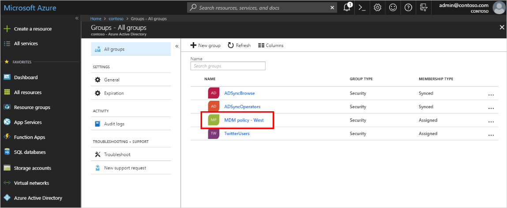
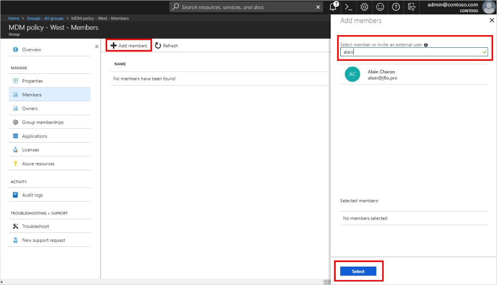

# How to: Add or remove members or devices from a group using the Azure AD portal
Using the Azure AD portal, you can continue to add and remove members from groups.

## To add or remove members

1. From the **Groups - All groups** blade, select the group you want to update. In this case, use our previously created group, **MDM policy - West**.

    

2. Select **Members**, and then select **Add members**.

    The **Add members** blade appears.

    

3. Select each of the members you want to include in your group, and then choose **Select**.

    You'll get a message that says the member was added successfully.

4. Refresh the screen to see all of the member names.

## To add or remove devices

1. blah

## Next steps

- [Search for and view your groups and associated members from the Azure AD portal](active-directory-groups-view-azure-portal.md)
- Modify or delete a group - New, need to create
- [Manage group and membership settings](active-directory-groups-settings-azure-portal.md)
- [Manage access to resources using groups](active-directory-manage-groups.md)
- [Associate or add an Azure subscription to Azure Active Directory](active-directory-how-subscriptions-associated-directory.md)
