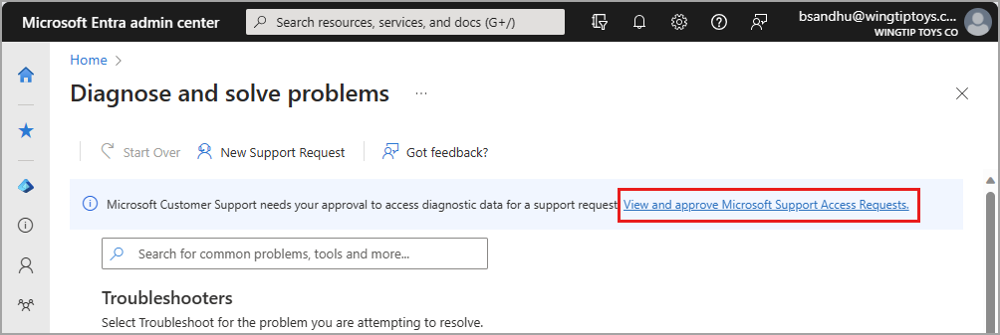
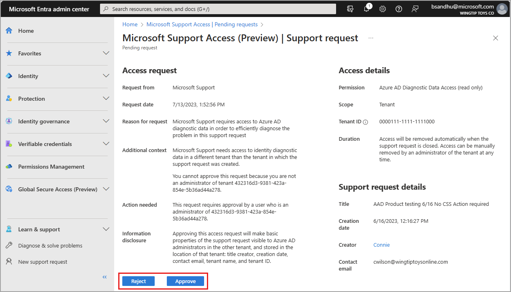

# Approving Microsoft Support access requests (preview)

In many situations, enabling the collection of **Advanced diagnostic information** during the creation of a support access request is sufficient for Microsoft Support to troubleshoot your issue. In some situations though, a separate approval may be needed to allow Microsoft Support to access your identity diagnostic data.

Microsoft Support access requests (preview) enable you to give Microsoft Support engineers access to [diagnostic data](concept-diagnostic-data-access.md) in your identity service to help solve support requests you submitted to Microsoft. You can use the Microsoft Entra admin center and the Azure Active Directory (Azure AD) portal to manage Microsoft Support access requests (preview).

This article describes how the process works and how to approve Microsoft Support access requests.

## Prerequisites

Only authorized users in your tenant can view and manage Microsoft Support access requests. To view, approve, and reject Microsoft Support access requests, a role must have the permission `microsoft.azure.supportTickets/allEntities/allTasks`. To see which Azure AD roles have this permission, search the [Azure AD built-in roles](../roles/permissions-reference.md) for the required permission.

## Scenarios and workflow

A support access request may be needed when a support request is submitted to Microsoft Support from a tenant that is different from the tenant where the issue is occurring. This scenario is known as a *cross-tenant* scenario. The *resource tenant* is the tenant where the issue is occurring and the tenant where the support request was created is known as the *support request tenant*.

Let's take a closer look at the workflow for this scenario:

- A support request is submitted from a tenant that is different from the tenant where the issue is occurring. 
- A Microsoft Support engineer creates a support access request to access identity diagnostic data for the *resource tenant*.
- An administrator of *both* tenants approves the Microsoft Support access request.
- With approval, the support engineer has access to the data only in the approved *resource tenant*. 
- When the support engineer closes the support request, access to your identity data is automatically revoked.

This cross-tenant scenario is the primary scenario where a support access request is necessary. In these scenarios, Microsoft approved access is visible only in the resource tenant. To preserve cross-tenant privacy, an administrator of the *support request tenant* is unable to see whether an administrator of the *resource tenant* has manually removed this approval. 

## View pending requests

When you have a pending support access request, you can view and approve that request from a couple places.

1. Sign in to the [Microsoft Entra admin center](https://entra.microsoft.com/) and navigate to **Diagnose and solve problems**.

1. Select the link from the banner message at the top of the page...

    

    ... or scroll to the bottom of the page and select **Manage pending requests** from the **Microsoft Support Access Requests** section.

    :::image type="content" source="media/how-to-approve-support-access-requests/diagnose-solve-problems-access-requests.png" alt-text="Screenshot of the Diagnose and solve problems page with the Manage pending requests link highlighted." lightbox="media/how-to-approve-support-access-requests/diagnose-solve-problems-access-requests-expanded.png":::

1. Select either the **Support request ID** link  or **Review for approval** link for the request you need to approve.

    

## Approve or reject a support request

The **Pending requests** page shows information about your support case, and the reason that Microsoft Support needs your approval in order to access your diagnostic data.

- To approve the support access request, select the **Approve** button.
    - Microsoft Support now has *read-only* access to your identity diagnostic data until your support request is completed.
- To reject the support access request, select the **Reject** button.
    - Microsoft Support does *not* have access to your identity diagnostic data.
    - A message appears, indicating this choice may result in slower resolution of your support request.
    - Your support engineer may ask you for data needed to diagnose the issue, and you must collect and provide that information to your support engineer. 

## Next steps

- [How to create a support request](how-to-get-support.md)
- [Manage Microsoft Support access requests](how-to-manage-support-access-requests.md)
- [View Microsoft Support access request logs](how-to-view-support-access-request-logs.md)
- [Learn how Microsoft uses data for Azure support](https://azure.microsoft.com/support/legal/support-diagnostic-information-collection/)
